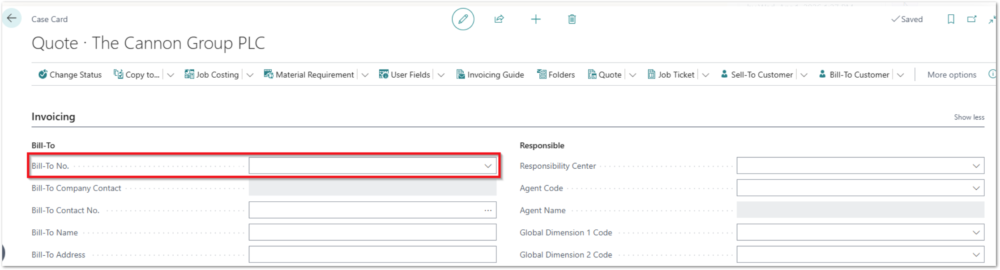
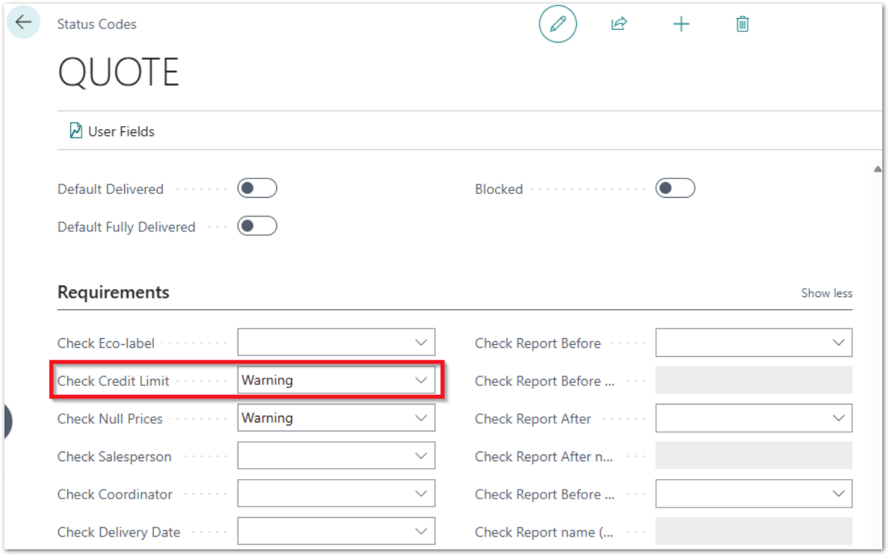
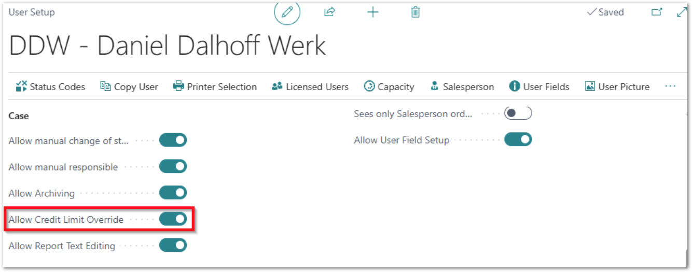

# PrintVis Credit Limit Check

The credit limit is always checked if any changes are made in the **Bill-To** field, and you will receive a warning if it changes to a customer with an exceeded credit limit.  
_Please note_: Also selection/changing the customer is changing the **Bill-To** field!

It is also rechecked if you change to a **Status Code** where **Check Credit Limit** is set to **Warning**.

If **Check Credit Limit** is set to **Stop**, you will not be able to change to this Status Code if the Bill-To customer exceeds the credit limit, unless the user has **Allow Credit Limit Override** turned on in their **PrintVis User Setup**.

For customizations, we provide the event PVSOnBeforeCheck_CreditLimit in Codeunit "PVS Credit Limit Control".