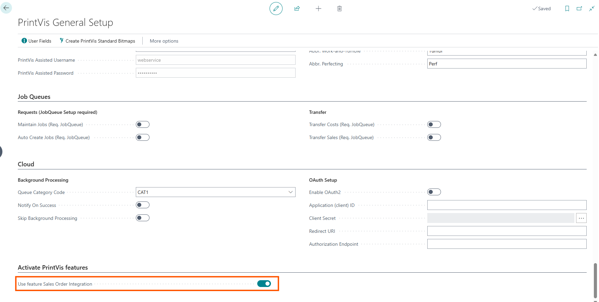
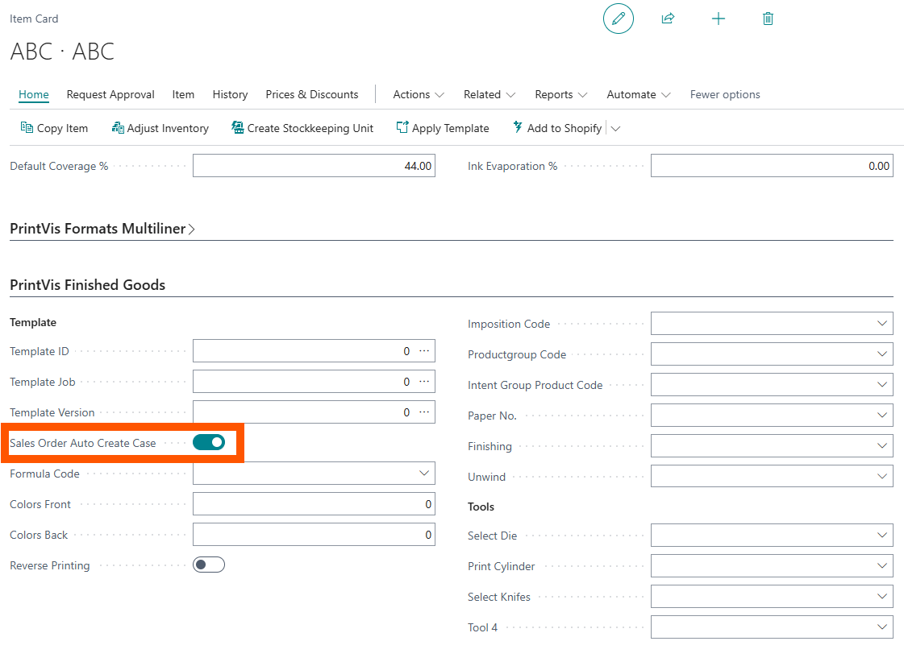
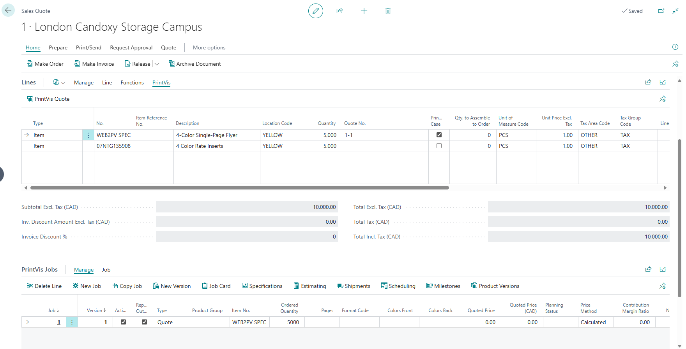

# Sales Order Integration

PrintVis has a standard integration with sales quotes and sales orders
that can be enabled.

## Setup

On the PrintVis General Setup page, enable the Use feature Sales Order
Integration

Once enabled, extra PrintVis fields will be added to the sales lines and
a PrintVis Jobs section will appear below the sales lines section. The
Jobs section will show the jobs section from the case connected to the
sales line.

## Item Setup

On the Item Card in the PrintVis Finished Goods section there is a new
checkbox field called Sales Order Auto Create Case.

Checking this box will automatically create the PrintVis Case whenever
the item is added to a sales quote / order. This can be used for items
that are always produced and never pulled from inventory.

## Usage

Check the PrintVis Case checkbox on the sales line to create the
PrintVis case from the Item No. and quantity of the sales line. The
Quote / Order number will appear on the line and the case jobs section
will populate accordingly.

If you want to see the full PrintVis Case, on the sales line menu there
is a PrintVis tab and an action to open the full Case.
