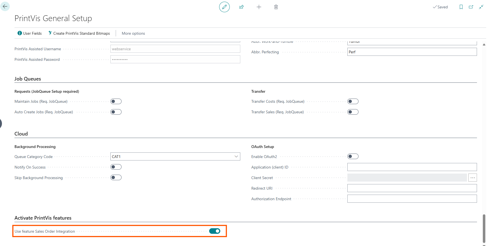
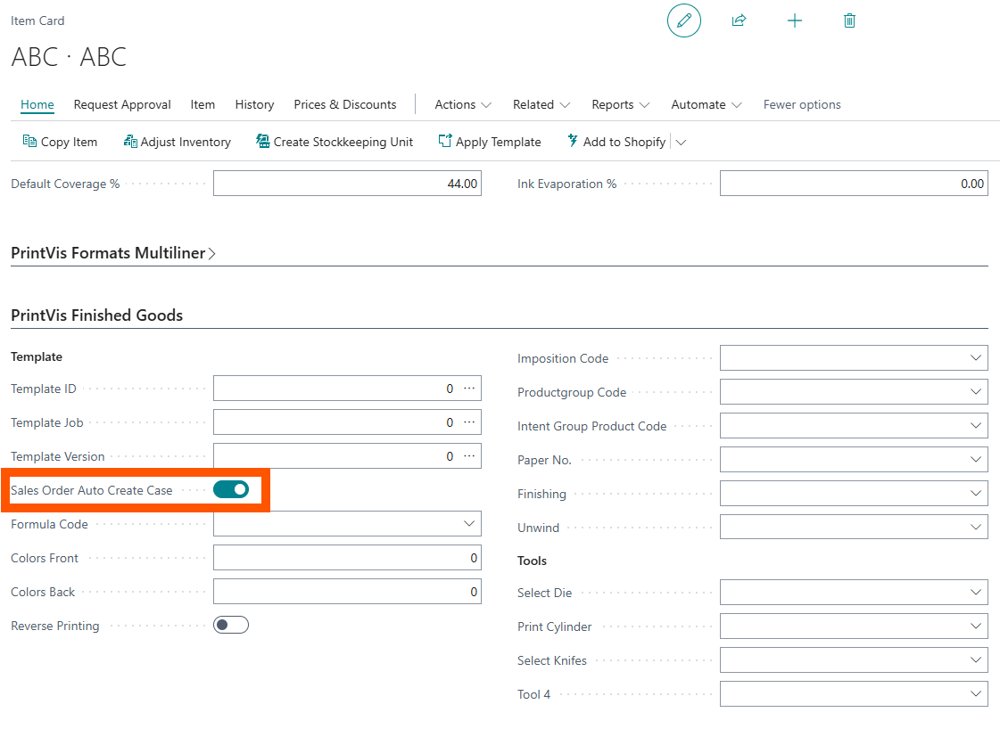
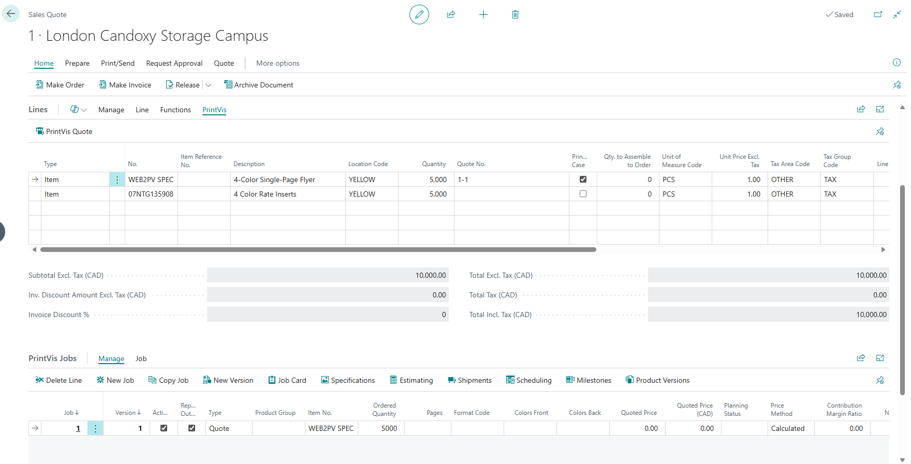

# Sales and Purchase Order Integration
PrintVis has a standard integration with sales quotes / orders and purchase quotes / orders that can be enabled.

## Sales Order Integration

PrintVis has a standard integration with sales quotes and sales orders
that can be enabled.

### Setup

On the PrintVis General Setup page, enable the Use feature Sales Order
Integration

Once enabled, extra PrintVis fields will be added to the sales lines and
a PrintVis Jobs section will appear below the sales lines section. The
Jobs section will show the jobs section from the case connected to the
sales line.

### Item Setup

On the Item Card in the PrintVis Finished Goods section there is a new
checkbox field called Sales Order Auto Create Case.

Checking this box will automatically create the PrintVis Case whenever
the item is added to a sales quote / order. This can be used for items
that are always produced and never pulled from inventory.

### Usage

Check the PrintVis Case checkbox on the sales line to create the
PrintVis case from the Item No. and quantity of the sales line. The
Quote / Order number will appear on the line and the case jobs section
will populate accordingly.

If you want to see the full PrintVis Case, on the sales line menu there
is a PrintVis tab and an action to open the full Case.

## Purchase Order Integration

This feature is typically used for stock items that are planned through purchasing processes but are produced internally. For example, if an item reaches its minimum stock level, the requisition worksheet may suggest creating a purchase order. Instead of sending the purchase order to an external supplier, the purchase line can be used to create a PrintVis case for internal production. 
Use this feature to convert demand from a purchase order line into an internal PrintVis production case. The produced items can then be received into stock and used to fulfill future sales or inventory requirements.

### Setup

- Open **PrintVis Feature Management**.
- Enable the purchase order creation feature. If the feature does not appear in Feature Management, use the **Initialize Features** action on the page.

### Usage

Follow these steps to create a PrintVis case from a purchase order line.

- Create a new purchase order.
- Add a purchase line for an item that has a valid PrintVis template assigned.
- If a customer is preset on the item card, the customer is displayed by default on the purchase line. Keep or change the customer number.
- Enable **PrintVis Case** on the purchase line. A new PrintVis case is created for the selected customer.
- Review the additional PrintVis fields, such as the PrintVis order number, and PrintVis status code. After the PrintVis case is created, the PrintVis order number is shown on the purchase line. The PrintVis status code on the purchase line is also updated, so users can see that the purchase line is linked to a PrintVis case.

### Important Notes

- If Purchase Order Integration is not enabled, purchase orders will behave like standard purchase orders.
- If Purchase Order Integration is enabled, purchase orders will behave like standard purchase orders unless you enable the field "PrintVis Case".
   - Because the purchase order will not be received or invoiced, it can be deleted after the production has been released to the inventory from the case.
- The integration does not replace normal purchasing processes. It provides an additional option for creating internal production from purchase demand or just from a manually created Purchase order.
- The quality of the created PrintVis case depends on the item setup and the assigned template.

