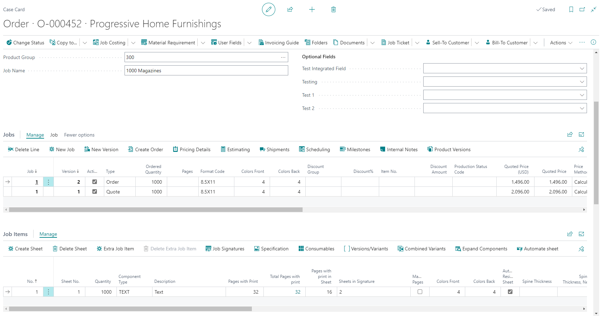
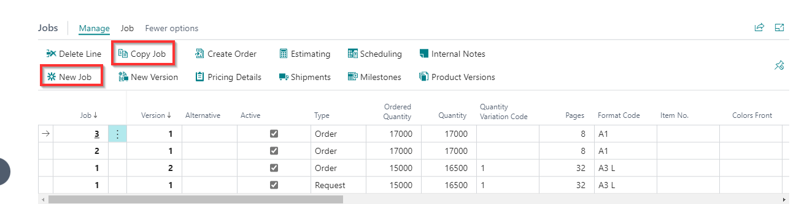
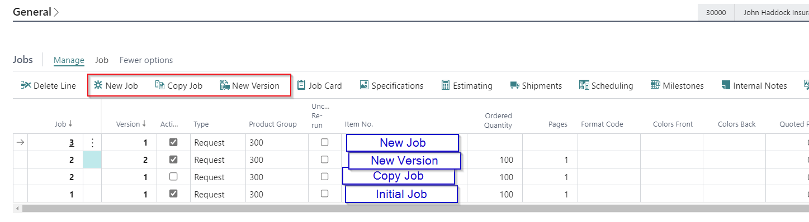
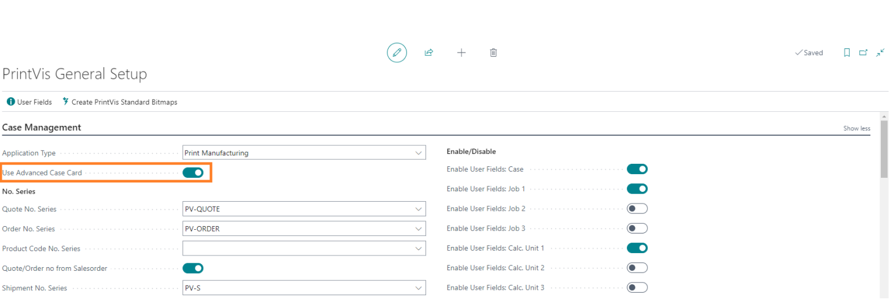

# Case Card

The PrintVis Case Card is the central hub for managing a print job from initial request through invoicing. Each case represents a customer job and contains all relevant information including job details, estimation, planning, production tracking, and invoicing data.

## Usage

A case progresses through the company using Status Codes, which control what actions are available at each stage (planning, job costing, invoicing, etc.).

### Case Lifecycle

A typical case follows this flow:

1. **Request** — Initial customer inquiry is entered as a case
2. **Quote** — Estimation is completed and a quote is prepared
3. **Order** — Customer approves the quote; case becomes an order
4. **Production Order** — Case is released to production
5. **Invoiced** — Job is completed and invoiced
6. **Archived** — Case is archived for historical reference

### Case Card Fields

| Field | Description |
|---|---|
| **Sell-To No.** | The customer this case is for. |
| **Order Type** | Classifies the type of work (e.g., Brochure, Label, Packaging). |
| **Product Group** | The product group for this job (affects templates, imposition, planning milestones). |
| **Job Name** | Description of the job. |
| **Salesperson** | The salesperson responsible for this case. |
| **Estimator** | The user responsible for estimating this case. |
| **Responsible** | The current responsible user (changes automatically based on Status Code and Responsibility Areas). |
| **Deadline** | The job deadline. Can be automatically calculated based on the Status Code's Deadline Period. |
| **Status Code** | The current stage of the case in the workflow. |
| **Quantity** | The ordered quantity. |
| **Pages** | Number of pages (if applicable). |
| **Format Code** | The product format. |
| **Colors Front / Back** | Color specifications. |

### Advanced Case Card

When **Use Advanced Case Card** is enabled in General Setup, the Case Card and Job Card are combined into one view, reducing the number of clicks needed to navigate between case information and job details.

The job menu includes **New Job** (creates a blank job line) and **Copy Job** (creates an exact copy of the highlighted job).

The Advanced Case Card is enabled or disabled from **General Setup → Case Management** section.

### Job Lines

Each case can have multiple job lines representing different versions or quantities. Job lines contain:
- Job-specific quantity, pages, and format
- Template selection
- Pricing information
- Job Card access (for estimation details)

### Working with Cases

**To create a new case:**
1. Go to the PrintVis Case List.
2. Click **New**.
3. Enter the customer (Sell-To No.), Order Type, Product Group, and Job Name.
4. Set the quantity, format, and color information on the job line.
5. Open the Job Card to proceed with estimation.

**To copy a case:**
- Use the **Copy** function on the Case Card to create a new case based on an existing one.
- The status code for the copied case is determined by the **Status Code New Request/Quote/Order** setting in General Setup.

**To check case status:**
- The **Status Code** field shows the current stage.
- The **Next Status** button advances the case to the next status in the workflow.

## Setup

Case Card behavior is controlled by several setup areas:

- **General Setup** — Controls number series, Advanced Case Card toggle, default order document, search name behavior, Additional Quantity, Default Time for Shipment Date
- **Status Codes** — Define what is allowed at each stage (planning, job costing, invoicing, archiving)
- **Responsibility Areas** — Define who becomes responsible when a case reaches each status
- **Order Types** — Control which Status Code a case starts in
- **Product Groups** — Control default templates and imposition information

See the individual setup articles for each of these areas for detailed configuration.

## Examples

### Example: Creating a Quote for a Brochure

1. Create a new Case Card.
2. Set **Sell-To No.** = the customer number.
3. Set **Order Type** = BROCHURE.
4. Set **Product Group** = SADDLESTITCH.
5. Set **Job Name** = "Company Brochure Q1 2025".
6. On the job line: set **Quantity** = 1000, **Pages** = 8, **Format Code** = A4.
7. Open the Job Card and select the template for a saddle-stitched brochure.
8. Navigate to Estimating to complete the calculation.
9. Return to the Case Card and print the quote report.

## See Also

- [Status Codes](status-codes.md)
- [Order Types](order-types.md)
- [Product Groups](product-groups.md)
- [Responsibility Areas](responsibility-areas.md)
- [Estimation Overview](../estimation/overview.md)
