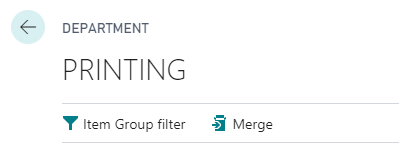
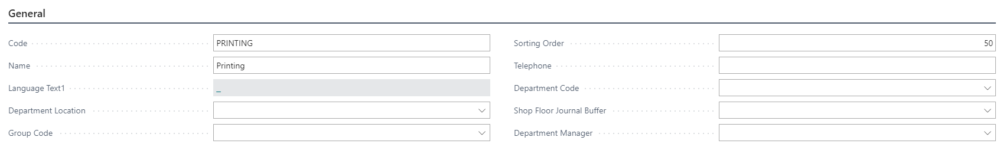
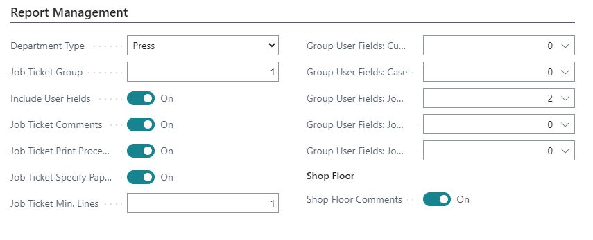
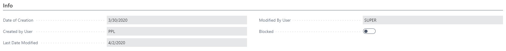

# Departments

Departments are used throughout PrintVis for statistical purposes and constitute the primary grouping for presentation in calculation windows, shop floor interfaces, and reports such as the Job Ticket.

## Usage

Departments affect several areas of the system:

- **Cost center grouping** — All cost centers are connected to a department, so all estimating and job costing is divided into departments
- **Job Ticket layout** — Production departments are presented in the order defined by their sorting position; the Job Ticket group controls whether and how each department appears on the job ticket
- **Shop floor filtering** — The shop floor can filter jobs and cost centers by department
- **Statistical analysis** — Production data is divided and reported by department
- **Sorting in lists** — All lists in the system are sorted in the order dictated by the department

### Department Types

Departments can be assigned a type that helps with categorization:

| Type | Description |
|---|---|
| Blank | No specific type |
| Preflight | Preflight/prepress checking |
| Prepress | Prepress/DTP |
| Repro | Reproduction/color separation |
| Press | Printing press operations |
| Warehouse | Materials storage and movement |
| Post Press | Finishing operations |
| Logistic | Shipping and logistics |

## Setup

Departments are found by searching **PrintVis Departments**.

### General Tab

| Field | Description |
|---|---|
| **Code** | Department code. |
| **Name** | Department name. |
| **Language** | Language for this department. |
| **Department Location** | Physical location associated with this department. |
| **Group Code** | The department group this department belongs to. |
| **Sorting Order** | Alternative sorting order. If blank, departments are ordered by creation order. |
| **Telephone** | Department phone number. |
| **Department Code** | Via the global dimension 1 code field, a filter restricts access to the department. |
| **Shop Floor Journal Buffer** | If set, shop floor entries are collected in this journal for review before posting. |
| **Department Manager** | The PrintVis User assigned as department manager. When cost centers have "Shop Floor posting = Move to journal", entries go to this manager's journal for approval. |
| **Item Group Filter** | Automatically applied to searches for web paper, paper, ink, etc. created in cost centers of this department. |

### Report Management Tab

| Field | Description |
|---|---|
| **Department Type** | Fixed options: Blank, Preflight, Prepress, Repro, Press, Warehouse, Post Press, Logistic. |
| **Job Ticket Group** | Enter **0** to hide from the job ticket. Enter a number to include the department on the job ticket at that position. |
| **Include User Fields** | Include user fields from this department's user field groups in reports. |
| **Job Ticket Comments** | If ticked, this department can be selected when entering internal comments on a case. |
| **Job Ticket Print Processes** | Select if the department has print information on the job ticket and paper should be specified per process. |
| **Job Ticket Specify Paper** | Displays paper information per process (used with Job Ticket Print Processes). |
| **Job Ticket Min. Lines** | Minimum lines reserved for this department on the job ticket. Ensures adequate spacing. |
| **Group User Fields** | Which user field groups are assigned to this department. |
| **Shop Floor Comments** | If ticked, internal "case description" comments appear in the FactBox on the Shop Floor for this department. |

### Merging Departments

If you need to consolidate departments, use the **Merge** function in the department menu rather than deleting and recreating records. This preserves historical data.

### Info Tab

| Field | Description |
|---|---|
| **Date of Creation** | The date this department was created. |
| **Created by User** | The user who created this department. |
| **Last Date Modified** | The date this department was last modified. |
| **Modified by User** | The user who last modified this department. |
| **Blocked** | If ticked, this department is blocked from further use. Use this only if the department is being completely discontinued. For merging, use the Merge function instead. |

## Examples

### Example: Typical Department Structure for an Offset Print Shop

| Code | Name | Type | Job Ticket Group | Sorting Order |
|---|---|---|---|---|
| PREPRESS | Prepress / DTP | Prepress | 1 | 10 |
| PRESS | Press Room | Press | 2 | 20 |
| FINISH | Finishing | Post Press | 3 | 30 |
| SHIP | Shipping | Logistic | 4 | 40 |

This setup puts departments in the correct order on both lists and job tickets.

## See Also

- [Cost Center](../../Pages/pvscostcenter.md)
- [Shop Floor](../shop-floor/shop-floor.md)
- [Job Tickets](../reports/job-tickets.md)
