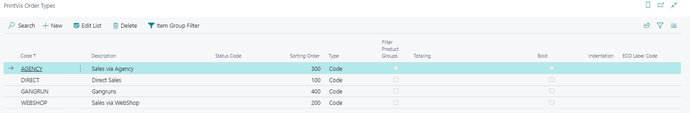

# Order Types

Order Types are used in PrintVis as a general statistics dimension to measure production and categorize jobs. They are typically combined with Product Groups to provide a detailed view of production and sales by type and product.

## Usage

Order Types are selected on the Case Card and serve several purposes:

- **Statistics and reporting** — Provides a dimension for analyzing how much production and revenue comes from each type of work (e.g., Brochures, Labels, Packaging, Digital)
- **Product Group filtering** — Optionally restricts which Product Groups are available when a specific Order Type is selected (via the **Filter Product Group** flag)
- **Status Code control** — The selected Order Type can determine the starting Status Code for a case
- **ECO label assignment** — Automatically assigns an ECO label to all cases with the selected Order Type
- **Responsibility Areas** — Order Types are used in Responsibility Area setup to define type-specific workflows and responsible users
- **Industry Captions** — Caption sets can be assigned per Order Type to customize field labels

## Setup

Order Types are found by searching **PrintVis Order Types**.

### Field Descriptions

| Field | Description |
|---|---|
| **Code** | Order Type code (unique identifier). |
| **Description** | Description of the Order Type. |
| **Status Code** | The starting Status Code automatically applied when this Order Type is selected on a new case. |
| **Sorting Order** | Alternative sorting order. Lists use this order if defined; otherwise, default primary key order is used. |
| **Type** | **Code** = an actual order type; **Heading** = used for grouping order types in lists. |
| **Filter Product Group** | If enabled, only Product Groups set up with an affinity to this Order Type are available for selection on cases. |
| **Eco-Label** | Automatically assigns the selected ECO label to all cases using this Order Type. |

### Relationship Between Order Types and Product Groups

Order Types and Product Groups are typically combined.

Together they provide:

- Fine-grained statistical analysis (e.g., total brochure production broken down by paper type or binding method)
- Template selection (Product Groups define available templates)
- Imposition information

When **Filter Product Group** is enabled on an Order Type, only Product Groups linked to that Order Type are shown on the Case Card, preventing incorrect combinations.

## Examples

### Example: Setting Up Order Types for a Commercial Print Shop

| Code | Description | Type |
|---|---|---|
| COMMERCIAL | Commercial Printing | Heading |
| BROCHURE | Brochures | Code |
| FLYER | Flyers | Code |
| BUSINESS-CARD | Business Cards | Code |
| LARGE-FORMAT | Large Format | Heading |
| BANNER | Banners | Code |
| POSTER | Posters | Code |

The headings group the codes in lookup lists for easier selection.

### Example: Order Type Controlling the Starting Status Code

A packaging company wants new cases with Order Type PACKAGING to automatically start at a status called PACKAGING-REQUEST (which has different checks than the standard REQUEST status):

1. Create a Status Code called PACKAGING-REQUEST.
2. On the PACKAGING Order Type, set **Status Code** = PACKAGING-REQUEST.
3. All new cases with Order Type PACKAGING now start at PACKAGING-REQUEST automatically.

## See Also

- [Product Groups](product-groups.md)
- [Status Codes](status-codes.md)
- [Responsibility Areas](responsibility-areas.md)
- [Industry Captions](../setup/industry-captions.md)
