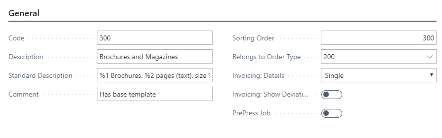
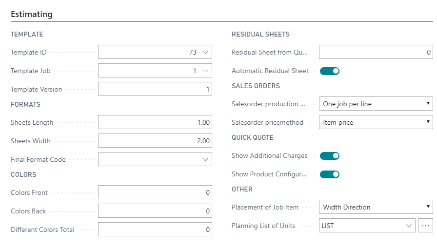
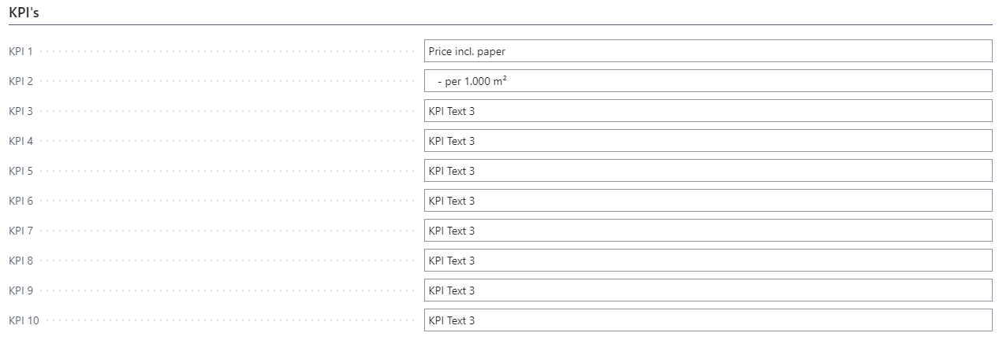

# Product Groups

Product Groups control a large part of the basic information on a print job and categorize the company's different products for statistical information — for example, on production and sales. A Product Group is attached directly to a Case and is also used on specific job lines to control imposition information and basic templates.

## Usage

Product Groups serve several functions in the system:

- **Statistical grouping** — Production and sales can be analyzed by Product Group
- **Template association** — Default estimation templates are linked to Product Groups
- **Imposition information** — Basic imposition defaults are set per Product Group
- **Eco-label control** — ECO label requirements can be set per Product Group
- **Standard texts** — Default job ticket texts can be assigned
- **Basic planning (Milestones)** — Production milestones can be set up per Product Group
- **Invoice building** — Invoice template assignments can be made per Product Group
- **Scrap and Speed calculations** — Product Groups are used as parameters in estimation calculations

Product Groups are also used in **Responsibility Areas** to define type-specific workflows.

## Setup

Product Groups are found by searching **PrintVis Product Groups**.

### General Tab Fields

| Field | Description |
|---|---|
| **Code** | Unique Product Group code (max. 20 characters). |
| **Description** | Product Group name. |
| **Sorting Order** | Alternative sorting order for lookups. |
| **Type** | **Code** = an actual product group; **Heading** = used for grouping in lists. |
| **Eco-Label** | The ECO label required for this product type. |
| **Template** | The default estimation template associated with this Product Group. |
| **Template Filter** | Filter controlling which templates are available when this Product Group is selected. |
| **Invoice Template** | Default invoice template for cases with this Product Group. |
| **Filter Order Type** | If set, this Product Group is only available when the specified Order Type is selected. |

### Imposition Tab Fields

| Field | Description |
|---|---|
| **Imposition Type** | Default imposition type for jobs in this Product Group. |
| **Standard Format** | Default format for impositions. |
| **Grain Direction** | Default grain direction preference. |

### Planning Tab Fields

| Field | Description |
|---|---|
| **Milestones** | Production milestones associated with this Product Group. Used in planning to set up default milestone schedules. |

## Examples

### Example: Product Groups for a Brochure Printer

| Code | Description | Type |
|---|---|---|
| BOUND-BOOKS | Bound Books | Heading |
| PERFECT-BOUND | Perfect Bound | Code |
| SADDLESTITCH | Saddle Stitch | Code |
| WIRE-O | Wire-O Bound | Code |
| FLAT-WORK | Flat Work | Heading |
| FLYER | Flyers | Code |
| POSTCARD | Postcards | Code |
| BUSINESS-CARD | Business Cards | Code |

### Example: Linking a Template to a Product Group

1. Create an estimation template for a standard 8-page saddle-stitched brochure.
2. Open the SADDLESTITCH Product Group.
3. Set **Template** = the brochure template code.
4. Now, when a new case is created with Product Group = SADDLESTITCH, the template is automatically available for selection.

## See Also

- [Order Types](order-types.md)
- [Templates](../estimation/templates.md)
- [Status Codes](status-codes.md)
- [Responsibility Areas](responsibility-areas.md)
