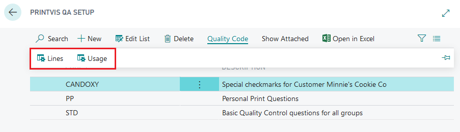
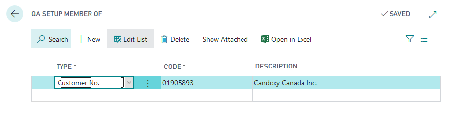
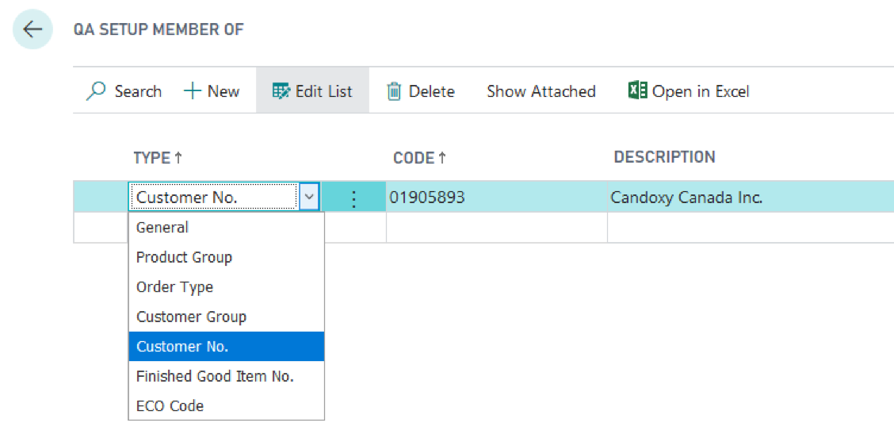
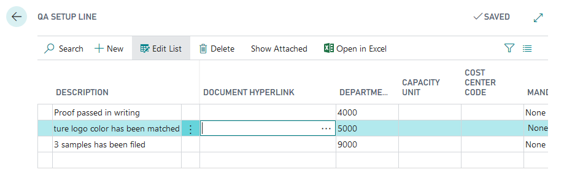
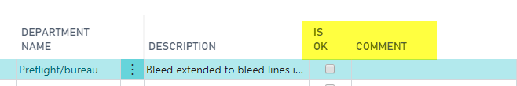
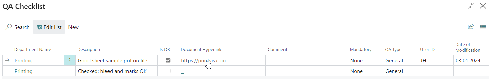
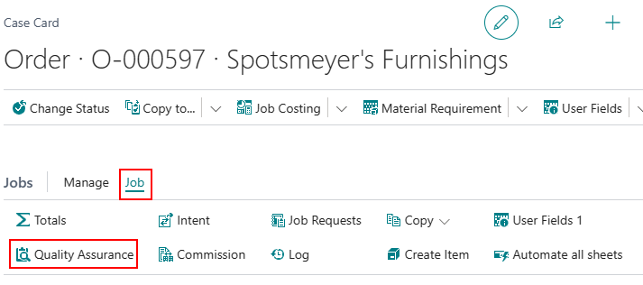

# Quality Assurance

PrintVis Quality Assurance (QA) provides a customizable checklist for production quality control. QA checklists can be displayed on the Case Card Job and on the Shop Floor Role Center, enabling operators to complete quality checks directly in the system.

## Usage

QA checklists are displayed based on the parameters configured in the QA Setup. The system determines which QA lines to show based on the case's order type, customer group, customer number, finished goods item, or ECO code.

QA lines can be:
- **General** — Always shown regardless of order type or customer
- **Order Type specific** — Shown for specific order types
- **Customer Group specific** — Shown for specific customer groups
- **Customer specific** — Shown for specific customers
- **Finished Good Item specific** — Shown when a specific item is on the job line
- **ECO Code specific** — Shown when a specific ECO label is set

If a case matches multiple criteria, the checklist combines questions from all applicable groups.

### QA Line Completion Rules

QA lines have a **QA Type** that controls when the check must be completed:

| Type | Description |
|---|---|
| **General** | Must be completed before marking a job as "Job Complete". If not completed, the system prevents job completion. |
| **Production** | Must be completed before starting production time. If not completed, the system prevents recording production time. |
| **Make Ready** | Must be completed before starting make-ready time. If not completed, the system prevents recording make-ready time. |

Lines marked as OK store the User ID and timestamp showing when and by whom the line was completed.

### Hyperlinks on QA Lines

The **Document Hyperlink** field on a QA line allows linking to:
- Files (e.g., work instructions, specifications)
- Web pages (e.g., customer portals, standards documents)

When the operator clicks the hyperlink, the linked document or page opens.

## Setup

QA Setup is accessed by searching **QA Setup**.

### QA Groups and Usage

1. Search for **QA Setup**.
2. Create a QA Group for each set of questions.
3. For each group, configure the **Usage** to define when the questions apply:

| Option | Description |
|---|---|
| **General** | Questions are always displayed. |
| **Order Type** | Questions are displayed if the case order type matches. |
| **Customer Group** | Questions are displayed if the customer is in the specified group. |
| **Customer No.** | Questions are displayed if the case is for this specific customer. |
| **Finished Good Item No.** | Questions are displayed if the job line contains this specific item. |
| **ECO Code** | Questions are displayed if the specified ECO label is set. |

### QA Lines

For each QA Group, add lines with the specific questions or checks:

| Field | Description |
|---|---|
| **Description** | The question or check to display. |
| **Field Mandatory** | **None** = optional; **Checkmark only** = must check "Is OK"; **Comments only** = must fill Comments; **Both** = must check Is OK and fill Comments. |
| **QA Type** | General, Production, or Make Ready (see descriptions above). |
| **Document Hyperlink** | Optional link to a file or web page with additional information. |

## Examples

### Example: Press Quality Check

A printing company wants operators to confirm press settings before starting production on any press-related job:

1. Create a QA Group: Code = PRESS-QA, Description = "Press Quality Checks".
2. Set Usage = **Order Type** = COMMERCIAL.
3. Add QA Lines:
   - "Paper loaded and verified" — QA Type: Make Ready, Mandatory: Checkmark only
   - "Ink densities calibrated" — QA Type: Make Ready, Mandatory: Checkmark only
   - "Press proof approved" — QA Type: Production, Mandatory: Both (checkmark + comments)
   - "Final sheet count verified" — QA Type: General, Mandatory: Checkmark only

Now, for any case with Order Type = COMMERCIAL, these checks must be completed at the appropriate stages in production.

### Troubleshooting: QA Lines Not Appearing

If expected QA lines do not appear on the Shop Floor checklist:

1. Verify the **Usage** configuration matches the case's order type, customer, etc.
2. Check that the QA Group has a matching usage for "General" if you expect it to always appear.
3. If searching for a job with Job = 0 on the shop floor, the system filters to all jobs.

## See Also

- [Case Card](case-card.md)
- [Shop Floor](../shop-floor/shop-floor.md)
- [Order Types](order-types.md)
