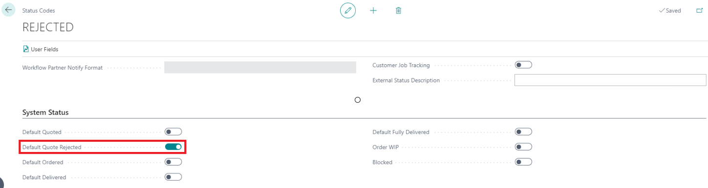
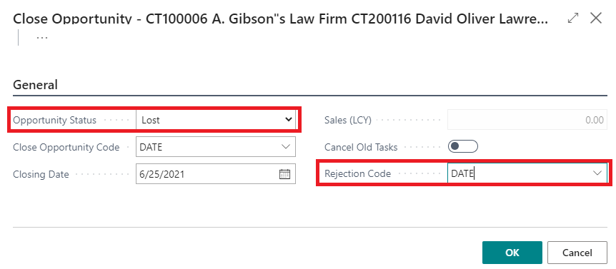
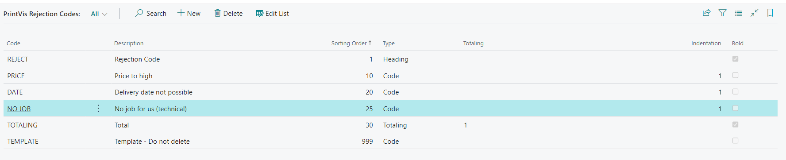

# Rejection Codes

Rejection Codes are used in PrintVis to specify reasons when a case (quote) is rejected. This information can be analyzed statistically to understand why quotes are lost, enabling business decisions around pricing, capacity, and customer management.

## Usage

Rejection Codes are applied when a case changes to a rejected status. They appear in:

- PrintVis case analysis and reporting
- Power BI reports (where rejection trends can be visualized)
- Business Central Relationship Management — when an opportunity is closed as "Lost," the rejection code can automatically be transferred to the PrintVis case

### Integration with BC Relationship Management

When an opportunity is closed and marked as Lost:
1. If the opportunity's status code is marked as **Default Quote Rejected** in PrintVis Status Codes, the corresponding PrintVis case automatically moves to the default quote rejected status.

2. The **Rejection Code** from the Close Opportunity page is transferred to the PrintVis case.

This integration provides a seamless connection between CRM opportunity management and PrintVis case management.

## Setup

Rejection Codes are found by searching **PrintVis Rejection Codes**.

### Field Descriptions

| Field | Description |
|---|---|
| **Code** | Unique identifier for the rejection code (max. 20 characters). |
| **Description** | Meaningful description of the rejection reason. |
| **Sorting Order** | Numeric sorting order for display in lookups and reports. |
| **Type** | **Heading** = section header grouping codes; **Code** = individual rejection code; **Totaling** = sums other codes in reports. |
| **Totaling** | Used when Type = Totaling to specify which codes to sum. |
| **Indentation** | Display indentation level: Blank, 1, or 2. Used for report formatting. |
| **Bold** | If checked, displays the line in bold on reports. |

### Structuring Rejection Codes

Organize rejection codes into logical groups using Headings and Totaling rows. This makes reports and analysis more readable.

**Example structure:**

| Code | Description | Type |
|---|---|---|
| PRICING | Pricing Related | Heading |
| TOO-EXPENSIVE | Price too high | Code |
| COMPETITOR | Competitor offered lower price | Code |
| TOTAL-PRICING | Total Pricing Rejections | Totaling |
| SCHEDULE | Schedule Related | Heading |
| DEADLINE | Could not meet deadline | Code |
| CAPACITY | No production capacity | Code |
| TOTAL-SCHEDULE | Total Schedule Rejections | Totaling |

## Examples

### Example: Analyzing Quote Rejection Trends

After setting up rejection codes, salespeople apply them when changing a case to Rejected status. Over time, this data can be analyzed to identify:

- Most common rejection reasons by customer group
- Seasonal patterns in rejection types
- Whether pricing is a competitive issue in certain product groups

This data can be viewed through PrintVis Analysis Pages or exported to Power BI for visualization.

## See Also

- [Status Codes](status-codes.md)
- [Case Card](case-card.md)
- [Analysis Pages](../reports/analysis-pages.md)
