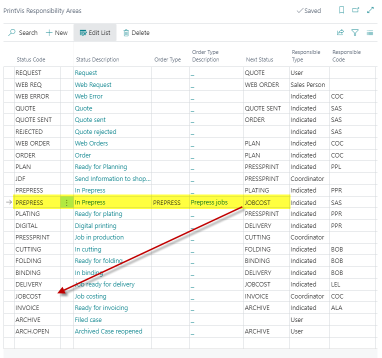

# Responsibility Areas

Responsibility Areas define the company's case flow. They control who becomes responsible for a case when it reaches a specific Status Code and what the next status in the workflow should be.

## Usage

Responsibility Areas are used for:

- **Designating responsibility** — Automatically assigning the current responsible user (or user group) when a case reaches a specific Status Code
- **Defining the next status** — Suggesting the next logical Status Code in the workflow
- **Order-Type-specific flows** — Setting up different workflows for different Order Types
- **Customer-specific flows** — Setting up different flows for specific customers or customer groups

When a case advances to a new Status Code, PrintVis looks up the Responsibility Areas table to find the matching row and automatically:
1. Updates the **Responsible** field on the Case Card
2. Suggests the **Next Status** when the user clicks "Next Status"

### Priority of Responsibility Area Lookup

PrintVis searches for a matching Responsibility Area in this priority order:
1. Exact match on Status Code + Order Type + Customer No.
2. Status Code + Order Type + Customer Group
3. Status Code + Order Type (no customer)
4. Status Code only (no order type or customer)

A general setup without Order Type or Customer is required as a fallback for all cases.

## Setup

Responsibility Areas are found by searching **PrintVis Responsibility Areas**.

### Field Descriptions

| Field | Description |
|---|---|
| **Status Code** | The Status Code this responsibility area applies to. |
| **Status Description** | Auto-filled from the Status Code. Not editable. |
| **Next Status** | The Status Code to suggest as the next step. |
| **Order Type** | If set, this row only applies to cases with this Order Type. |
| **Order Type Text** | Auto-filled from the Order Type. Not editable. |
| **Customer Group** | If set, this row only applies to cases for customers in this group. |
| **Sell to No.** | If set, this row only applies to cases for this specific customer. |
| **Responsible** | The user (or user group) that becomes responsible when a case reaches this Status Code. |
| **Responsible Type** | Whether the responsible is a specific user, a user group, or determined by another rule. |
| **Department** | Optionally links the responsible to a department. |

### Setting Up a Basic Status Flow

For a basic setup without Order Type or customer-specific flows:

1. Search for **Responsibility Areas**.
2. Create one row for each Status Code in your workflow.
3. Set the **Status Code** and **Next Status** for each row.
4. Set the **Responsible** user or group for each row.
5. Leave Order Type and Customer fields blank (these rows serve as the general fallback).

### Setting Up an Order-Type-Specific Flow

For a packaging workflow that differs from the standard commercial print workflow:

1. Create Responsibility Area rows with **Order Type** = PACKAGING.
2. Set the Status Code, Next Status, and Responsible for each step.
3. These rows will override the general rows for cases with Order Type = PACKAGING.
4. Keep the general rows (without Order Type) as fallback for all other order types.

## Examples

### Example: Basic Commercial Print Flow

| Status Code | Next Status | Responsible |
|---|---|---|
| REQUEST | QUOTE | Estimator team |
| QUOTE | ORDER | Salesperson |
| QUOTE-SENT | ORDER | Salesperson |
| ORDER | PROD | Coordinator |
| PROD | QUALITY | Shift supervisor |
| QUALITY | SHIPPED | Shipping team |
| SHIPPED | INVOICED | Finance team |

## See Also

- [Status Codes](status-codes.md)
- [Order Types](order-types.md)
- [Case Card](case-card.md)
- [Users](../setup/users.md)
