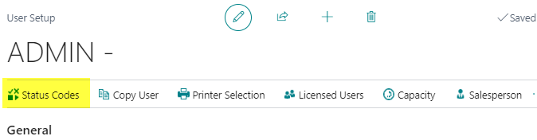
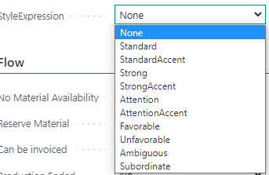
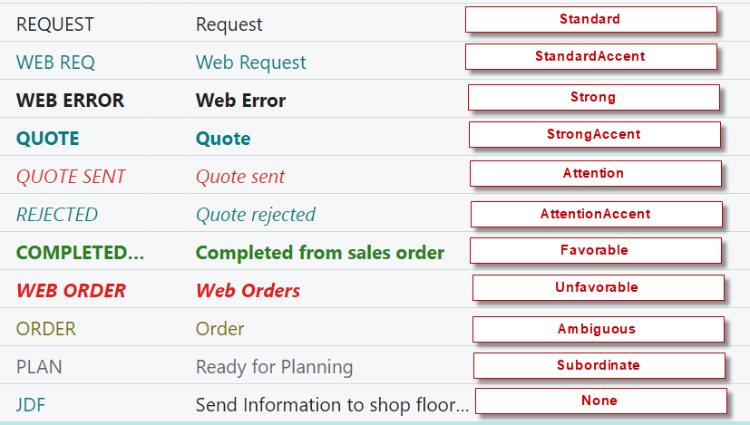

# Status Codes

Status Codes are an integrated tool in PrintVis that direct the workflow of a case through the company. They control whether job costing can be registered, planning can occur, invoicing is possible, and more. Status Codes also control case-level checks and validations before a case can advance.

## Usage

Every case in PrintVis has a Status Code that represents its current stage in the production workflow. Status Codes define:

- The type of case at that stage (Request, Quote, Order, Production Order)
- What actions are allowed (planning, job costing, invoicing, archiving)
- Whether materials can be reserved
- Whether historical data (quote lines) should be locked when an order is created
- When to create SharePoint folders or trigger CIM/JDF communications
- Deadline calculation for the case
- Warnings or stops when vital information is missing

### Status Code Types

Status Codes are assigned a type to make filtering easier in overviews and analysis:

| Type | Description |
|---|---|
| **Request** | Initial inquiry stage |
| **Quote** | Quote sent to customer |
| **Order** | Confirmed customer order |
| **Production Order** | Released to production |

### User-Specific Status Codes

It is possible to limit which Status Codes a user can change to. When configured on the PrintVis User, the user can only move cases to the status codes assigned to them.

**Example:** A salesperson can only change status to Request, Quote Sent, or Order. They cannot change to Rejected or Archived — those must be done by someone with broader rights.

### Status Code Checks and Validations

Standard checks can be configured to warn or stop a case from advancing if:
- Order Type is missing
- Product Group is missing
- Salesperson is not assigned
- Coordinator is not assigned
- ECO label is not set
- Invoicing information is missing

Custom checks can also be developed and linked to specific Status Codes.

### Analysis

The different Status Codes can be used for analysis through the PrintVis Analysis pages, including:
- PrintVis Open Quotes
- PrintVis Rejected Quotes
- PrintVis Case Complexity

## Setup

The Status Code Setup can be found by searching **PrintVis Status Codes**.

### General Tab Fields

| Field | Description |
|---|---|
| **Code** | Unique identifier for the Status Code (max. 20 characters). |
| **Text** | Status Code name. |
| **Description** | Meaningful description of what this status represents. |
| **Deadline Period** | Date formula for calculating a new deadline when a case reaches this status (e.g., `<2D>` = 2 days from today, `<1W>` = 1 week, `<CM>` = end of current month). |
| **Next Status** | The default next status to suggest when the user clicks "Next Status" on the Case Card. |
| **Type** | Request, Quote, Order, or Production Order. Used for filtering and analysis. |
| **Style Expression** | Controls how the status appears in the case list (color, bold, italic, etc.). Available options:  Examples:  |
| **Allow Planning** | Whether planning is allowed at this status. |
| **Allow Job Costing** | Whether job costing registrations are allowed. |
| **Allow Invoicing** | Whether invoicing is allowed. |
| **Allow Archiving** | Whether the case can be archived at this status. |
| **Allow Material Reservation** | Whether materials can be reserved. |
| **Default Quote Rejected** | Marks this as the default "rejected" status for CRM opportunity close integration. |
| **Lock Quote Lines** | Whether quote lines should be locked when an order line is created (preserves historical quote data). |
| **Create SharePoint Folder** | Whether to create a SharePoint folder when a case reaches this status. |
| **Send CIM/JDF** | Whether to trigger a CIM/JDF message to an external system. |

### Setting Up the Status Code Flow

After creating all Status Codes, configure the flow in **Responsibility Areas**:
- Define the **Next Status** for each Status Code in the context of each Order Type
- Assign who becomes **responsible** for a case at each Status Code

## Examples

### Example: Typical Status Code Flow for a Commercial Print Shop

| Status Code | Type | Description |
|---|---|---|
| REQUEST | Request | Initial inquiry received |
| QUOTE | Quote | Estimate completed, quote ready |
| QUOTE-SENT | Quote | Quote sent to customer |
| ORDER | Order | Customer confirmed the order |
| PROD | Production Order | Released to production |
| QUALITY | Production Order | In quality check |
| SHIPPED | Production Order | Goods shipped |
| INVOICED | Order | Invoice posted |
| REJECTED | Quote | Quote was rejected |
| ARCHIVED | Order | Case archived |

### Example: Deadline Period Formula

Setting the **ORDER** status code's Deadline Period to `<1W>` means that whenever a case changes to ORDER status, the system automatically suggests a deadline one week from today. Users can still override this manually.

## See Also

- [Responsibility Areas](responsibility-areas.md)
- [Case Card](case-card.md)
- [Order Types](order-types.md)
- [Users](../setup/users.md)
