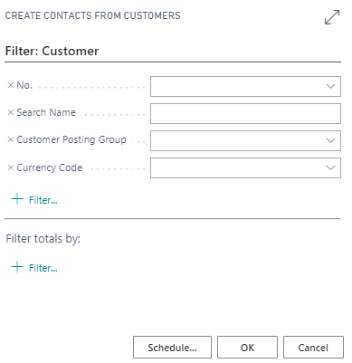
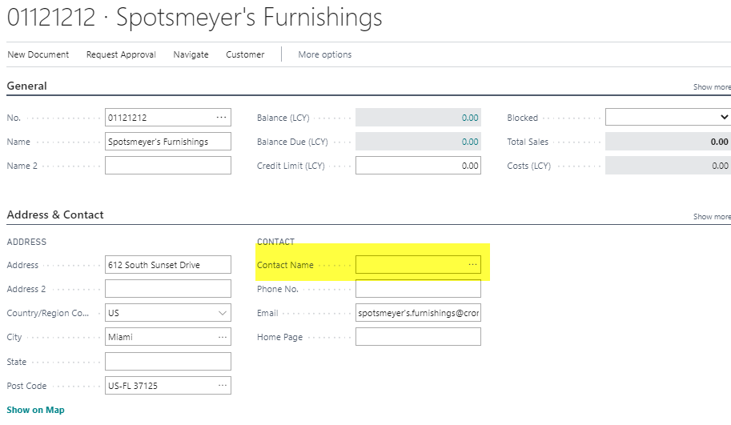
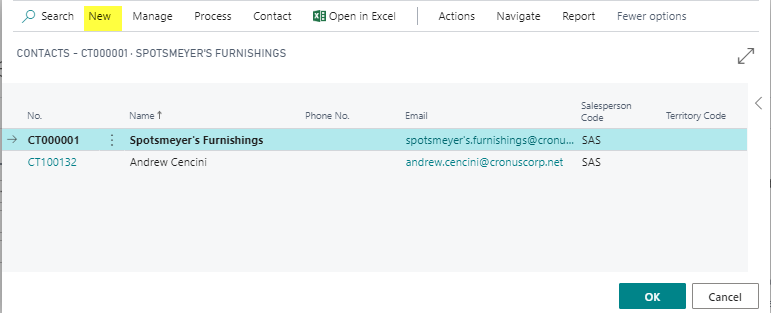
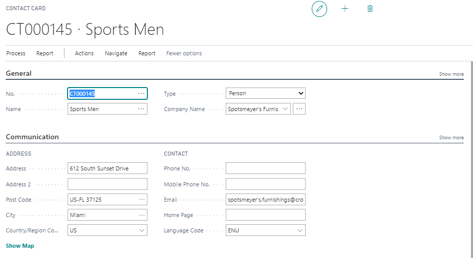

# Contacts

Contacts in Business Central represent people and companies you interact with, including customers, prospects, vendors, banks, law firms, consultants, and more. PrintVis can use contacts to create cases even before a formal customer record exists.

## Usage

Contacts are used in PrintVis for:

- **CRM and opportunity management** — Contacts are linked to BC opportunities, which can be connected to PrintVis cases
- **Creating cases for prospects** — A case can be created using only a Contact (no customer record required), useful for quoting to new prospects
- **Contact persons** — Individual contacts are linked to customer companies as contact persons, and appear on the Case Card

### Creating a PrintVis Case with a Contact Only

You can create a PrintVis case linked to a contact without a formal customer record. This is useful when quoting to a prospect:

1. Create a Contact for the prospect company.
2. Open a new Case Card.
3. In the **Sell-To No.** field, select or enter the contact instead of a customer number.
4. Complete the case as normal.

If the prospect becomes a customer, you can convert the contact to a customer and link the existing cases to the new customer record.

## Setup

### Creating a Company Contact from Scratch

1. Search for **Contacts**.

2. Click **New**.
3. Set **Type** = Company.
4. Enter the contact number (or let the number series auto-assign one).
5. Fill in all required fields (Name, Address, etc.).

### Creating a Person Contact from a Customer

1. Open the **Customer Card**.
2. Navigate to the **Contacts** subpage or use the Contacts action.

3. Click **New** to create a new person contact linked to this customer.

4. Fill in the contact card (Name, Email, Phone, Title, etc.).

### Creating Contacts from Existing Customer, Vendor, or Bank Accounts

Business Central provides batch jobs to create contacts automatically from existing records:

1. Search for **Create Contacts from Customers** (or Vendors/Bank Accounts).
2. Set filters if you want to create contacts for specific records only.
3. Click **OK** to create contacts.

The next available contact numbers from the number series are assigned. Business relations are automatically linked.

!!! note "Marketing Setup"
    Before creating contacts, ensure the **Marketing Setup** has the correct settings for business relation codes for customers, vendors, and bank accounts.

## Examples

### Example: Creating a Contact for a New Prospect

A sales rep visits a potential customer at a trade show. To track the opportunity:

1. Search for Contacts → New.
2. Set Type = Company.
3. Enter the company name, address, and primary contact information.
4. Create a BC Opportunity linked to this contact.
5. Create a PrintVis Case using the contact as the Sell-To (even without a customer record).
6. Quote the job.
7. If the prospect approves the quote, convert the contact to a customer and update the case.

## See Also

- [Customers](customers.md)
- [Case Card](../case-management/case-card.md)
