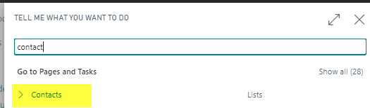
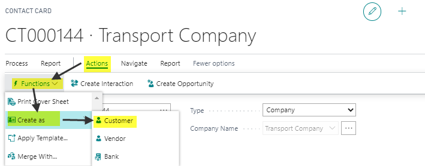
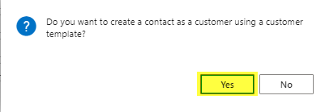
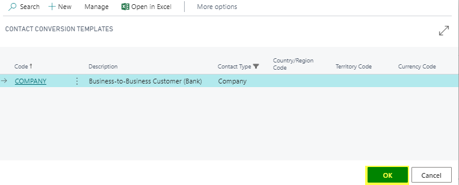
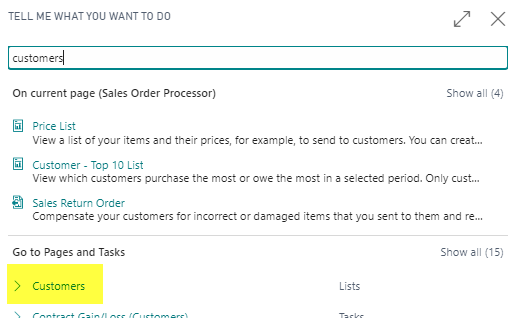
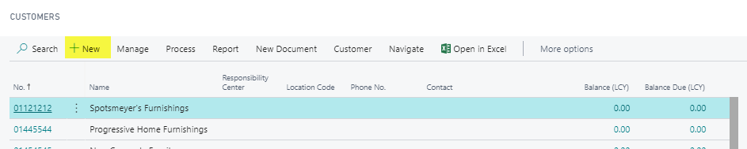
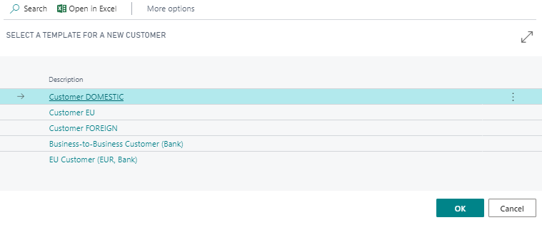

# Customers

Customers in PrintVis are managed through the standard Business Central Customer Card. PrintVis extends the customer card with print-specific fields and integrates customer data throughout the case and job management workflow.

## Usage

Customers are used on the Case Card (Sell-To No.) and are the foundation for invoicing, pricing, and CRM. Customer data flows through:

- Case Card (customer name, address, contact, payment terms)
- Price Lists (customer-specific pricing)
- Credit limit checks
- Invoice posting (using customer posting groups)
- CRM and opportunity management

### Creating a Case Without a Customer

It is possible to create a PrintVis Case with only a Contact (no formal customer record). This is useful for prospects where a full customer record has not yet been created. See [Contacts](contacts.md) for details.

## Setup

### Creating a New Customer from an Existing Contact

1. Go to the **Contact List**.

2. Find the contact you want to convert to a customer.
3. Open **Actions** → **Functions** → **Create As**.

4. Select the option to create as a Customer.

5. Choose the appropriate **Customer Template**.

6. The system creates a customer card linked to the contact.

### Creating a New Customer Directly

1. Go to the **Customer List** (search "Customers").

2. Click **New**.

3. Select a **Customer Template** to pre-fill default settings.

4. Fill in all required fields.
   - **Name**
   - **Address** (Street, City, Post Code, Country)
   - **Contact** (primary contact person)
   - **Gen. Bus. Posting Group**
   - **VAT Bus. Posting Group**
   - **Customer Posting Group**
   - **Payment Terms**
   - **Currency Code** (if not in local currency)

### Customer Templates

Customer Templates pre-fill common fields for new customers, reducing data entry. Templates typically include:

- Default posting groups
- Default payment terms
- Currency settings
- Country/region

Create templates by searching **Customer Templates** in Business Central.

### PrintVis-Specific Customer Settings

PrintVis adds several fields to the customer card relevant to print jobs:

- **Customer Group** — Used in Responsibility Areas and for customer-specific QA checklists
- **Credit Limit** — Used with the PrintVis Credit Limit Check
- **User Fields** — Custom fields for print-specific customer data

## Examples

### Example: Creating a New Commercial Print Customer

1. Go to Customer List → New.
2. Select the "Commercial Customer" template.
3. Fill in:
   - Name: ABC Corporation
   - Address: 123 Main St, Springfield, IL 62701
   - Gen. Bus. Posting Group: DOMESTIC
   - Payment Terms: NET30
4. Link or create a primary Contact for the customer.
5. The customer is now available for use on PrintVis Case Cards.

## See Also

- [Contacts](contacts.md)
- [Customer Groups](customer-groups.md)
- [Currency Management](currency.md)
- [Case Card](../case-management/case-card.md)
