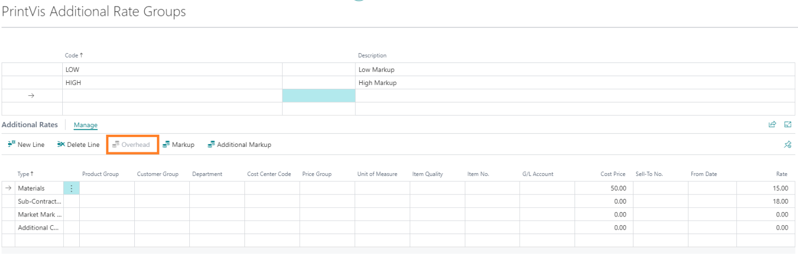
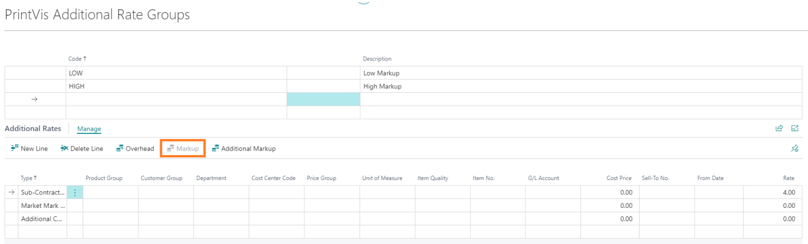

# Additional Rates

Additional Rates (also called Surcharges) are extra costs that can be applied to jobs in PrintVis estimation. They are used for costs that are not captured by the standard cost center calculation — such as rush fees, special handling charges, environmental fees, or packaging charges.

## Usage

Additional Rates appear in the estimation as surcharge lines. They can be:
- **Manual** — The estimator selects and adds them to a job
- **Automatic** — Triggered automatically based on conditions (e.g., order type, quantity, material)
- **Popup-driven** — A popup appears asking the estimator to confirm or enter a value

Additional Rates can be:
- A fixed amount per job
- A percentage of the base cost
- A per-unit charge
- Combined (fixed + percentage)

### Surcharge Popups

By default, PrintVis shows a popup when a surcharge is automatically triggered, asking the estimator to confirm. This popup can be suppressed for specific surcharges to streamline the estimation process. See [Tips & Tricks](tips-tricks.md) for how to avoid extra surcharge popups.

### One Surcharge Across Multiple Cost Centers

It is possible to configure a surcharge that applies across multiple cost centers (e.g., an environmental fee that applies to all press operations). See the legacy documentation for setup details.

## Setup

Additional Rates are found by searching **PrintVis Additional Rates**.

!!! warning "Assisted Setup Note"
    Additional Rates are one of the sections in PrintVis Assisted Setup where standard rates can be imported from the reference database.

### Field Descriptions

| Field | Description |
|---|---|
| **Code** | Unique identifier for the additional rate. |
| **Description** | Name of the additional rate. |
| **Rate Type** | How the rate is calculated: Fixed Amount, Percentage, Per Unit, or combination. |
| **Rate** | The charge amount or percentage. |
| **Trigger** | When/how this rate is applied: Manual, Automatic, or Popup. |
| **G/L Account** | The G/L account to post this charge to (for invoicing). |

## Examples

### Example: Rush Order Surcharge

A print shop charges a 25% rush fee for orders needed within 24 hours:

1. Create Additional Rate: Code = RUSH, Description = "Rush Order Surcharge".
2. Set Rate Type = Percentage, Rate = 25%.
3. Set Trigger = Manual (estimator adds it when applicable).
4. The estimator manually adds the RUSH surcharge to any job with a rush deadline.

## See Also

- [Alternative Rates](alternative-rates.md)
- [Calculation Units](calculation-units.md)
- [Tips & Tricks](tips-tricks.md)
