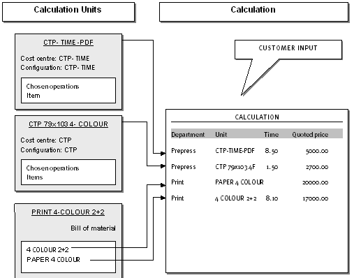
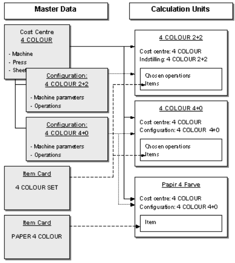

# Calculation Units

Calculation Units are the core building blocks of the PrintVis estimation system. Each Calculation Unit calculates a specific part of a print job's production cost, linking master data (cost centers, operations, items) into a reusable, consistent calculation module.

## Usage

When estimating a job, the estimator selects the Calculation Units that together represent all the production processes for that job. Each unit calculates its portion of the cost, and the sum of all units = the total estimated production cost.

Calculation Units are analogous to small spreadsheets:
- Each one calculates a limited, specific part of the production
- They link to cost centers, operations, and items
- They control what is printed on the job ticket

### The Function of Calculation Units

Calculation Units are used to estimate:
- **Time consumption** — How long each process takes (linked to cost center operations and speed tables)
- **Item consumption** — How much material is used (linked to items and quantities)

They also control how calculation data is printed on the job ticket.

### Using Calculation Units

On the Estimating page of a job:
1. Calculation units are selected for each production process.
2. The user enters job-specific inputs (quantity, pages, format, hours, etc.).
3. Each unit calculates its costs automatically from the master data.
4. Manual/fixed entries are only needed where automation cannot determine the value.

### Userfields on Calculation Units

If **Enable User Fields** is turned on in General Setup, calculation units support User Fields that allow custom data entry at the calculation unit level.

## Setup

### Design Principles

When designing calculation units, consider:

1. **What must the unit calculate?** — Time, materials, or both?
2. **Which elements must be displayed?** — On the estimating page and on the job ticket?
3. **What level of detail is needed?** — More detail = more flexibility, but also more complexity for the estimator.

In order to estimate time consumption and/or item consumption, you need to connect every calculation unit to the cost center, the configuration, and the selected operations (time). Then you connect items from the items table.

Via Calculation Units, you filter, select, and combine elements from master data into smaller, more manageable portions.

**Recommended approach:**
1. Define what the calculation unit must calculate (or display/print).
2. Set up the relevant parts.
3. Test the setup.
4. Correct errors and retest.

### Calculation Unit Setup Fields

Access Calculation Units by searching **PrintVis Calculation Units** or via the **Estimation** menu in the Admin Role Center.

| Field | Description |
|---|---|
| **Code** | Unique identifier for the calculation unit. |
| **Description** | Name of the calculation unit. |
| **Cost Center** | The cost center this unit is linked to. |
| **Configuration** | The specific machine configuration (if the cost center has multiple configurations). |
| **Department** | The department this unit belongs to (for job ticket grouping). |
| **Sorting Order** | Controls the display order in the estimating window. |
| **Type** | Time, item, or combination. |
| **Speed Table** | The speed table used to calculate run time. |
| **Scrap Group** | The scrap group used to calculate material waste. |

### Calculation Lines

Each Calculation Unit has lines that define:
- Which operations to calculate
- Which items to include
- How quantities are derived (formulas, fixed values, user input)
- Whether the line appears on the job ticket

### An Example Setup: CTP Calculation Unit

A printing works has a CTP machine for plate production. Plates come in two sizes: 52×74 cm and 72×104 cm.

**Master data created:**
- Cost Center: CTP TIME (for labor/time)
- Cost Center: CTP PLATES (for plate items)
- Operations: Preparation, Imposition, Terminal time, Control time, Archiving
- Items: Plate 52×74, Plate 72×104

**Calculation Units created:**
- CTP PREP: Links to CTP TIME, calculates preparation and imposition time
- CTP OUTPUT: Links to CTP PLATES, calculates plate quantity from number of colors and impositions

The estimator selects both CTP PREP and CTP OUTPUT when estimating any job that requires CTP output.

## Examples

### Example: Time-Based Calculation Unit for DTP

A DTP (prepress) calculation unit calculates the time a DTP operator spends preparing files:

1. Cost Center: DTP (linked to the DTP department)
2. Operation: DTP Hours (hourly rate applied)
3. Line: Input field for hours — the estimator manually enters estimated DTP hours
4. Result: DTP cost = entered hours × DTP hourly rate

### Example: Speed-Table-Based Calculation Unit for a Press

A press calculation unit calculates run time automatically:

1. Cost Center: 4-COLOR PRESS
2. Speed Table: HEIDELBERG-SM74 (contains speeds by format)
3. Line: Run time = Sheets ÷ Speed (from speed table for the job's format)
4. Result: Press run cost = calculated run time × press hourly rate

The estimator does not need to manually enter any time — it is calculated automatically from the sheet count and format.

## See Also

- [Estimation Overview](overview.md)
- [Calculation Formulas](calculation-formulas.md)
- [Speed Tables](speed-tables.md)
- [Cost Center](../../Pages/pvscostcenter.md)
