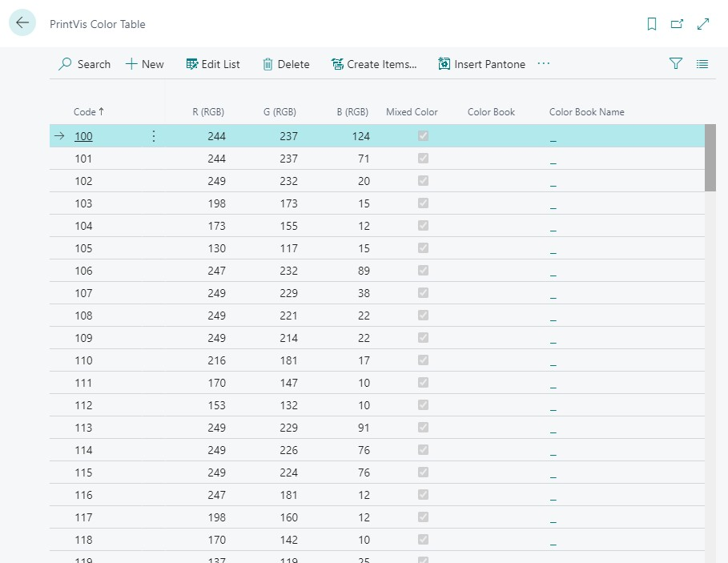
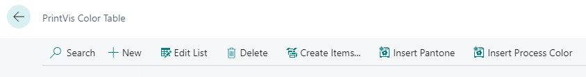

# Color Table

The Color Table in PrintVis defines the color combinations used in estimation and how they affect press make-ready time and ink setup. Colors are a key input when estimating printing costs, as the number and type of colors directly affects machine setup time and plate costs.

## Usage

The Color Table is referenced when:
- Setting up colors on a job line (Colors Front / Colors Back fields on the Case Card)
- Calculating make-ready time in press calculation units
- Calculating plate quantities in CTP calculation units

Color entries define:
- What color combinations are available (e.g., 1/0, 4/4, 5/1+CMYK)
- Whether special inks (Pantone, varnish, UV) are included
- Make-ready time adjustments for color changes

## Setup

The Color Table is set up via the **PrintVis Assisted Setup** during initial configuration, or can be accessed directly.

!!! warning "Assisted Setup Note"
    The Color Table section in Assisted Setup auto-marks itself as completed after you click OK. It cannot be reopened from Assisted Setup. Make any changes directly in the Color Table setup page after initial setup.

### Color Table Fields

| Field | Description |
|---|---|
| **Code** | Color combination code (e.g., 1/0, 4/4, 4+1/4+1). |
| **Description** | Description of the color combination. |
| **Colors Front** | Number of colors on the front of the sheet. |
| **Colors Back** | Number of colors on the back of the sheet. |
| **Special Colors Front** | Number of special/Pantone colors on the front. |
| **Special Colors Back** | Number of special/Pantone colors on the back. |
| **Make Ready** | Additional make-ready time factor for this color combination. |

## Examples

### Example: Standard Color Combinations

| Code | Description | Front | Back |
|---|---|---|---|
| 1/0 | 1 color, simplex | 1 | 0 |
| 4/0 | 4-color, simplex | 4 | 0 |
| 4/4 | 4-color, duplex | 4 | 4 |
| 4+1/4 | CMYK + 1 Pantone front, 4 back | 5 | 4 |
| 5/5 | 4-color + 1 Pantone, duplex | 5 | 5 |

## See Also

- [Estimation Overview](overview.md)
- [Calculation Units](calculation-units.md)
- [Format Codes](format-codes.md)
