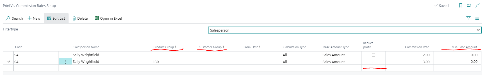
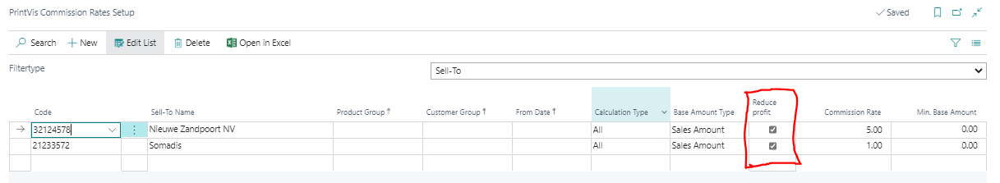

# Commission Setup

Commission Setup in PrintVis allows you to configure automatic commission calculations for salespeople based on invoiced sales. Commissions can be set up as a percentage of revenue or profit.

## Usage

When invoices are posted, PrintVis can automatically calculate commission amounts for the assigned salesperson. Commission data can then be reported and used for payroll or performance tracking.

## Setup

Commission Setup is found via the Estimation setup area.

## Examples

!!! warning "Missing Content"
    No specific examples for Commission Setup are currently documented.

## See Also

- [Users](../setup/users.md)
- [Invoicing](../invoicing/invoicing.md)
