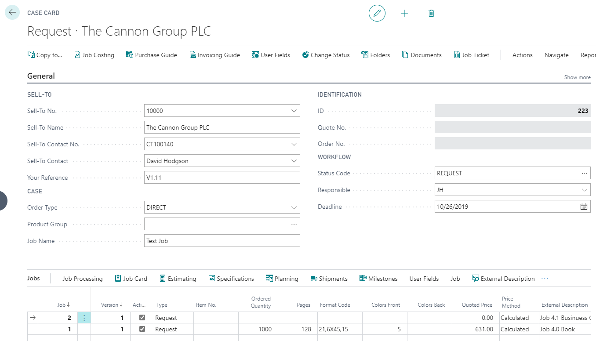
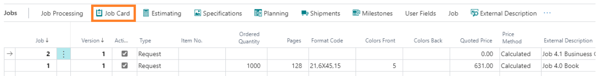
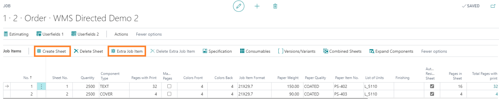
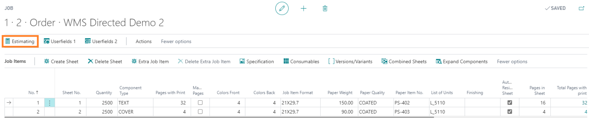
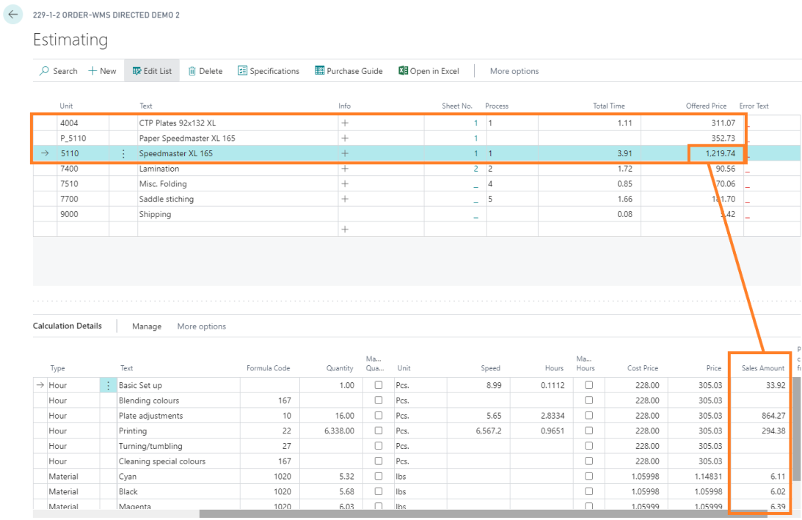
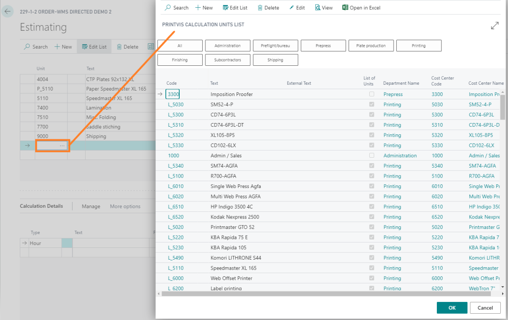
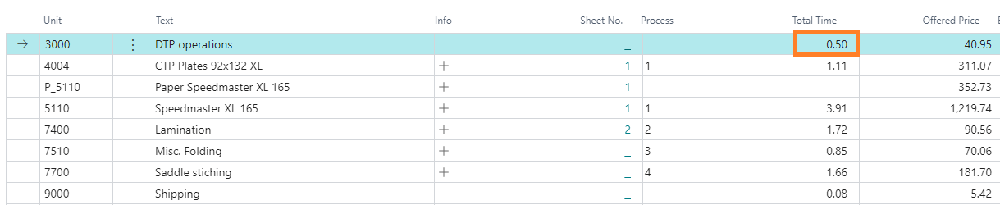
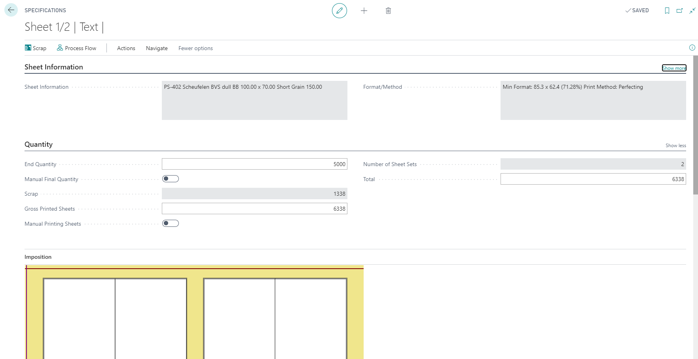
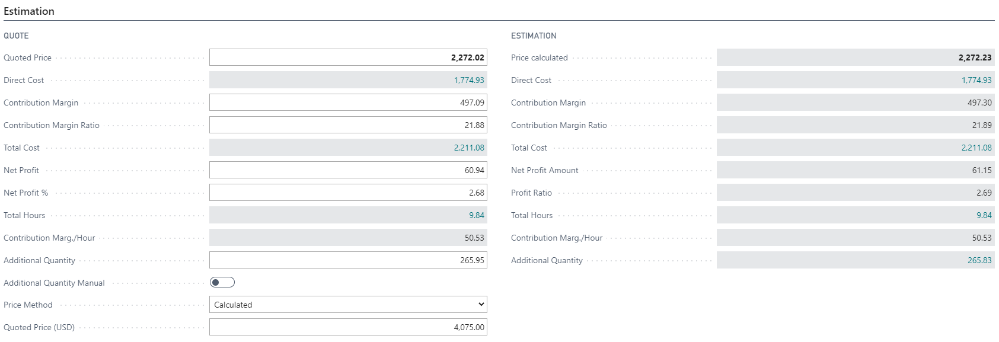
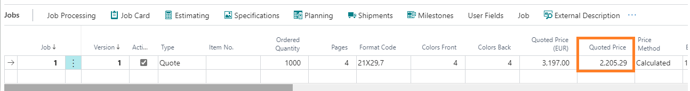

# Creating an Estimate

Creating an estimate in PrintVis involves calculating a quoted price for a requested product. The estimate forms the basis for quoting, ordering, and production planning.

## Usage

### The Estimation Workflow

The complete estimation workflow is accessible from the Case Card. For new users, following the structured flow below is recommended:

1. **Case Card** — Enter all header information and open the Job Card
2. **Job Card** — Create sheets, enter job item details, select the List of Units (printing machine)
3. **Estimating page** — Select Calculation Units and input operational data
4. **Specification page** — Review and adjust calculation details for each sheet
5. **Pricing** — Review pricing on the Estimation tab in the Job Card
6. **Versioning** — Create additional versions for different quantities or configurations
7. **Quote** — Print or send the quote

### Step 1: Case Card

1. Open or create a new Case Card.

2. Fill in or select:
   - **Sell-To No.** (customer)
   - **Order Type**
   - **Product Group**
   - **Job Name**
3. Verify or set:
   - Salesperson, Estimator, Responsible
   - Deadline
4. On the job line, enter:
   - **Quantity**
   - **Pages**
   - **Format Code**
   - **Colors Front / Colors Back**
   - **Paper** (if selecting a specific paper)
5. Select a **Template** if one is available.

6. Click **Job Card** to proceed.

### Step 2: Job Card

1. In the Job Card, the product parts are defined (sheets).
2. Click **Create Sheet** to add a new sheet.

3. For each sheet:
   - Enter the **Sheet Type**
   - Select the **List of Units** (printing machine)
4. Click **Estimating** to open the calculation window.

### Step 3: Estimating Page

1. The first three calculation units come pre-populated from the selected printing machine (make-ready, run, and machine time).

2. Add remaining calculation units for all other production processes.

3. For each calculation unit, verify or enter the required inputs.

### Step 4: Specification Page

1. Open the **Specification** page for each sheet.

2. Review the detailed breakdown of machine times, material quantities, and costs.
3. Adjust any incorrect values.
4. Close and return to the Job Card.

### Step 5: Review Pricing

1. On the **Estimation** tab of the Job Card, review:

   - Total production cost
   - Markup
   - Quoted selling price
2. Adjust markup percentages as needed.

### Step 6: Versioning

Create additional versions (job lines) for:
- Alternative quantities (e.g., 1,000; 2,500; 5,000)
- Alternative configurations (e.g., 2-color version vs. 4-color)

### Step 7: Print the Quote

1. Return to the Case Card.
2. Use the **Print** or **Send** action to produce the quote document.
3. Change the Status Code to "Quote Sent" (or equivalent).

## Setup

Estimation requires setup in the following areas (in order):

- Departments and Cost Centers
- Format Codes
- Speed Tables and Scrap
- Color Table
- Calculation Units
- Templates

See [Estimation Overview](overview.md) for the full setup sequence.

## Examples

### Example: Estimating a 4-Color Brochure (8 pages, A4, 1,000 copies)

**Case Card:**
- Customer: ABC Corp
- Order Type: BROCHURE
- Quantity: 1,000
- Pages: 8
- Format: A4
- Colors: 4/4

**Job Card:**
- Create Sheet 1 (text body)
- List of Units: 4-Color Offset Press

**Estimating:**
- Press make-ready: automatically calculated from machine setup
- Press run: automatically calculated from speed table for A4 at 1,000 sheets
- Add CTP: 4 plates, approximately 20 minutes plate-making
- Add DTP/Prepress: 0.5 hours
- Add Saddle Stitching: calculated from speed table for 1,000 copies
- Add Trimming: calculated

**Result:**
- Total cost: calculated by the system
- Markup: set by the estimator (e.g., 40%)
- Quoted price: automatically computed

## See Also

- [Estimation Overview](overview.md)
- [Templates](templates.md)
- [Calculation Units](calculation-units.md)
- [Quick Quote](quick-quote.md)
- [Case Card](../case-management/case-card.md)
