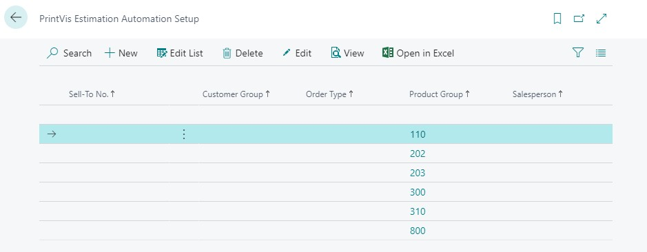
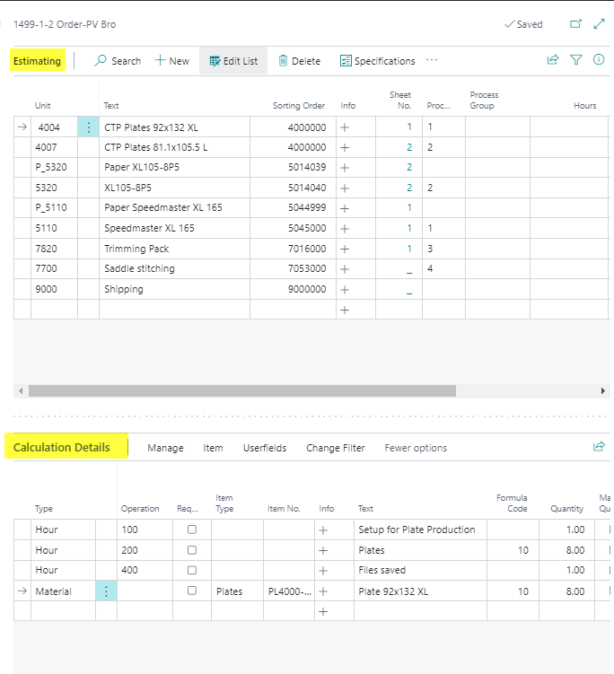
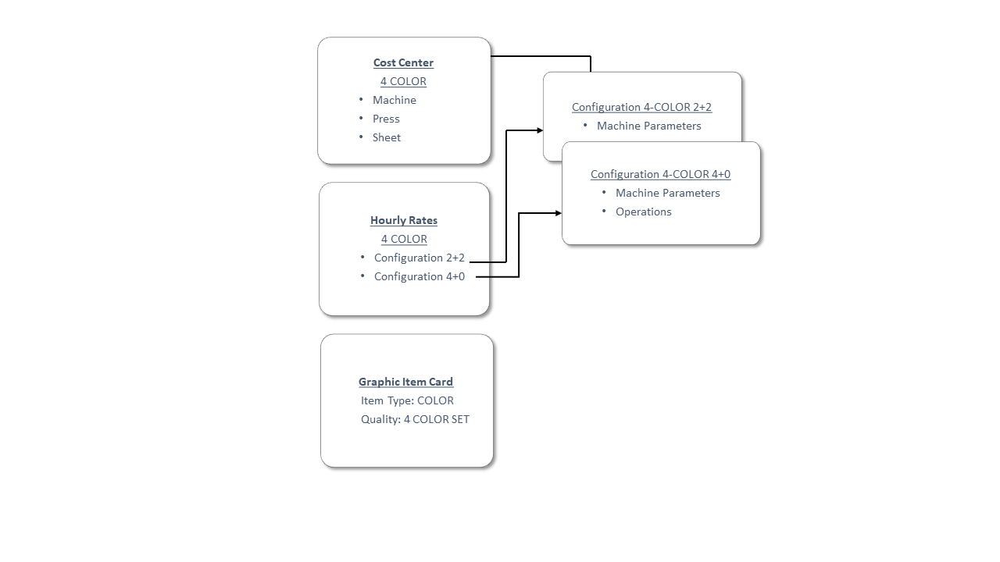
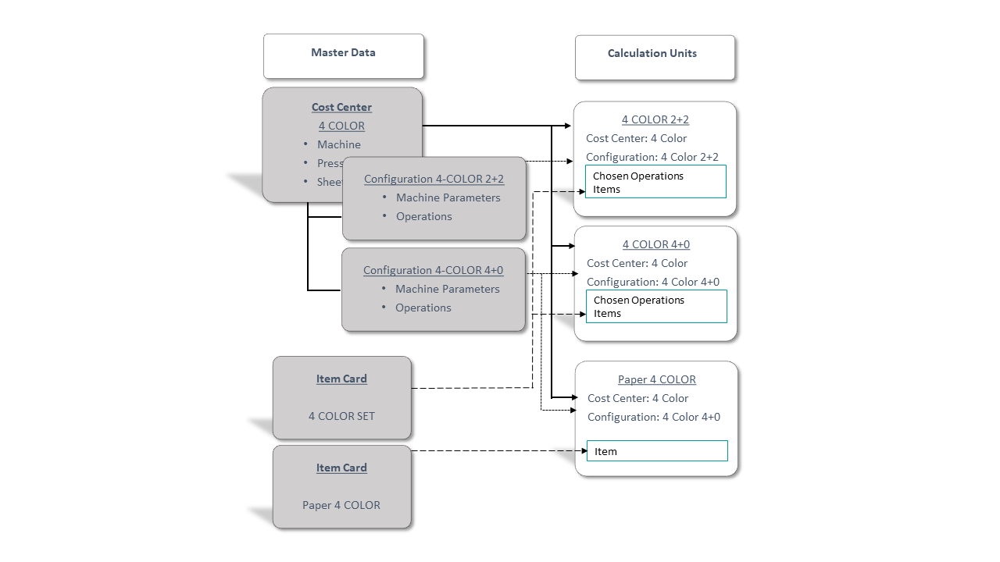

# Estimation Overview

The PrintVis Calculation Module provides a complete estimation system for print companies, enabling accurate, consistent, and efficient quoting. Estimates are built from master data and calculation units that together calculate all production costs for a job.

## Usage

Estimation in PrintVis involves selecting the appropriate Calculation Units for a job and entering job-specific information. The system then calculates the estimated cost and price automatically based on the master data setup.

### The Estimation Workflow

A complete estimation follows this flow:

1. **Case Card** — Create the case, enter customer, order type, product group, quantity, pages, and format
2. **Job Card** — Define the product parts (sheets, job items), select the printing machine (List of Units)
3. **Estimating page** — Select the Calculation Units that represent each production process; the system calculates costs
4. **Specification page** — Review and adjust job-specific details for each sheet
5. **Versioning** — Create multiple versions for different quantities or price breaks
6. **Quote** — Print or send the quote to the customer

### The Two Layers of Estimation

Estimation in PrintVis is built on two layers:

**Layer 1: Master Data**

Master data forms the foundation. This includes:
- Cost centers and their operations (machine speeds, hourly rates)
- Items (paper, consumables) and their costs
- Speed tables and scrap tables
- Format codes
- Color tables

Well-organized master data ensures consistent, accurate quotes.

**Layer 2: Calculation Units**

Calculation Units are built on top of master data. They define *how* the master data is combined and calculated for a specific production process. Each calculation unit:
- Links to a specific cost center and its operations
- Selects which master data items to include
- Defines calculation logic (speed-based, quantity-based, hourly, etc.)
- Controls what is printed on the job ticket

Calculation units are analogous to small spreadsheets — each calculates one limited part of the production.

### How It All Works Together

When an estimator opens the Estimating page for a job:
1. They select the calculation units relevant to that job's production process
2. Each unit calculates its portion of the cost using the master data
3. The sum of all calculation unit lines = the estimated production cost
4. A markup/price structure converts cost to the quoted selling price

## Setup

A complete estimation setup requires configuring (in roughly this order):

1. [Departments](../case-management/departments.md) — Organize cost centers by production area
2. [Cost Centers](../../Pages/pvscostcenter.md) — Machine/process definitions with hourly rates
3. [Cost Center Configurations](../../Pages/pvscostcenterconfig.md) — Machine configurations and capacities
4. [Format Codes](format-codes.md) — Paper/substrate format definitions
5. [Speed Tables](speed-tables.md) — Machine speed profiles by format
6. [Scrap](scrap.md) — Scrap/waste percentages by process
7. [Color Table](color-table.md) — Color definitions and make-ready times
8. [Component Types](component-types.md) — Types of product components (cover, text, insert)
9. [Finishing Types](finishing-types.md) — Finishing process definitions
10. [Calculation Units](calculation-units.md) — The core estimation building blocks
11. [Calculation Formulas](calculation-formulas.md) — Custom calculation logic
12. [Templates](templates.md) — Pre-built job structures for common products
13. [Price Lists](price-lists.md) — Customer and item-specific pricing
14. [Additional Rates](additional-rates.md) — Surcharges and extra costs
15. [Alternative Rates](alternative-rates.md) — Pricing alternatives

## Examples

### Example: Estimating a 4-Color Brochure

A customer requests 1,000 copies of an A4, 8-page, 4-color saddle-stitched brochure.

The estimator:
1. Creates a case with Order Type = BROCHURE, Product Group = SADDLESTITCH.
2. Selects the template for a saddle-stitched brochure.
3. Enters quantity = 1000, pages = 8, format = A4, colors front/back = 4/4.
4. Opens the Estimating page.
5. The printing machine calculation units are pre-populated from the template.
6. Adds calculation units for:
   - CTP platemaking
   - Saddle stitching
   - Trimming
7. Reviews the calculated cost.
8. Adjusts markup as needed.
9. Prints the quote.

## See Also

- [Templates](templates.md)
- [Calculation Units](calculation-units.md)
- [Creating an Estimate](creating-estimate.md)
- [Quick Quote](quick-quote.md)
- [Cost Center](../../Pages/pvscostcenter.md)
