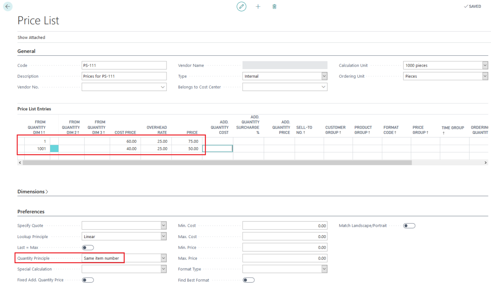
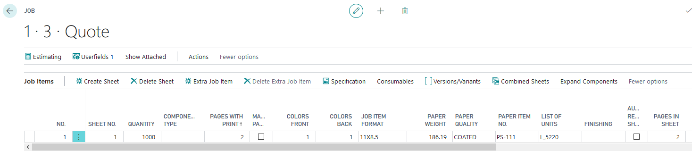

# Price Lists

Price Lists in PrintVis allow you to define specific pricing for items (particularly paper and materials) that override the standard item cost in estimation. Paper price lists are a key component, enabling the system to automatically apply the correct paper price for each job.

## Usage

Price Lists are used in estimation when calculating material costs. When a paper item is used in a job, the system checks whether a price list entry exists for that item (and customer/price group) and applies the list price if found.

### Types of Price Lists

**Item Price Lists**
Standard price lists for any item used in estimation. Prices can be set by:
- Customer (customer-specific pricing)
- Customer Price Group
- Date range (time-limited promotions)
- Minimum quantity

**Paper Price Lists**
Specialized price lists for paper and substrates. Paper pricing is often per kilogram or per 1,000 sheets and varies by:
- Paper type and weight
- Format/size
- Quantity breaks

### Price List Import/Export

Price lists can be imported from and exported to external files (e.g., from paper supplier price lists). This makes it efficient to update paper prices when suppliers issue new price lists.

## Setup

Price Lists are found by searching **PrintVis Price Lists** or via the Items setup in the Admin Role Center.

### Creating a Price List

1. Search for **PrintVis Price Lists**.

2. Create a new price list with a Code, Description, and Type (Item, Paper, etc.).

3. Add price list lines for each item/paper with the applicable price.
4. Set the starting date (and optionally ending date) for the price.
5. Assign the price list to customers or price groups as appropriate.

### Paper Price Lists

For paper pricing specifically:
1. Create a Paper Price List linked to a paper supplier.
2. Add lines for each paper type and weight combination.
3. Set prices per kg or per 1,000 sheets.
4. Link the price list to the relevant paper items.

### Importing/Exporting Price Lists

To update prices from a supplier spreadsheet:
1. Export the existing price list to a template file.
2. Populate the template with updated prices.
3. Import the file back into PrintVis.

This process is described in more detail in the legacy Price List Import/Export documentation.

## Examples

### Example: Paper Price List for a Stock Paper Supplier

A paper merchant provides updated prices quarterly. The print shop imports the prices:

1. Export the existing price list to the template format.
2. Replace the prices in the template with the new supplier prices.
3. Import back into PrintVis.
4. All new estimates automatically use the updated paper prices.

## See Also

- [Items](../warehouse/items.md)
- [Calculation Units](calculation-units.md)
- [Price Groups](price-groups.md)
- [Additional Rates](additional-rates.md)
