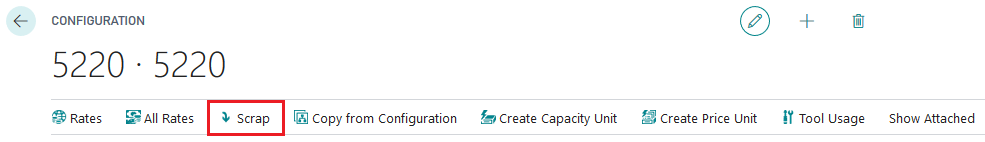
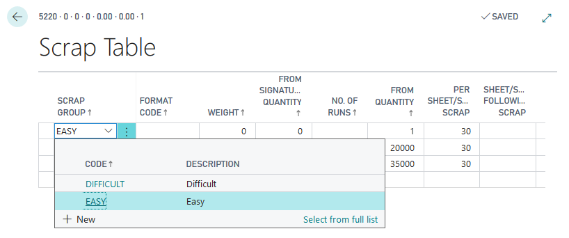
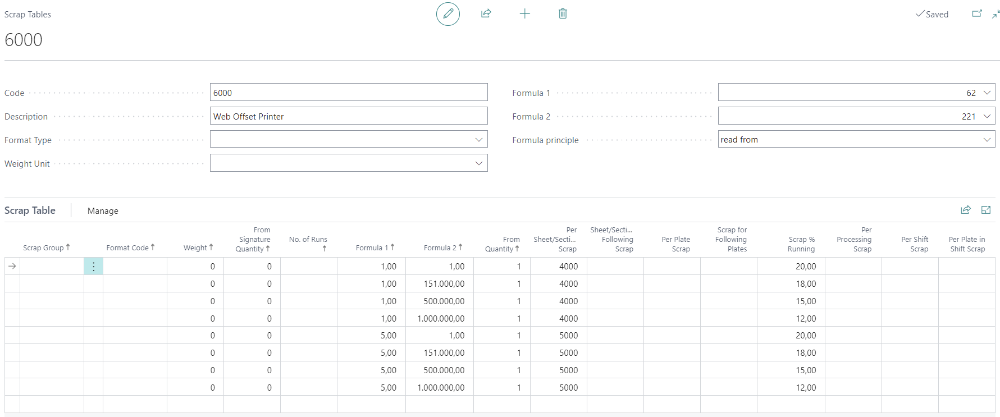
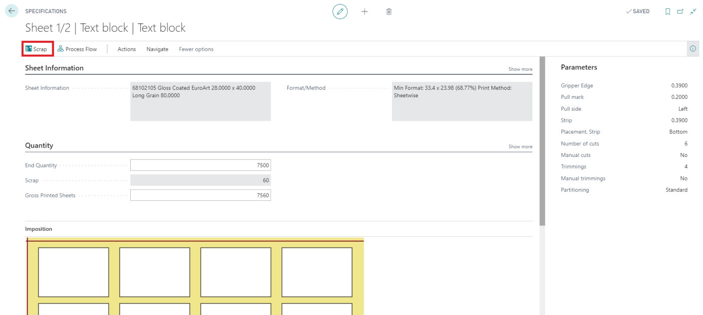

# Scrap

Scrap in PrintVis defines the waste percentage or quantity to add during production to account for setup waste, make-ready sheets, and production spoilage. Scrap is used in estimation to calculate the total material consumption required to deliver the ordered quantity.

## Usage

Scrap affects:
- **Paper quantity** — More sheets are ordered/consumed than the net delivery quantity because some sheets are wasted in make-ready and production
- **Ink consumption** — Additional ink is used for make-ready sheets
- **Cost calculation** — Material costs are calculated on the gross quantity (including scrap)

Scrap can be defined as:
- A **percentage** of the run quantity (e.g., 5% waste)
- A **fixed quantity** (e.g., 100 make-ready sheets per job)
- A **combination** of both

Scrap can vary by:
- Product Group
- Format
- Number of colors
- Quantity range (more scrap percentage for short runs)

## Setup

Scrap is configured in two places: **Scrap Groups** and **Scrap Tables**.

### Scrap Groups

Scrap Groups define categories of scrap used in the calculation. Found by searching **PrintVis Scrap Groups**.

| Field | Description |
|---|---|
| **Code** | Unique identifier for the scrap group. |
| **Description** | Name of the scrap group. |
| **Type** | How scrap is applied: Percentage, Fixed Quantity, or Both. |

### Scrap Tables

Scrap Tables contain the actual scrap values for each group. Found by searching **PrintVis Scrap Tables**.

| Field | Description |
|---|---|
| **Scrap Group Code** | Links to the Scrap Group. |
| **Product Group** | Optional — scrap values specific to a product group. |
| **Format Code** | Optional — scrap values specific to a format. |
| **From Quantity / To Quantity** | Quantity range where this scrap value applies. |
| **Scrap %** | Percentage of scrap to add. |
| **Fixed Qty** | Fixed quantity of scrap sheets to add. |

### Assigning Scrap Groups to Calculation Units

After creating scrap groups and tables:
1. Open the relevant Calculation Unit.
2. Set the **Scrap Group** field.
3. The calculation unit will apply scrap from the table when calculating material quantities.

## Examples

### Example: Scrap Setup for an Offset Press

A print shop uses 5% scrap for medium-to-long runs and 100 sheets fixed scrap for short runs:

| Quantity From | Quantity To | Scrap % | Fixed Qty |
|---|---|---|---|
| 1 | 500 | 0% | 100 |
| 501 | 5,000 | 3% | 50 |
| 5,001 | 99,999 | 2% | 50 |

For a run of 1,000 sheets: gross quantity = 1,000 × 1.03 + 50 = 1,080 sheets ordered.

## See Also

- [Calculation Units](calculation-units.md)
- [Speed Tables](speed-tables.md)
- [Format Codes](format-codes.md)
