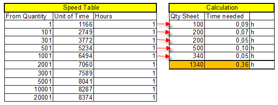

# Speed Tables

Speed Tables define the production speeds for cost centers (machines) by format code. They allow PrintVis to automatically calculate press run times based on the job's format and sheet count, eliminating the need for estimators to manually look up and enter machine speeds.

## Usage

Speed Tables are used in Calculation Units for time-based calculations. When a press calculation unit is used in an estimate:

1. The system looks up the speed table assigned to that calculation unit.
2. It finds the row matching the job's format (or the nearest applicable format range).
3. It retrieves the speed (sheets per hour or similar).
4. It calculates run time = quantity ÷ speed.

Speeds can vary by:
- Format/sheet size
- Number of colors
- Paper weight or type
- Production method

### Speed Table Reductions

Speed reductions can be set up for special conditions (e.g., printing on heavy stock, printing with special inks, running at reduced speed for quality reasons). See the Tips & Tricks article for details on speed table reductions.

## Setup

Speed Tables are found by searching **PrintVis Speed Tables**.

### Creating a Speed Table

1. Create a new Speed Table with a code and description.

2. Add lines for each format range or condition.

### Speed Table Line Fields

| Field | Description |
|---|---|
| **Format Code** | The format this speed applies to. |
| **Minimum Qty / Maximum Qty** | Quantity range where this speed applies (for run-length-dependent speeds). |
| **Speed** | The production speed (e.g., sheets per hour). |
| **Unit of Measure** | Unit the speed is measured in (SH/H = sheets per hour, M/H = meters per hour, etc.). |
| **Setup Time** | Fixed setup/make-ready time for this format. |
| **Extra Percentage** | Additional time percentage applied (e.g., for color changes). |

### Assigning Speed Tables to Calculation Units

After creating a speed table:
1. Open the relevant Calculation Unit.
2. Set the **Speed Table** field to the new speed table.
3. The calculation unit will now use this table to calculate run times.

## Examples

### Example: Speed Table for a 4-Color Offset Press

A Heidelberg SM74 press runs at different speeds depending on sheet format:

| Format | Speed (Sh/H) | Setup Time (min) |
|---|---|---|
| Up to A4 | 12,000 | 60 |
| A3 / 50x70 | 10,000 | 75 |
| 52x74 | 9,000 | 90 |
| 70x100 | 8,000 | 120 |

For a job with 1,000 A4 sheets: run time = 1,000 ÷ 12,000 = 0.083 hours = ~5 minutes.

## See Also

- [Calculation Units](calculation-units.md)
- [Format Codes](format-codes.md)
- [Tips & Tricks](tips-tricks.md)
