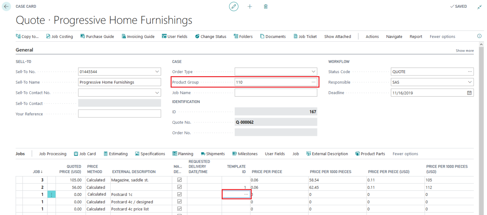
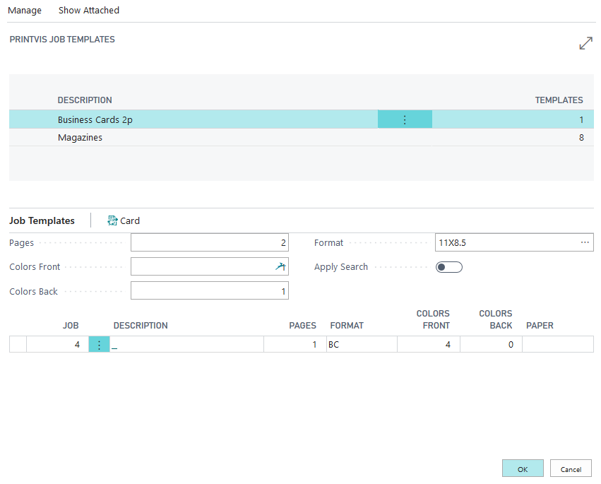
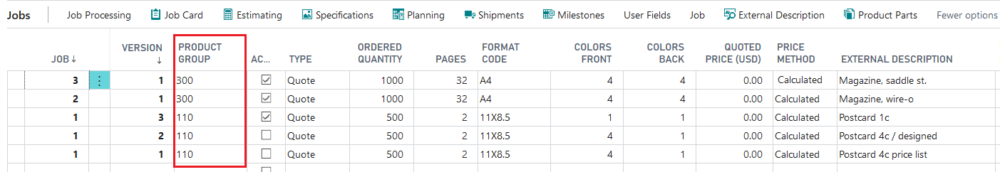
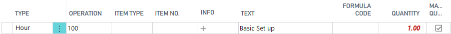
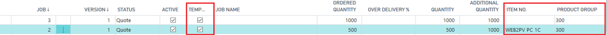
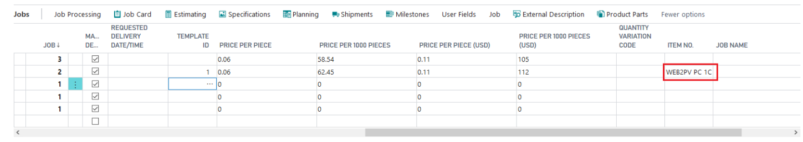

# Templates

Templates in PrintVis streamline the quoting process by providing pre-built job structures for common products. Using templates saves time and ensures consistency across quotes for similar jobs.

## Usage

Templates are used when creating a new case or job. When an estimator opens the Job Card, they select the appropriate template for the product type. The template pre-populates:

- Job items (product parts — cover, text body, insert, etc.)
- Printing sheets and their structure
- Calculation units for each production process
- Machine selections (List of Units)

This allows the estimator to quickly start with a fully-structured estimate rather than building it from scratch.

### Types of Templates

**1. Templates Related to a Product Group**

A Product Group can have multiple templates for variations of the same product type.

*Example — Product Group: Brochure*
- Saddle stitch brochure with 4-page cover
- Saddle stitch brochure with 6-page cover
- Saddle stitch brochure with 8-page cover
- Perfect bound brochure

**2. Templates Related to a Finished Good Item**

Templates can also be linked to a specific Finished Good Item, enabling item-based template selection for repeat jobs.

*Example — Finished Good Items:*
- Label
- Calendar
- Poster

### Working with Templates

When creating a new case:
1. Enter the customer, order type, and product group on the Case Card.
2. Open the Job Card.
3. In the Template field, select the applicable template.

4. The job structure is copied from the template into the current job.
5. Adjust quantities, formats, and other job-specific details.
6. Proceed to the Estimating page to calculate.

!!! warning "Manual/Fixed Entries in Templates"
    Avoid entering manual or fixed values in a template's estimation. Templates should be adaptable to different quantities and conditions. Fixed values in templates can cause calculation errors when the template is used for different jobs.

## Setup

### Creating a Template

1. Create a new Case Card as you would for any job.
2. Set the Order Type and Product Group that this template is for.
3. Create the Job Card with all relevant product parts and sheets.

4. Open the Estimating page and add all calculation units needed for this product type.

5. Leave quantity-dependent fields flexible (do not hard-code quantities).

### Marking a Job as a Template

1. On the Job Card, open the **Job** tab.
2. Mark the **Template** checkbox to designate this job as a template.
3. The template is now available in the Template field when creating new jobs with the same Product Group.

### Assigning a Template to a Product Group

1. After marking the job as a template, open the Job Card.
2. The first line assigns the job as a template for the Product Group.

3. The system now presents this template when a user creates a new case with this Product Group.

### Assigning a Template to a Finished Good Item

1. On the Job Card, enter the Item No. in the finished good item field.

2. The template is now available when a job line contains this specific item.

### Template Filters

Template Filters allow you to control which templates are shown based on additional criteria (e.g., size, paper type). Configure Template Filters via the **Template Filters** setup. Template Filters are linked to Product Groups and act as additional filtering criteria.

## Examples

### Example: Creating a Saddle-Stitch Brochure Template

1. Create a new case: Order Type = BROCHURE, Product Group = SADDLESTITCH.
2. In the Job Card, create the following sheets:
   - Sheet 1: Cover (4-page, different stock)
   - Sheet 2: Text body (8 pages, standard stock)
3. For each sheet, add calculation units:
   - Cover: CTP plating, 4-color press, saddle stitch
   - Text: CTP plating, 4-color press
4. Mark as Template on the Job Card.
5. Assign to Product Group = SADDLESTITCH.

Now, any new case with Product Group = SADDLESTITCH can use this template as a starting point.

## See Also

- [Estimation Overview](overview.md)
- [Creating an Estimate](creating-estimate.md)
- [Product Groups](../case-management/product-groups.md)
- [Calculation Units](calculation-units.md)
