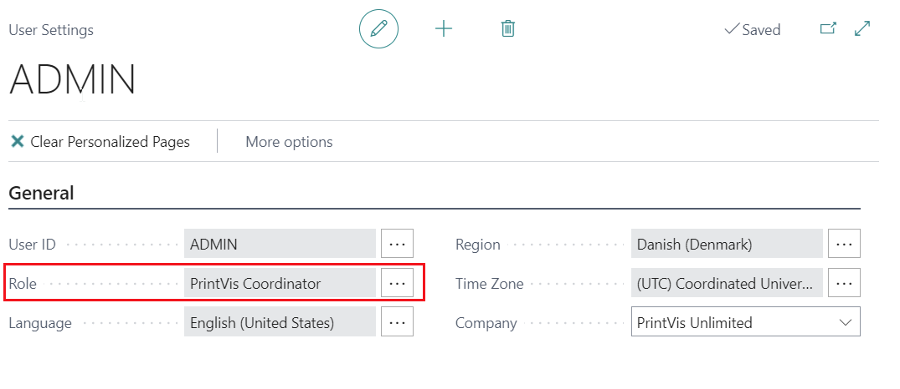
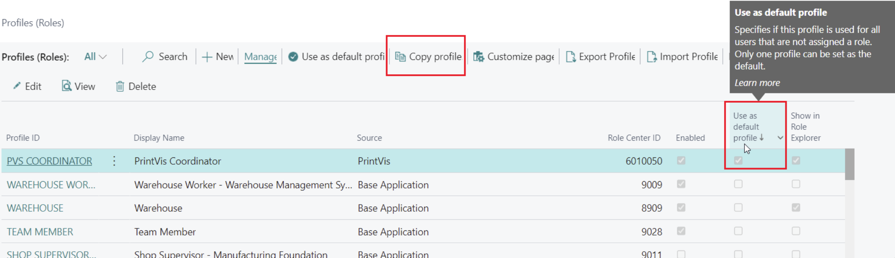
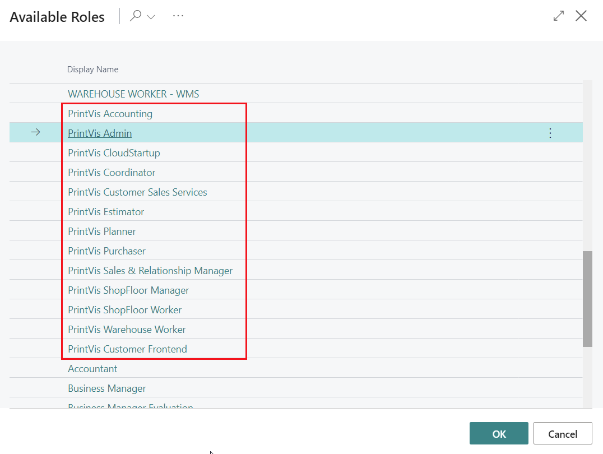
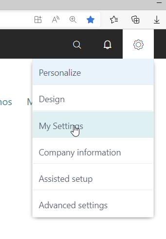
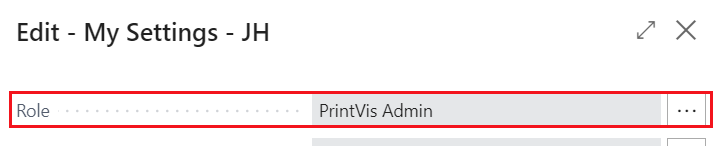
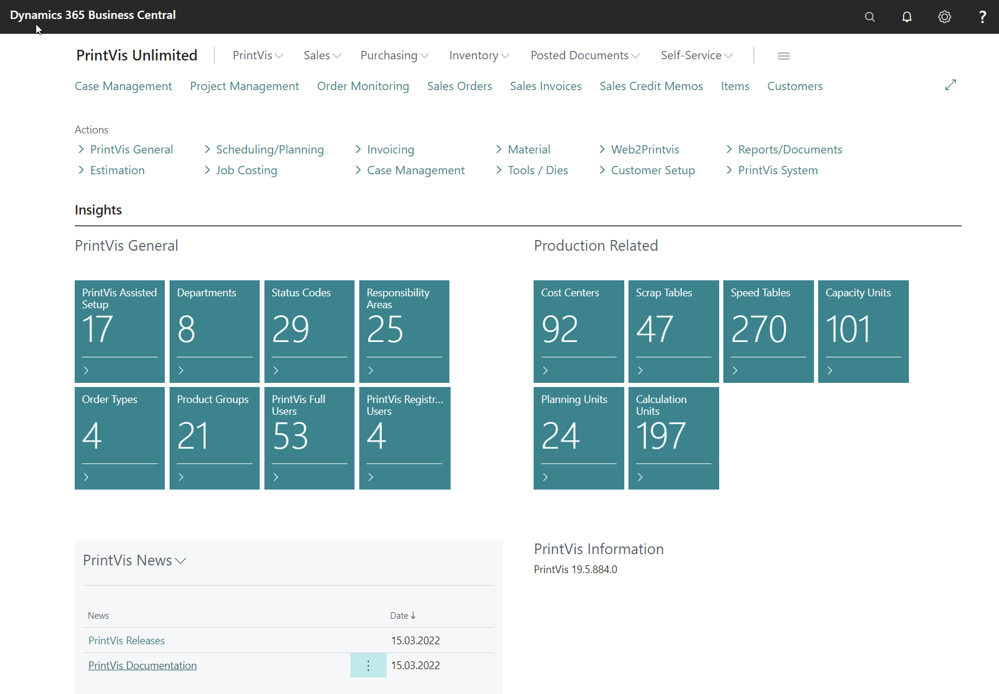
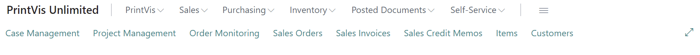
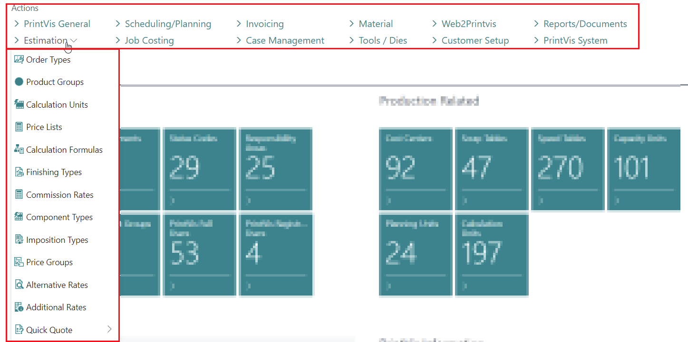

# Role Centers

In Business Central, all users are assigned profiles that reflect their business roles, departments, or other categorizations. Profiles allow administrators to manage what different user types can see and do in the user interface. PrintVis extends this functionality by providing specific Role Centers for various user roles in a printing company.

## Usage

A Role Center gives users quick access to information pertinent to their daily work, displaying relevant data and facilitating navigation to necessary pages for tasks.

Profiles are assigned to users under **User Settings** (field "Role"). If no profile is assigned, the default profile is used.

### Available PrintVis Profiles

PrintVis provides the following profiles:

| Profile | Description |
|---|---|
| **PrintVis Admin** | For setting up and administrating PrintVis. Access all setup areas, including RapidStart/Assisted Setup. |
| **PrintVis Coordinator** | For customer service and scheduling. Manages typical request and order management tasks, including purchase and inventory. |
| **PrintVis Shop Floor Worker** | For production staff. Access to production information and shop floor data collection. |
| **PrintVis Salesperson** | For sales users managing quotes, CRM, and customer interactions. |
| **PrintVis Estimator** | For estimators working on case cards and calculation. |

> **Note:** Profiles can be copied and saved under a custom name on the Profiles page. It is recommended to copy an existing profile with the required access and modify it, keeping the original PrintVis profiles intact.

### Selecting a Profile

1. Click the gear icon in the upper right-hand corner of the screen.

2. Choose your role from the role options.

3. Click **OK** to access the selected Role Center.

### PrintVis Admin Profile

The Admin profile provides:

- Access to all PrintVis setup areas
- RapidStart/Assisted Setup initiation and control
- Menu items organized by topic:

| Menu Topic | Description |
|---|---|
| **PrintVis General** | Essential settings including Assisted Setup, General Setup, User Setup, and Cost Center Setup |
| **Estimation** | Estimation-related setup including Order Types/Product Groups, Calculation Units, Component Types, Additional Rates |
| **Scheduling/Planning** | Planning-related setup including Capacity Units and Groups, Planning Units, Opening Hours |
| **Job Costing** | Job costing setup including Units of Measure, Job Costing Journals, Shop Floor Setup |
| **Invoicing** | Invoicing setup including G/L Posting Setup, Invoice Templates, BC General/Inventory Posting Setup |
| **Case Management** | Status flow setup including Status Codes, Responsibility Areas, Planning Unit Setup |
| **Materials** | Item-related settings including Item Qualities, Item Type Codes, BC Item Templates |
| **Tools / Dies** | Tool and die-related settings |
| **Web2PrintVis** | Back-end and front-end settings for Web2PV integration |
| **Customer Setup** | Customer-related settings |

## Setup

### Assigning a Profile to a User

1. Search for **Users** in Business Central.
2. Open the user record.
3. Go to **User Settings** and set the **Role** field to the desired PrintVis profile.

### Creating a Custom Profile

1. Search for **Profiles (Roles)** in Business Central.
2. Find the PrintVis profile you want to use as a base.
3. Use the **Copy Profile** action to create a copy.
4. Give the copy a new ID and description.
5. Customize the pages and actions visible in the copied profile.

> **Tip:** Always copy and customize; do not modify the original PrintVis profiles, as they may be overwritten during updates.

## Examples

### Example: Setting Up a New Coordinator User

1. Create a Business Central user with the appropriate BC license.
2. Create a PrintVis Licensed User linked to the BC user.
3. Create a PrintVis User with the **Coordinator / Order Planner** flag enabled.
4. In **User Settings**, assign the **PrintVis Coordinator** profile.
5. The user now sees the Coordinator Role Center with relevant tiles and menus.

## See Also

- [Users](../setup/users.md)
- [Permission Sets](../setup/permission-sets.md)
- [PrintVis Assisted Setup](../setup/assisted-setup.md)
