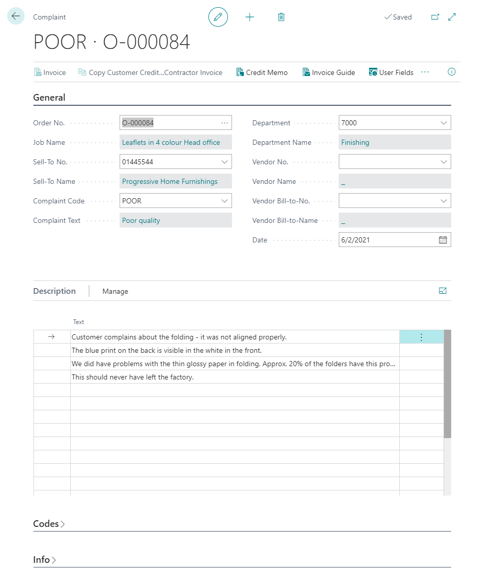

# Complaints

Complaints in PrintVis allow you to track and manage quality issues and customer complaints related to specific jobs. Complaint data is linked to cases and can be used for quality analysis and customer relationship management.

## Usage

Complaints are used to:
- Record when a customer reports a quality issue with a delivered job
- Track the cause, resolution, and cost of quality problems
- Generate credit notes or reprints for customer claims
- Analyze quality trends over time (by product group, cost center, or cause)

### Complaint Workflow

1. A customer reports a quality issue.
2. Open the relevant Case Card.
3. Create a Complaint record linked to the case.
4. Enter the complaint details:
   - Complaint type and description
   - Quantity affected
   - Cause (if known)
   - Responsible department or person
5. Determine the resolution:
   - Reprint
   - Credit note
   - No action
6. Close the complaint when resolved.

Complaint data feeds into quality reporting and analysis.

## Setup

!!! warning "Missing Content"
    Detailed setup instructions for the Complaints module are not fully documented in this article. Refer to the legacy Complaints documentation (Legacy/Invoicing/Complaints.md) for setup details including complaint types, resolution codes, and posting configuration.

## Examples

!!! warning "Missing Content"
    No specific Complaints examples are currently documented. The complaints workflow is described in the Usage section above.

## See Also

- [Invoicing](invoicing.md)
- [Case Card](../case-management/case-card.md)
- [Quality Assurance](../case-management/qa.md)
