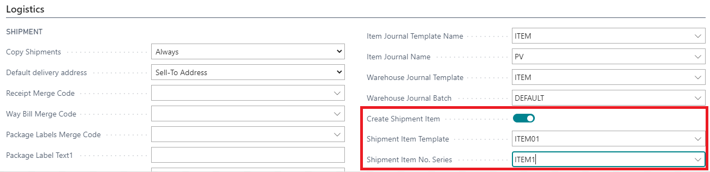
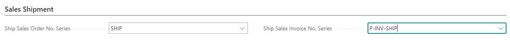
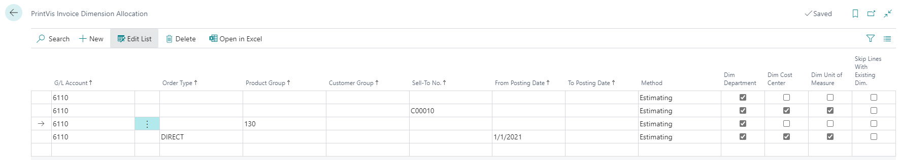
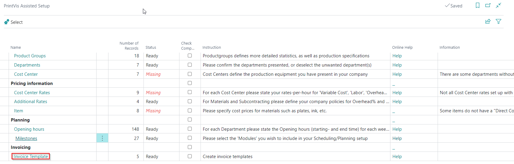
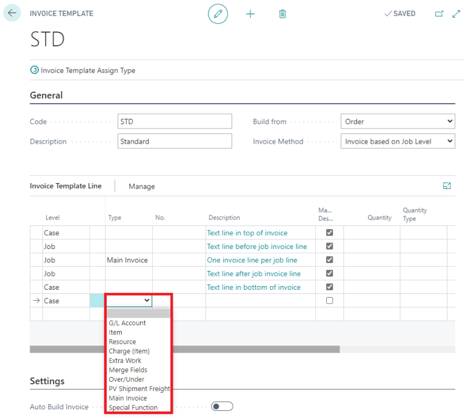
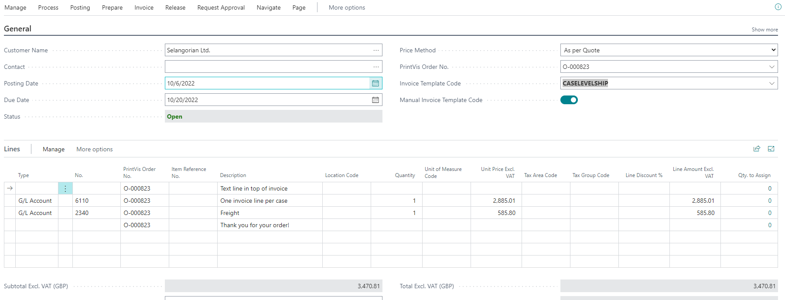

# Invoicing

PrintVis provides flexible invoicing options that integrate with Business Central's invoicing functionality. Invoice drafts are created in PrintVis and then posted as standard BC Sales Invoices.

## Usage

Invoicing in PrintVis is managed through the Case Card. When a job is complete (or at an interim billing point), an invoice draft is created from the job's cost and pricing data.

### Invoicing Methods

| Method | Description |
|---|---|
| **Template-based invoicing** | Invoices are built automatically from invoice templates that define which lines to include and how amounts are calculated. Most common for print shops with standard pricing. |
| **Per job line invoicing** | Each job line on the case becomes an invoice line, allowing line-by-line control of what is invoiced. |
| **Combined invoicing** | Multiple cases for the same customer are combined into a single invoice. Useful for customers with many small jobs. |
| **Partial invoicing** | Invoice for a portion of the job (e.g., a deposit or milestone payment). |

### Invoice Template–Based Invoicing

Invoice templates define:
- Which lines are included (quoted price, cost, materials, etc.)
- How amounts are calculated (by product group, by job line, etc.)
- Text codes for header and footer text
- VAT and posting group assignments

When a case reaches an invoicing stage:
1. The system reads the invoice template assigned to the case.

2. It builds the invoice draft automatically based on the template rules.
3. The coordinator or accounts user reviews the draft.
4. The draft is posted as a BC Sales Invoice.

### Invoice Dimension Allocation

For companies using BC dimensions for cost center or profit center reporting, invoice dimension allocation ensures that revenue from each invoice line is attributed to the correct dimension values.

## Setup

### Invoice Template Setup

Invoice templates are set up in the PrintVis Invoice Template setup:
1. Search for **PrintVis Invoice Templates**.

2. Create a template for each invoicing scenario.
3. Define the template lines (what is included and how it is calculated).
4. Assign templates to Product Groups or Order Types.

### Setting Up Combined Invoicing

To enable combined invoicing for a customer:
1. Enable the **Combine Invoice** option on the customer card.
2. When invoicing, cases for this customer are combined into one invoice.

### G/L Posting Setup

Ensure the G/L Posting Setup is configured correctly so revenue is posted to the correct accounts. See [G/L Posting Setup](gl-posting-setup.md).

### Invoice Posting Permissions

Users must have the **Allow Invoice Posting** permission in their PrintVis User Setup to post invoice drafts. Users without this permission can create invoice drafts but cannot post them.

## Examples

### Example: Creating and Posting an Invoice

1. A job is complete and at status "Ready to Invoice".
2. Open the Case Card.
3. Click **Invoice** → **Create Invoice Draft**.

4. The system builds the invoice draft using the invoice template.
5. Review the draft lines and amounts.

6. If correct, click **Post Invoice**.
7. A BC Sales Invoice is created and posted.
8. The case status changes to "Invoiced".

## See Also

- [G/L Posting Setup](gl-posting-setup.md)
- [Complaints](complaints.md)
- [Status Codes](../case-management/status-codes.md)
