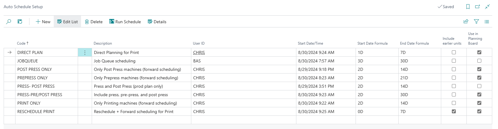
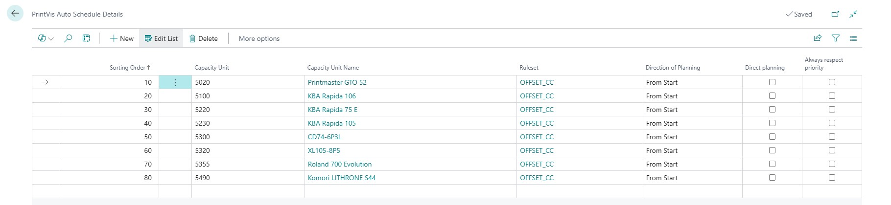

# Auto Scheduling

Auto Scheduling in PrintVis automatically places jobs into the production schedule based on defined rules, deadlines, and available capacity. It reduces the manual effort required for scheduling while ensuring jobs are placed in the most efficient order.

## Usage

Auto Scheduling is used by planners to:
- Automatically schedule new jobs that have entered the production queue
- Re-schedule jobs when capacity changes or deadlines shift
- Optimize the production schedule to minimize waste and maximize throughput

### Auto Scheduling Scenarios

Auto Scheduling supports different scheduling scenarios:
- **Forward scheduling** — Schedule jobs as early as possible from today
- **Backward scheduling** — Schedule jobs as late as possible to meet the deadline
- **Critical path scheduling** — Optimize based on the overall job sequence and dependencies

### Job Queue Auto Scheduling

The Job Queue can be configured to automatically run the scheduling algorithm at defined intervals (e.g., every morning at 7 AM), ensuring the production plan is always up to date without manual intervention.

## Setup

### Setting Up Auto Scheduling Rules

1. Search for **PrintVis Auto Scheduling Setup**.

2. Configure the scheduling rules:

| Field | Description |
|---|---|
| **Scheduling Method** | Forward, Backward, or Critical Path. |
| **Planning Horizon** | How many days/weeks into the future to schedule. |
| **Default Scheduling Priority** | How to prioritize jobs when capacity is limited (e.g., by deadline, by order type, by customer priority). |

### Setting Up the Job Queue for Auto Scheduling

1. Search for **Job Queue Entries** in Business Central.
2. Create a new Job Queue entry linked to the PrintVis Auto Scheduling codeunit.
3. Set the schedule (e.g., daily at 07:00).
4. Enable the job queue entry.

### Ruleset Setup

Rulesets define the specific rules that govern auto scheduling behavior. Rules can specify:
- Which jobs to include/exclude
- How to handle capacity conflicts
- Priority overrides for specific customers or order types

## Examples

!!! warning "Missing Content"
    Detailed auto scheduling examples with step-by-step configuration are not fully documented in the current source material. Refer to the legacy Auto Scheduling Setup and Scenarios documentation for detailed examples.

## See Also

- [Production Plan](production-plan.md)
- [Planning Board](planning-board.md)
- [Opening Hours](opening-hours.md)
- [Bottleneck Planning](bottleneck-planning.md)
