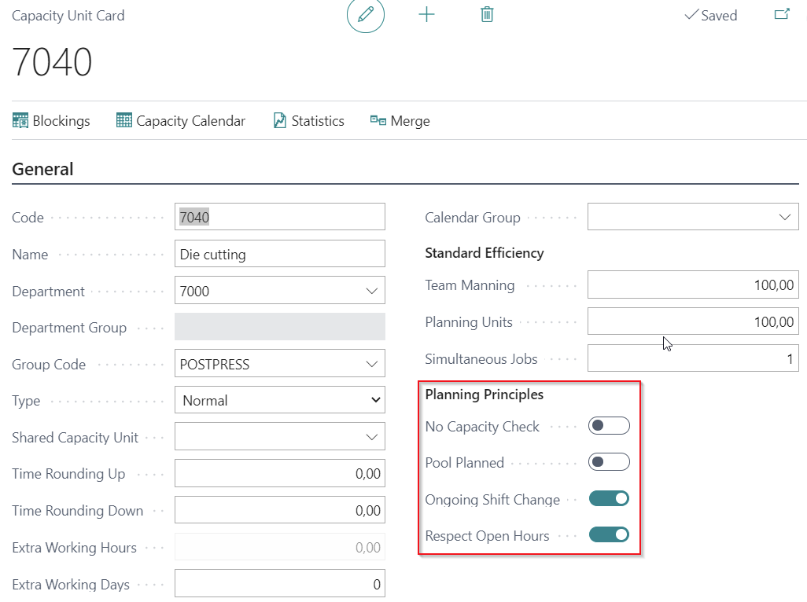

# Bottleneck Planning

Bottleneck Planning in PrintVis helps identify and manage production constraints — the machines or resources that limit overall throughput. By focusing planning attention on bottlenecks, print shops can maximize production efficiency.

## Usage

Bottleneck Planning is used to:
- Identify which cost center is the current production bottleneck
- Prioritize jobs through the bottleneck resource
- Adjust scheduling to maximize utilization of the bottleneck
- Identify capacity expansion needs

In a print shop, common bottlenecks include:
- The main offset press (if it is the only press or has the most demand)
- A specific finishing machine (e.g., perfect binder)
- A CTP unit (if it has limited throughput)

### Theory of Constraints in PrintVis

Bottleneck Planning in PrintVis applies the principles of the Theory of Constraints:
1. **Identify** the bottleneck resource.
2. **Exploit** the bottleneck — never leave it idle, always have a job queued.
3. **Subordinate** everything else to the bottleneck's schedule.
4. **Elevate** the bottleneck's capacity if needed.
5. **Repeat** when a new bottleneck emerges.

## Setup

!!! warning "Missing Content"
    Detailed setup instructions for Bottleneck Planning are not fully documented in the current source material. Contact PrintVis support or refer to the legacy Bottleneck Planning documentation for configuration details.

## Examples

!!! warning "Missing Content"
    No specific bottleneck planning examples are currently documented.

## See Also

- [Production Plan](production-plan.md)
- [Planning Board](planning-board.md)
- [Auto Scheduling](auto-scheduling.md)
- [Capacity Resources](capacity-resources.md)
