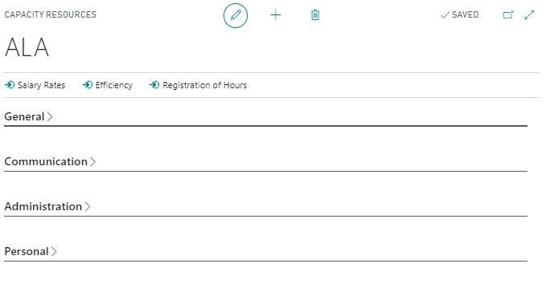
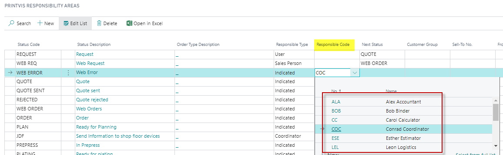

# Capacity Resources

Capacity Resources in PrintVis represent individual operators, employees, or teams that are linked to production planning. They allow production planning to account for human resource availability in addition to machine capacity.

## Usage

Capacity Resources are used to:
- Link employees to cost centers (machines) for planning purposes
- Track which operator is assigned to each job
- Calculate available operator capacity alongside machine capacity
- Use in conjunction with Capacity Groups for team-based planning

### Capacity Groups

Capacity Groups allow you to group multiple capacity resources together. This is useful when:
- Multiple operators can work on the same machine
- A team of people works on a shared set of tasks
- You want to schedule by team rather than individual operator

### Capacity Blockings and Blocking Codes

Capacity Blockings allow you to remove capacity from the planning system for a period of time. Common uses:
- Vacation/holiday
- Maintenance downtime
- Training periods

Blocking codes categorize the reason for the blocking (e.g., Vacation, Maintenance, Holiday, Sick Leave).

## Setup

### Setting Up Capacity Resources

1. Search for **Capacity Resources** or access via the Planning setup menu.
2. Create a resource for each operator or team member.

| Field | Description |
|---|---|
| **Code** | Unique identifier for the resource. |
| **Name** | Name of the resource (person or team). |
| **Cost Center** | The primary cost center this resource is associated with. |
| **Type** | Person, Machine, or Team. |
| **Capacity** | The standard capacity for this resource (e.g., 8 hours/day). |

### Setting Up Capacity Groups

1. Search for **Capacity Groups**.
2. Create a group and add the relevant resources to it.
3. The group can then be scheduled as a unit on the Planning Board.

### Setting Up Blocking Codes

1. Search for **Blocking Codes**.
2. Create codes for each type of capacity removal (e.g., VACATION, MAINTENANCE, HOLIDAY).

### Adding Capacity Blockings

1. From the Capacity Resource card, add blocking periods.
2. Specify the start/end date and the blocking code.
3. The Planning Board will show the resource as unavailable during this period.

## Examples

### Example: Managing Press Operator Capacity

A printing company has three press operators who rotate between two offset presses:

1. Create Capacity Resources: OPERATOR-1, OPERATOR-2, OPERATOR-3.
2. Create Capacity Group: PRESS-OPERATORS.
3. Add all three operators to the group.
4. When scheduling press jobs, the planner can see if there is a press operator available during the planned time slot.

## See Also

- [Planning Units](planning-units.md)
- [Opening Hours](opening-hours.md)
- [Planning Board](planning-board.md)
