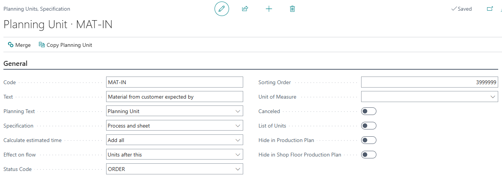
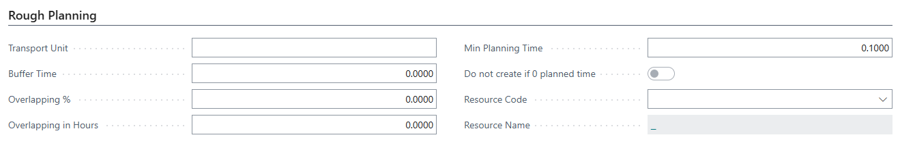
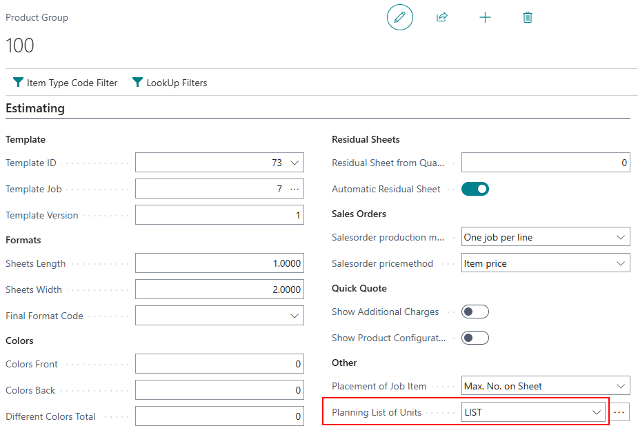

# Milestones

Milestones in PrintVis define key dates and production checkpoints for a job. They are used to track production progress, ensure deadlines are met, and communicate expected completion dates to customers and production teams.

## Usage

Milestones can be used to:
- Define expected completion dates for each stage of production (e.g., "Files received by", "Proof approved by", "Printing complete by")
- Track whether jobs are on schedule
- Generate alerts when milestones are missed
- Plan production around key delivery dates
- Display milestone information on the Planning Board

### Milestones on the Planning Board

When milestones are set up and assigned to a job, they can appear as markers on the Planning Board. This helps planners see deadline-critical dates while scheduling.

### Case Milestones on the Production Plan

Milestones linked to a case are visible on the Production Plan, allowing coordinators to monitor whether production is progressing on schedule relative to the committed dates.

### Planning Around Milestones

The planning system can use milestone dates as constraints when scheduling jobs. For example, if "Proof approved" must happen by a certain date, the system can work backward from that milestone to determine when prepress must start.

## Setup

Milestones setup involves two steps: configuring the milestone types, and then assigning them to Product Groups or cases.

### Configuring Milestones

1. Search for **PrintVis Milestones** or access via the Assisted Setup.
2. Create milestone definitions:

| Field | Description |
|---|---|
| **Code** | Unique identifier for this milestone type. |
| **Description** | Name of the milestone (e.g., "Files Due", "Proof Approved", "Print Complete"). |
| **Sorting Order** | Controls the display order in lists. |
| **Days Before Deadline** | How many days before the job deadline this milestone should be achieved. Used for automatic date calculation. |

!!! warning "Assisted Setup Note"
    Milestones are one of the sections in PrintVis Assisted Setup. Standard milestones can be imported from the reference database during initial setup.

### Assigning Milestones to Product Groups

Milestone schedules can be assigned to Product Groups so that all new cases with that product group automatically get the appropriate milestone set:

1. Open the Product Group.
2. In the Planning section, assign the Milestones.
3. When a case is created with this Product Group, the milestones are automatically added.

### Assigning Milestones to Individual Cases

Milestones can also be manually added or adjusted on individual Case Cards to reflect the specific requirements of a job.

## Examples

### Example: Milestone Setup for a Brochure Job

| Milestone | Days Before Deadline |
|---|---|
| Files/Artwork Due | 10 days |
| Proof Approved | 7 days |
| Plate Making Complete | 5 days |
| Printing Complete | 3 days |
| Finishing Complete | 1 day |
| Ship to Customer | 0 days (= deadline) |

When a brochure case has a deadline of July 15, the system automatically calculates milestone dates:
- Files Due: July 5
- Proof Approved: July 8
- Plate Making: July 10
- Printing Complete: July 12
- Finishing: July 14
- Ship: July 15

## See Also

- [Production Plan](production-plan.md)
- [Planning Board](planning-board.md)
- [Product Groups](../case-management/product-groups.md)
