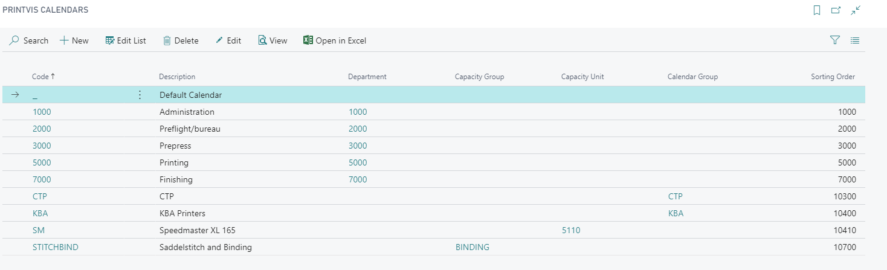

# Opening Hours

Opening Hours in PrintVis define the available production calendar for cost centers and resources. They determine when each machine or resource is available for scheduling, and are used to calculate accurate planned dates and capacity.

## Usage

Opening Hours control:
- Which days and hours each cost center is available for production
- Public holidays and company closures
- Shift patterns (e.g., 8-hour day shift, 16-hour two-shift operation)
- Special schedules (e.g., reduced hours on Fridays)

When the system calculates planned dates (e.g., in Auto Scheduling or when the planner schedules jobs), it uses Opening Hours to determine when work can actually be performed.

### Opening Hours Maintenance

Opening Hours calendars require regular maintenance to stay current:
- Add new public holidays at the start of each year
- Update shift schedules when operational hours change
- Create special calendars for planned maintenance periods

## Setup

Opening Hours are found by searching **PrintVis Opening Hours** or via the Planning setup menu.

!!! warning "Assisted Setup Note"
    Opening Hours is one of the sections covered in PrintVis Assisted Setup. Standard opening hours can be set up during initial implementation.

### Creating an Opening Hours Profile

1. Search for **PrintVis Opening Hours Profiles**.
2. Create a profile for each type of schedule (e.g., Standard 8-hour Day, Two-Shift, Three-Shift).

3. Define the working hours for each day of the week.
4. Define exceptions (holidays, special closures).

### Assigning Opening Hours to Planning Units

After creating profiles:
1. Open the **Planning Unit** for each cost center.
2. Set the **Opening Hours Profile** field to the appropriate profile.
3. The planning system will now respect these hours when scheduling.

### Opening Hours Calendar Maintenance

To update the calendar for the upcoming year:
1. Search for **Opening Hours Calendar Maintenance**.

2. Select the year to generate.
3. The system creates calendar entries based on the profile.
4. Manually add or remove specific dates as needed (public holidays, special closures).

## Examples

### Example: Two-Shift Opening Hours Profile

For a printing company running two 8-hour shifts (6 AM–10 PM, Monday–Friday):

| Day | Hours From | Hours To |
|---|---|---|
| Monday | 06:00 | 22:00 |
| Tuesday | 06:00 | 22:00 |
| Wednesday | 06:00 | 22:00 |
| Thursday | 06:00 | 22:00 |
| Friday | 06:00 | 22:00 |
| Saturday | Closed | |
| Sunday | Closed | |

Then add public holiday exceptions for each holiday date.

## See Also

- [Planning Units](planning-units.md)
- [Capacity Resources](capacity-resources.md)
- [Auto Scheduling](auto-scheduling.md)
