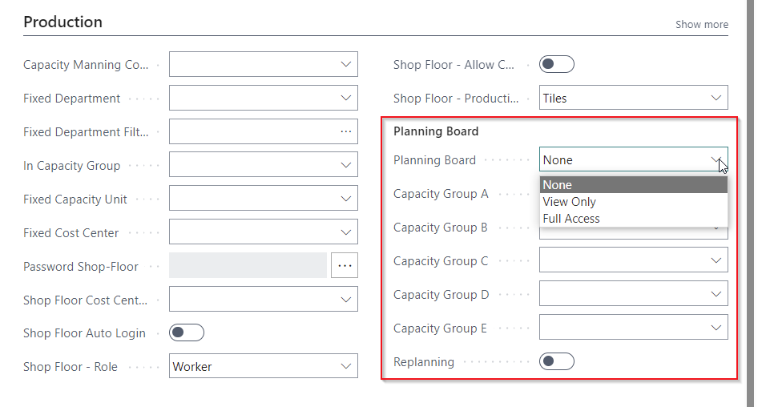
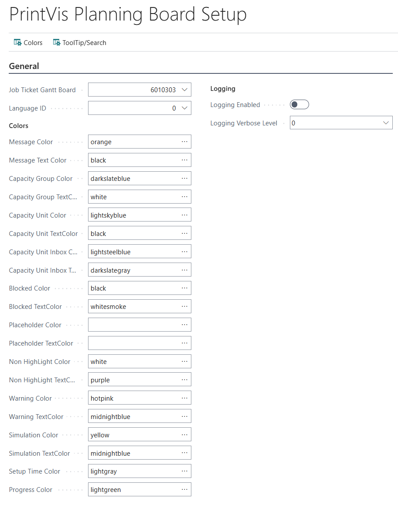
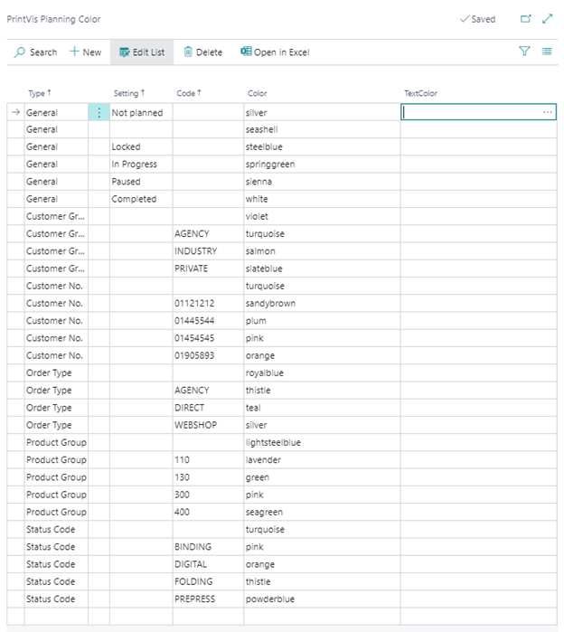

# Planning Board

The PrintVis Planning Board is a visual Gantt-chart-style scheduling tool that allows planners and coordinators to drag and drop jobs onto cost centers and time slots. It replaces Business Central's Resource Scheduling/Schedule Board with print-production-specific functionality.

## Usage

The Planning Board provides a visual overview of:
- Which jobs are scheduled on each machine/cost center
- When each job is planned
- Available capacity vs. loaded capacity
- Job tooltips with detailed job information

### Navigation and Views

- **Horizontal axis** — Time (days, weeks, or hours depending on zoom level)
- **Vertical axis** — Cost centers / planning units
- **Bars** — Represent jobs/operations; color-coded by status or job type
- **Tooltips** — Hover over a job bar to see detailed job information

### Scheduling Jobs on the Planning Board

1. Unscheduled jobs appear in the **job queue** panel.
2. Drag a job from the queue onto the appropriate cost center at the desired time slot.
3. The system calculates the end time based on the estimated run time.
4. Overlapping jobs show as a conflict.

### Actions Available on the Planning Board

- **Drag and drop** — Move jobs between cost centers or time slots
- **Resize** — Extend or shorten a job's planned duration
- **Status change** — Change job status directly from the Planning Board
- **Navigate to Case** — Open the Case Card from a planning bar
- **Tooltips** — Show job-specific details in a configurable tooltip panel

### Planning Board Tooltip Setup

The Planning Board can display configurable tooltips with job-specific information when a user is clocked into a job. Tooltip lines can be shown or hidden via the **PV Shop Floor Setup** action.

## Setup

The Planning Board requires:
- **Advanced License** — The Planning Board is an advanced feature requiring an Advanced PrintVis license
- **Planning Units** — Cost centers must have Planning Units set up
- **Opening Hours** — Capacity is calculated from the opening hours calendar

### Enabling the Planning Board

1. Ensure users have the appropriate license (Advanced Full User).
2. Assign the **PVS 365 ADV** (or **PVS 365 ADV Setup**) permission set.
3. The Planning Board is accessible from the Coordinator Role Center or via search.

### Planning Board Layout and Configuration

The Planning Board layout is configured per-user. Each user can customize:
- Which cost centers are visible
- The time scale (hourly, daily, weekly)
- Color coding for job bars
- Tooltip content

## Examples

!!! warning "Missing Content"
    Detailed step-by-step Planning Board usage examples are not fully documented in the current source material. Refer to the legacy Planning Board documentation for specific navigation and configuration examples.

## See Also

- [Production Plan](production-plan.md)
- [Planning Units](planning-units.md)
- [Capacity Resources](capacity-resources.md)
- [Opening Hours](opening-hours.md)
