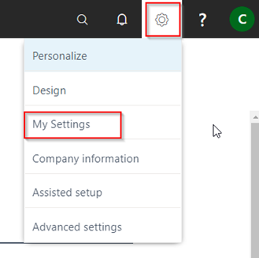
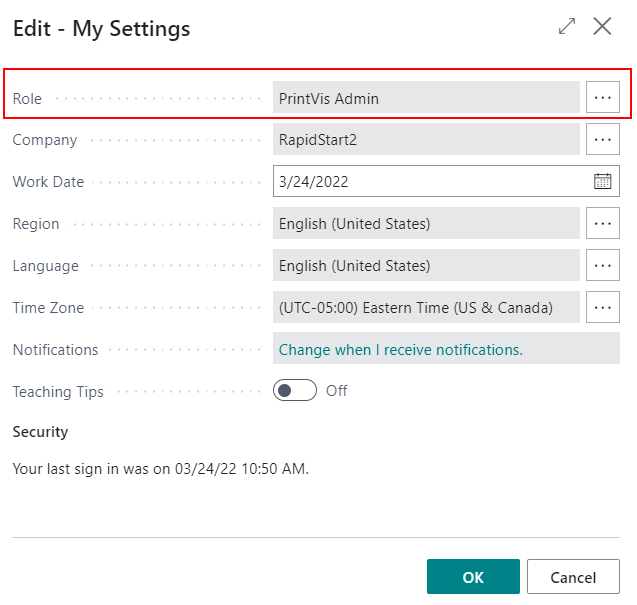
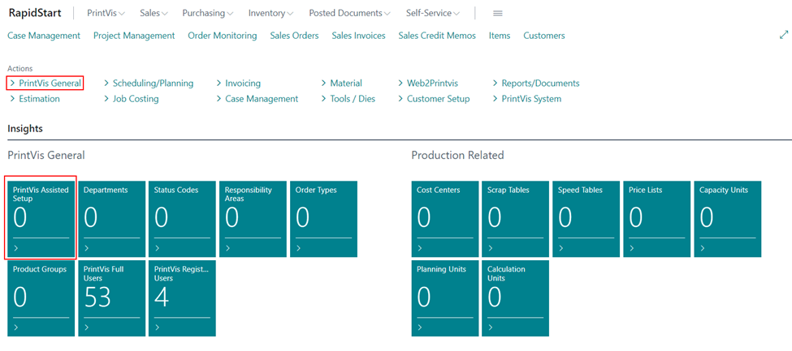
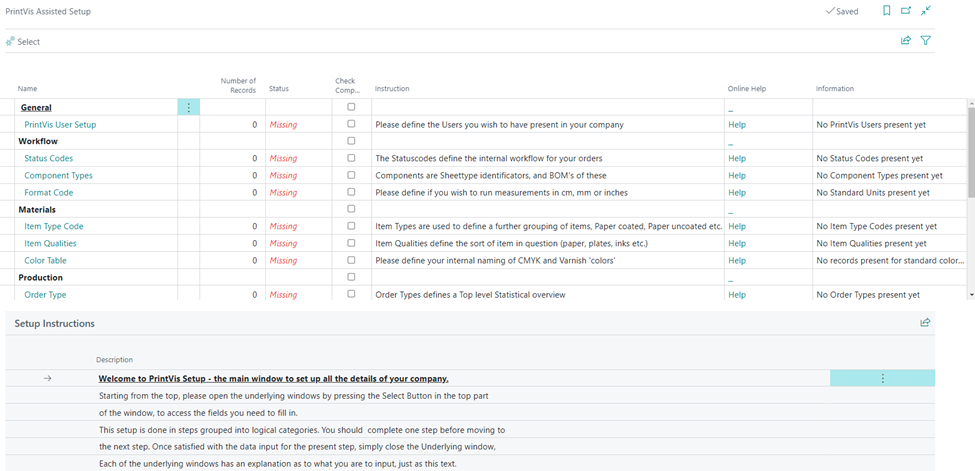

# PrintVis Assisted Setup

PrintVis Assisted Setup (also referred to as PrintVis RapidStart) is a step-by-step guided workflow for setting up a new PrintVis company. It uses a Web Service connection to a reference database where preselected standard data can be copied into your database, significantly reducing implementation time.

## Usage

The Assisted Setup provides a structured checklist that guides you through all the essential PrintVis configuration steps in the correct order. It is designed for use during initial implementation of a new company.

Access Assisted Setup by:
- Clicking the **PrintVis Assisted Setup** tile on the PrintVis Admin Role Center
- Going to **PrintVis General** → **PrintVis Assisted Setup**
- Searching for **PrintVis Assisted Setup**

### Assisted Setup Worksheet Fields

| Field | Description |
|---|---|
| **Name** | Section headers (in bold) group related steps. Clickable links (in blue/green) lead to the setup page for that section. |
| **Number of Records** | Shows how many records have been created for this section. |
| **Status** | Shows whether the section is **missing**, **ready**, **completed**, or **not yet available** (waiting on a prerequisite). |
| **Check Completed** | Mark this when a section is done. Format Code and Color Table are auto-marked after clicking OK — they cannot be reopened. All other sections should be marked manually. |
| **Instruction** | Quick hints for the section. More detailed instructions are on the individual setup page. |
| **Online Help** | Direct link to support articles related to the section. |
| **Information** | Reminder showing whether information has been entered or the section is still incomplete. |

### Recommended Workflow

Work through the Assisted Setup from top to bottom. Some sections depend on others being completed first.

**Example:** The **Cost Center** section cannot be started without first completing **Departments**. Following the top-to-bottom order avoids this issue.

Once completed, the system should support the full workflow from **Request** to **Invoicing**, provided the initial Business Central setup has also been done.

## Setup

### Prerequisites

Before starting Assisted Setup:

1. Ensure Business Central is set up with the company information.
2. Start Business Central and select the new company.
3. Set your role to **PrintVis Admin** via the gear icon → **My Settings**.

### Step-by-Step Process

1. Open **PrintVis Assisted Setup** from the Admin Role Center.

2. Note that all tiles show **0** initially (except Full Users and Registration Users).
3. Work through each section from top to bottom:

   - Each section link opens the corresponding setup page.
   - The Web Service connection to the reference database allows importing standard data.
   - Mark **Check Completed** after finishing each section.
4. Tiles on the Admin Role Center will update as data is populated.

### Assisted Setup Sections

The following sections are covered in Assisted Setup (in recommended order):

- PrintVis User Setup
- Status Codes
- Component Types
- Format Codes
- Item Type Codes
- Item Qualities
- Color Table
- Order Types
- Product Groups
- Departments
- Cost Centers
- Cost Center Rates
- Additional Rates
- Items
- Opening Hours
- Milestones
- Unit of Measure
- Extra Work Codes
- Invoice Template
- Configuration Packages
- Data Mapping
- Additional To Dos

## Examples

### Example: Importing Standard Status Codes

During Assisted Setup:

1. Click on the **Status Codes** link in the worksheet.
2. The system connects to the PrintVis reference database.
3. A list of standard status codes is presented (Request, Quote, Order, Production Order, Invoiced, Archived, etc.).
4. Select the status codes you want to import.
5. Click **OK** to import them into your company.
6. Return to Assisted Setup and check **Check Completed** for the Status Codes section.

## See Also

- [General Setup](general-setup.md)
- [Status Codes](../case-management/status-codes.md)
- [Departments](../case-management/departments.md)
- [Cost Center](../../Pages/pvscostcenter.md)
