# PrintVis General Setup

The PrintVis General Setup page allows the company to set a number of standard parameters such as number series, invoicing, job costing, and more. The page is divided into sections, each containing parameters for specific areas of the system.

## Usage

The General Setup controls system-wide behavior in PrintVis. Changes here affect all users and all cases. Access it by searching **PrintVis General Setup**.

Key areas controlled by General Setup:

- **Number series** for quotes, orders, and shipments
- **Case card behavior** — whether to use the Advanced Case Card, how search names are built, default order documents
- **Estimation defaults** — how pages and format are entered, grain direction, color coverage defaults
- **Production defaults** — gang job setup, prepress job handling, folder archiving
- **Job costing** — WIP account, journal behavior
- **Invoicing** — invoice template text codes
- **Integrations** — CRM coupling, ECO label settings

### Menu Actions

| Function | Description |
|---|---|
| **User Fields** | View/Edit the General Setup integrated user fields |
| **Create PrintVis Standard Bitmaps** | Creates the standard bitmap system entries used in PrintVis |

## Setup

### Menu

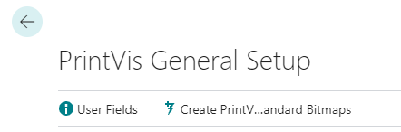

| Function | Description |
|---|---|
| **User Fields** | View/Edit the General Setup integrated user fields. |
| **Create PrintVis Standard Bitmaps** | Creates the Standard Bitmaps system entries used in PrintVis. |

### Case Management Section

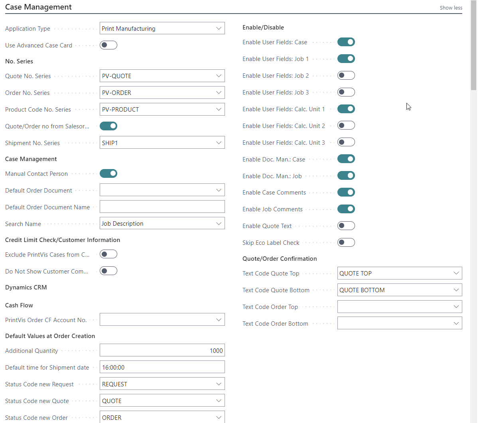

| Field | Description |
|---|---|
| **Application Type** | Select **Print Manufacturing** for most print shops. Use **General Manufacturing** if print-specific pages and fields are not needed. |
| **Use Advanced Case Card** | If enabled, the case card and job card are combined, reducing clicks. If disabled, the job card opens separately. |
| **Quote No. Series** | Number series for quote cases. |
| **Order No. Series** | Number series for order cases. |
| **Quote/Order No from Sales Order** | If ticked, the Case Card number is based on the Sales Order number with a suffix. |
| **Shipment No. Series** | Required if using combined shipments or posted shipments. |
| **Manual Contact Person** | Enables or disables users' ability to change the contact person on Case Cards. |
| **Default Order Document** | Default order confirmation document for automation. |
| **Search Name** | Determines how the Case Card search name is updated (e.g., Job Description, Customer Name). |
| **Exclude PrintVis Cases from Credit Limit Check** | If enabled, quoted prices on orders are excluded from BC Credit Limit calculations. |
| **Additional Quantity** | Default additional quantity (e.g., 1000). Can be changed per case. |
| **Default Time for Shipment Date** | Sets a default shipment time (e.g., 16:00) if not manually entered. |
| **Status Code New Request / Quote / Order** | Defines default status codes used when copying cases to new requests, quotes, or orders. |
| **Enable User Fields** | Grants access to User Fields at the Calculation Unit level. |
| **Enable Document Management** | Enables document management for generating Word documents with variable information. |
| **Enable Comments** | Allows job-specific comments, optionally linked to departments. |
| **Enable Quote Text** | Enables text lines for quotes (requires a special report for merging). |
| **Skip Eco Label Check** | If enabled, the system will not validate ECO Label codes. |
| **Text Code Quote/Order Top/Bottom** | Links to Text Code table for header and footer text on quotes and orders. |

### Estimating Section

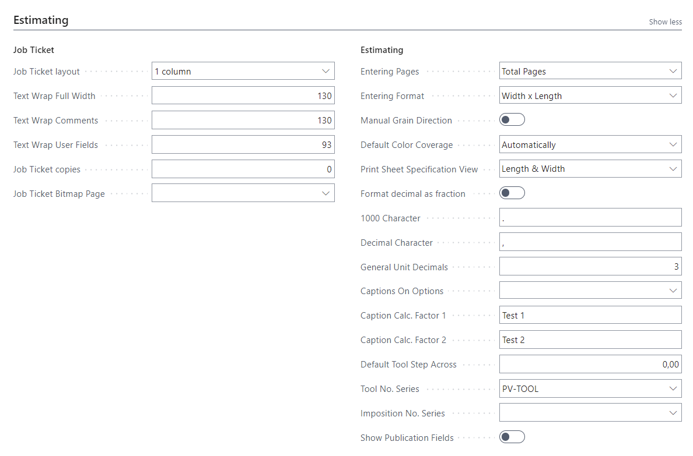

| Field | Description |
|---|---|
| **Job Ticket Layout** | **2 columns** (shorter report) or **1 column** (easier to find information). |
| **Text Wrap Full Width / Comments / User Fields** | Character limits for text wrapping in different areas of the Job Ticket. |
| **Job Ticket Copies** | Number of copies to print when printing a Job Ticket. |
| **Job Ticket Bitmap Page** | Bitmap logo to display on the Job Ticket Report. |
| **Entering Pages** | How number of pages is entered: **Pages with Print**, **Sheets**, or **Total Pages**. |
| **Entering Format** | How format is entered: **Length x Width** or **Width x Length**. |
| **Manual Grain Direction** | Allow setting grain direction individually per item (mainly for North America). |
| **Default Color Coverage** | Default color calculation: **Both pages**, **Front**, **Back**, or **Automatically**. |
| **Print Sheet Specification View** | **Length & Width** or **Format 1 & 2 Values**. |
| **Format Decimal as Fraction** | How fractions are handled when laying out multiple Job Items on one sheet. |
| **1000 Character / Decimal Character** | Characters used for thousands and decimal separators. |
| **Captions on Options** | Unit captions: **Metric**, **Imperial**, or based on language. |
| **Caption Calc. Factor 1 & 2** | Customizable field labels for complex calculations in Estimation. |
| **Default Tool Step Across** | Default value for Step Across when creating new dies. |
| **Tool No. Series / Imposition No. Series** | Numbering series for tools and impositions. |
| **Show Publication Fields** | Enables Publications, Editions, Issues, Sections fields. |

### Production Section

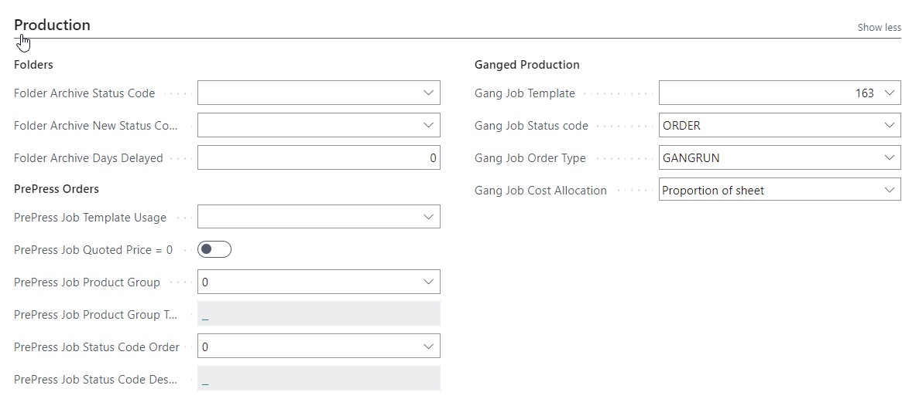

| Field | Description |
|---|---|
| **Folder Archive Status Code** | Status Code that triggers the folder archiving function. |
| **Folder Archive Days Delayed** | Days to delay moving folder items to archive. |
| **PrePress Job Template Usage** | **Use Product Group Template** or **Use Item Template** for automatically created prepress cases. |
| **PrePress Job Quoted Price = 0** | If ticked, automatically created prepress cases are set to zero quoted price. |
| **PrePress Product Group** | Product group set up for prepress cases/jobs. |
| **PrePress Status Code Order** | Status code set up for prepress cases/jobs. |
| **Gang Job Template** | General template used for ganged (combined) jobs. |
| **Gang Job Status Code** | Status code for new combined orders. |
| **Gang Job Order Type** | Order type for ganged jobs. Only templates with this order type are suggested. |
| **Gang Job Cost Allocation** | **Equal** — costs divided equally by number of job items; **Proportion of Sheet** — divided by space each job item occupies; **Index** — manually set per job item. |

### Job Costing Section

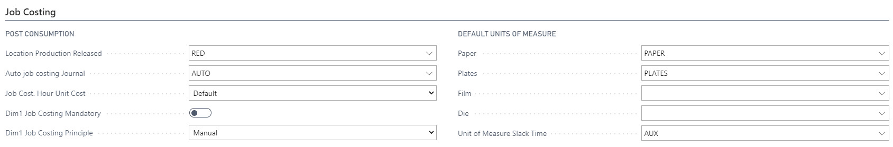

| Field | Description |
|---|---|
| **Location Production Released** | Location where surplus materials go when production ends and goods are released. |
| **Auto Job Costing Journal** | Journal used for automatic posting of time and material when production ends. |
| **Job Cost. Hour Unit Cost** | **Default** = normal time rates; **Weighted** = adjusted by user efficiency; **Actual** = uses recorded hours with any overtime factors. |
| **Dim1 Job Costing Mandatory** | If ticked, Dimension 1 is required on all job costing entries. |
| **Dim1 Job Costing Principle** | How Dimension 1 is populated: Manual, Case (from Case Card), Department, or User Department. |
| **Def. UoM Paper / Plates / Film / Die** | Default Units of Measure for paper, plates, film, and dies when not set on the item card. |
| **UoM Slack Time** | Unit of Measure used to record idle/slack time between jobs for efficiency tracking. |

### Invoicing Section

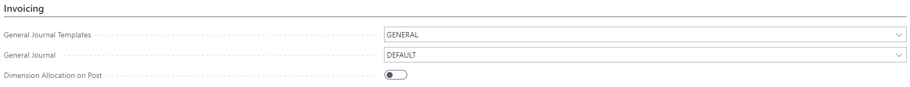

| Field | Description |
|---|---|
| **General Journal Templates** | Which General Journal Template is used for posting invoice lines. |
| **General Journal** | Which General Journal Batch is used for posting invoices. |
| **Dimension Allocation on Post** | When set, the system allocates and re-posts invoice turnover by dimensions to the General Ledger after invoicing. |

### Posting Section

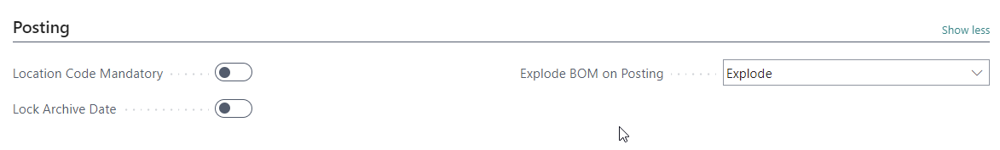

| Field | Description |
|---|---|
| **Location Code Mandatory** | If ticked, a location code is required when posting item-related transactions. |
| **Lock Archive Date** | If ticked, the Archiving Date on the Case Card cannot be changed after its first value is set. |
| **Explode BOM on Posting** | **Explode** = expand BOM on posting; **Do not explode** = do not expand. |

### Logistics Section

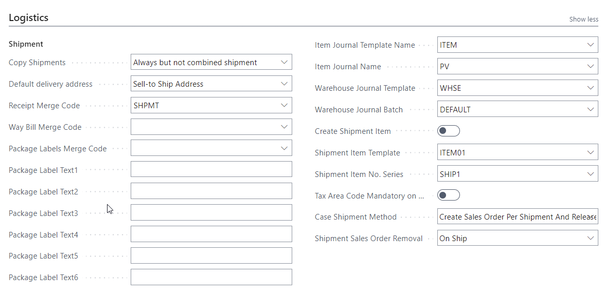

| Field | Description |
|---|---|
| **Copy Shipments** | Whether to copy shipments when using Copy To: Always, Never, Always but not combined shipment. |
| **Default Delivery Address** | Default address on the Shipment Card: Sell-To Address, Sell-To Ship Address, or No Address. |
| **Receipt / Way Bill / Package Label Merge Code** | Merge codes for building information lines on receipt, shipment, and package label documents. |
| **Package Label Text 1–6** | Fixed caption fields for package labels (up to 6). |
| **Item Journal Template / Name** | Journal used for posting items consumed from production. |
| **Warehouse Journal Template / Batch** | For companies using BC Warehouse module, the journal for PrintVis warehouse-related posting. |
| **Create Shipment Item** | When posting a PrintVis Shipment, optionally generate a standard BC shipment using a dummy item or a new item per shipment. |
| **Case Shipment Method** | How PrintVis shipments are processed: No Sales Order, Create Sales Order Per Shipment, Create and Release, Create and Post, or Create Posted Shipments. |
| **Shipment Sales Order Removal** | When to remove the Sales Order after posting: On Ship (default), On Archive, or Never. |

### Sales / Purchase Order Section

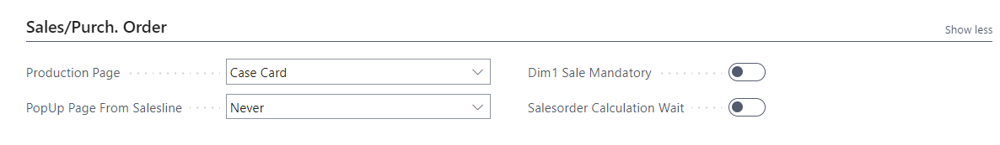

| Field | Description |
|---|---|
| **Production Page** | Which page is displayed as the production plan: Case Card, Job Card, or Quick Quote. |
| **PopUp Page From Salesline** | Whether a popup page appears from the sales line: Never, Always, or If no template. |
| **Dim1 Sale Mandatory** | If ticked, the Sales Order must have Dimension 1 before creating a production order. |

### Sales Shipment Section

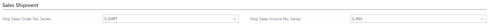

| Field | Description |
|---|---|
| **Ship Sales Order No. Series** | Number series for ship sales orders. |
| **Ship Sales Invoice No. Series** | Number series for ship sales invoices. |

### Purchase Order Section

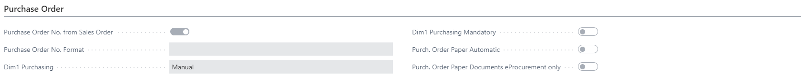

| Field | Description |
|---|---|
| **Purchase Order No. from Sales Order** | If selected, a purchase order created from a sales order receives the same number. |
| **Purchase Order No. Format** | Format string for purchase order numbers (e.g., `CASE-%1-DK` → `CASE-8856-DK`). |
| **Dim1 Purchasing** | Dimension value on the purchase order: Manual, PV Case, Department, User Department, or Purchaser Dimension. |
| **Dim1 Purchasing Mandatory** | If ticked, all Purchase Orders must have a Dimension 1 code. |
| **Purch. Order Paper Automatic** | If ticked, activates automated paper purchasing (eProcurement). |

### Special Section

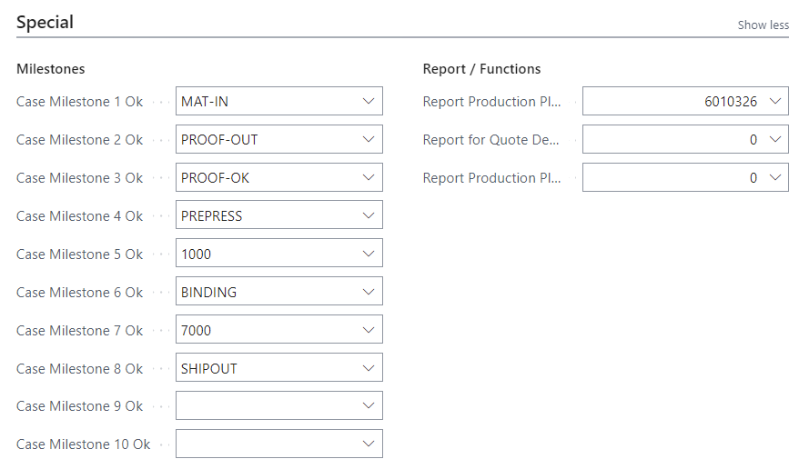

| Field | Description |
|---|---|
| **Scheduling Locked Behavior** | **Stop Manual Move** (default) = locked planning units cannot be moved; **Allow Manual Move** = allows moving despite lock (for customizations). |
| **Case Milestone 1–10 Ok** | Up to 10 milestones shown in the Production Plan and Case Management overview. |
| **Report Production Plan** | Replaces the standard Production Plan report with a custom version. |
| **Report for Quote Description** | Custom report for generating quote description text. |
| **Report Production Plan Milestones** | Replaces the standard Milestones report with a custom version. |

### System Section

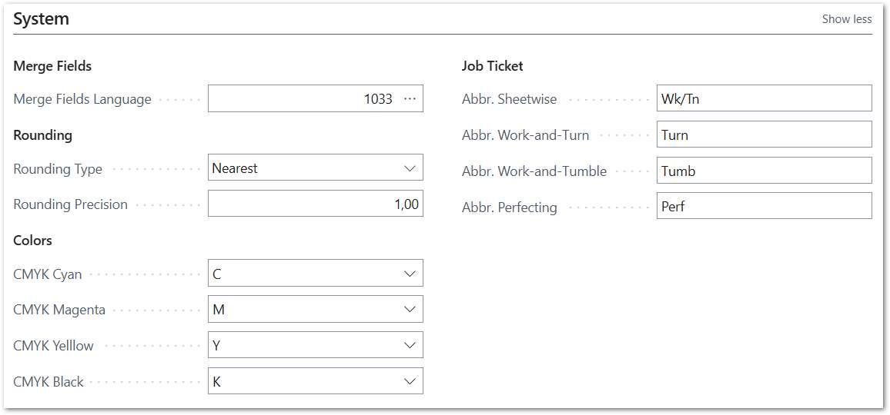

| Field | Description |
|---|---|
| **Merge Fields Language** | Base language for Merge code creation. |
| **Rounding Type** | How the Quoted Price on the Job line is rounded: No Rounding, Up, Down, Nearest. |
| **Rounding Precision** | Works with Rounding Type to define rounding precision on Quoted Price. |
| **PrintVis Assisted Setup Webservice URL** | URL for connecting to PrintVis Assisted Setup reference database. |
| **PrintVis Assisted Username / Password** | Credentials for the PrintVis RapidStart reference database. |
| **CMYK Cyan / Magenta / Yellow / Black** | Item card references for CMYK process colors used on job tickets. |
| **Abbr. Sheetwise / Work-and-Turn / Work-and-Tumble / Perfecting** | Abbreviations for printing processes shown on the Job Ticket Report. |

### Job Queues Section

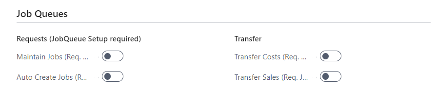

Controls whether Job Queues are used for: Maintain Jobs, Auto Create Jobs, Transfer Costs, and Transfer Sales background processing.

### Cloud Section

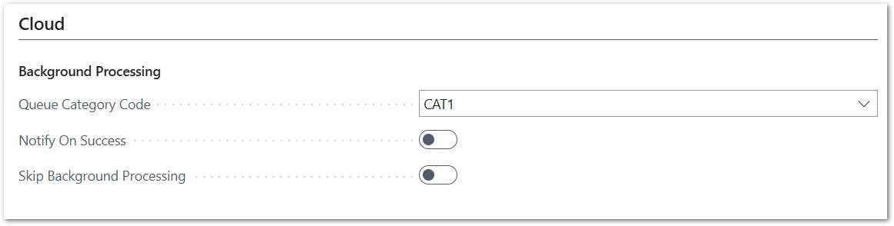

| Field | Description |
|---|---|
| **Queue Category Code** | Job Queue Category used for cloud processing. |
| **Notify on Success** | Whether a success log is created when cloud processing completes. |
| **Skip Background Processing** | If enabled, functions like folder creation and status changes run in the foreground rather than as background processes. |

### Assisted Setup Connection Section

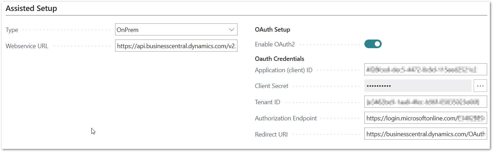

Used to connect to a reference company for importing setup data via **Assisted Setup** or **Create from Reference Company**.

| Field | Description |
|---|---|
| **Type** | **PrintVis** = connect to default PrintVis RapidStart; **OnPrem** = connect to an on-premises BC environment; **Cloud** = connect to a BC Cloud environment. |
| **Webservice URL** | URL for the PVS RAPID Web Service. |
| **Enable OAuth2** | Enable to connect via OAuth 2.0. |
| **Username / Password** | Credentials for basic authentication. |
| **Application (client) ID / Client Secret / Tenant ID** | OAuth 2.0 credentials from Microsoft Entra ID. |

To find the Webservice URL, publish a Web Service in the source company using Object Type **Codeunit**, Object ID **6010159**, Service Name **RapidStart**, then copy the SOAP URL.

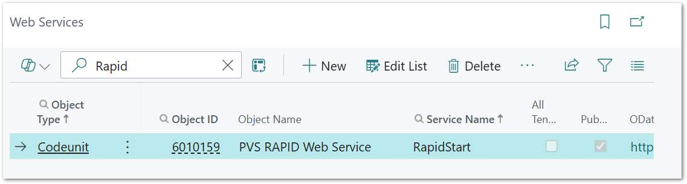

## Examples

### Example: Configuring for North American Usage

For a North American printing company:

1. Set **Entering Format** = **Width x Length** (standard North American convention)
2. Set **Captions on Options** = **Imperial**
3. Enable **Manual Grain Direction** to allow individual grain direction per item
4. Set **1000 Character** = `,` and **Decimal Character** = `.`

### Example: Setting Up Quote/Order Number Series

1. First, create number series in **No. Series** (search "No. Series" in BC).
2. In General Setup → Case Management:
   - Set **Quote No. Series** to your quote number series code
   - Set **Order No. Series** to your order number series code
3. Cases will now automatically receive numbers from these series when created.

## See Also

- [Feature Management](feature-management.md)
- [Status Codes](../case-management/status-codes.md)
- [Users](users.md)
