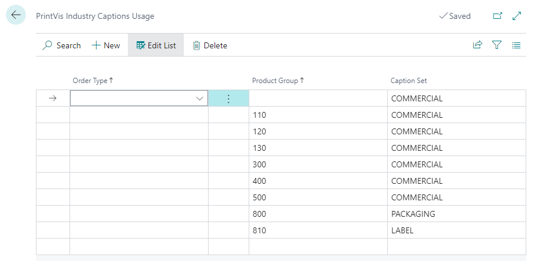
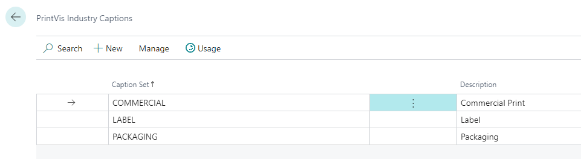
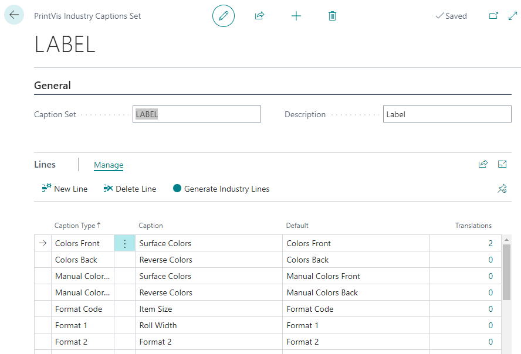
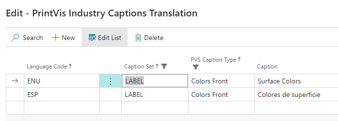

# Industry Captions

PrintVis Industry Captions allow customization of field labels based on industry, order type, or product group. This ensures the system aligns with your company's terminology and industry standards. If no custom captions are set, default PrintVis captions are used.

## Usage

Once caption sets are configured, the system automatically displays the correct captions based on the order type or product group assigned to a case.

- A case with Order Type "Labels" can show label-specific field names
- A case with Order Type "Packaging" can show packaging-specific field names
- Cases without a specific caption set use the **Default Caption Set**

Some fields (such as those related to tools or dies) always use the default caption set regardless of order type or product group.

### Assigning Caption Sets

Caption sets are assigned on the **Industry Captions Usage** page:

1. Open **Industry Captions Usage** (accessible from the Industry Captions page).
2. Add a row for each Order Type or Product Group that needs custom captions.
3. Select the appropriate **Caption Set** for each row.
4. Create a **Default** row to cover cases where no specific order type or product group match exists.

## Setup

### Creating a Caption Set

1. Search for **PrintVis Industry Captions**.
2. Create a new Caption Set by clicking **New**.

| Field | Description |
|---|---|
| **Caption Set** | Code used to identify this caption set. |
| **Description** | Text description of the caption set. |

### Editing Captions in a Set

1. Select a caption set and click **Edit**.
2. Add rows for each field you want to customize:

| Field | Description |
|---|---|
| **Caption Type** | The PrintVis field being modified. |
| **Caption** | The new caption to display for that field. |
| **Default** | Shows the original PrintVis caption for reference. |

### Adding Translations

For multi-language environments:
1. In the caption set editor, click the number in the **Translations** column.
2. Enter the appropriate caption for each language.

### Using the Generate Industry Lines Action

PrintVis provides a quick-start action to create industry-specific captions based on pre-defined defaults:

1. Click **Generate Industry Lines**.
2. Select an industry standard (e.g., Commercial Printing, Label, Packaging).
3. The system creates a set of caption overrides appropriate for that industry.

## Examples

### Example: Creating a Label Industry Caption Set

A label printer wants the word "Press" replaced with "Press/Printer" and "Format" replaced with "Label Size":

1. Create a Caption Set with code **LABEL** and description "Label Industry Captions".
2. Add caption rows:
   - Caption Type: Press → Caption: Press/Printer
   - Caption Type: Format → Caption: Label Size
3. On the Industry Captions Usage page, add a row:
   - Order Type: LABEL → Caption Set: LABEL
4. Now when a case uses the LABEL order type, these custom captions appear.

## See Also

- [Order Types](../case-management/order-types.md)
- [Product Groups](../case-management/product-groups.md)
- [General Setup](general-setup.md)
