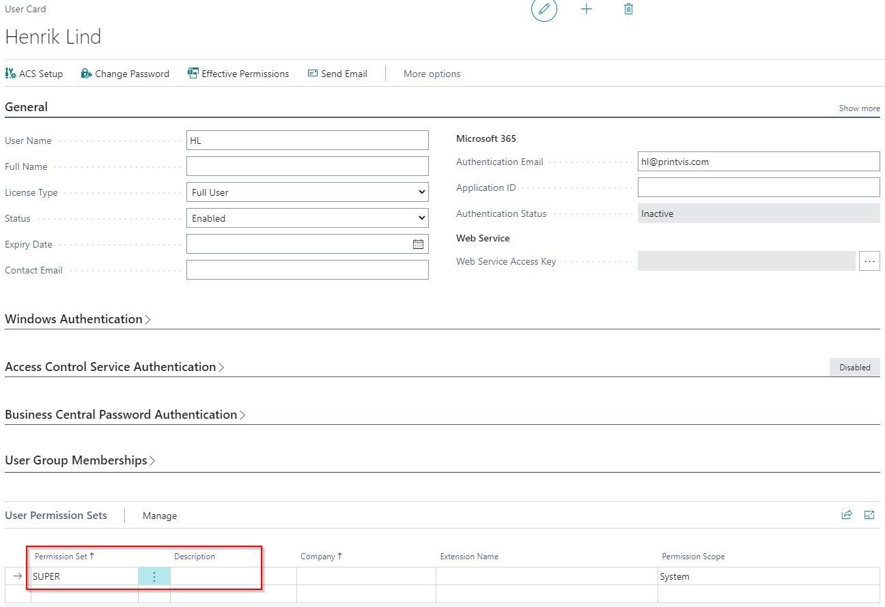
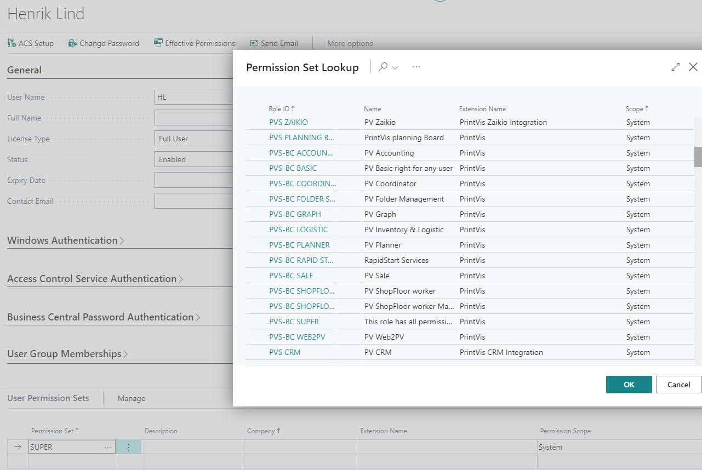
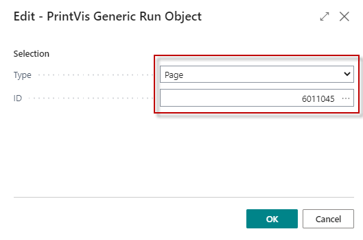
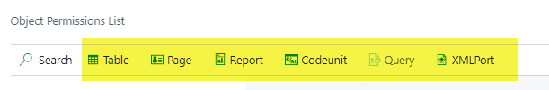

# Permission Sets

PrintVis provides a set of Permission Sets that control what users can access in Business Central and PrintVis. Using specific Permission Sets instead of the generic SUPER role ensures proper access control and security.

## Usage

Permission Sets control which Business Central and PrintVis objects a user can read, insert, modify, delete, and execute. Assigning SUPER to all users grants all rights, which is risky and not recommended.

Instead, use specific PrintVis Permission Sets tailored to user roles.

PrintVis provides two generations of permission sets:

| Generation | Prefix | Notes |
|---|---|---|
| **Old Permission Sets** | `PVS-BC ...` | Older sets still in use but not maintained for new PrintVis versions |
| **Current Permission Sets** | `PVS 365 ...` | Updated, streamlined sets maintained for current PrintVis versions |

Use the **PVS 365** permission sets for all new and current implementations.

### PrintVis Permission Sets Overview

| Permission Set | Description |
|---|---|
| **PVS 365 Basic** | Included automatically by other sets. Do not assign manually — it is a dependency set. |
| **PVS 365 Case Edit** | Required for users who perform non-read actions on cases or related pages. Includes PVS 365 Basic. |
| **PVS 365 Setup** | Required for users who edit PrintVis setup data (cost centers, planning units, etc.). Includes PVS 365 Basic. |
| **PVS 365 ADV** | Required for users using advanced features such as the Planning Board or Web2PV. Includes PVS 365 Basic. |
| **PVS 365 ADV Setup** | For users setting up advanced features (Planning Board, Web2PV, CIM connections). Includes PVS 365 ADV, PVS 365 Basic, and PVS 365 Setup. |
| **PVS 365 SFloor** | Required for any shop floor user. Includes PVS 365 Basic and PVS 365 Job Cost ENT. |
| **PVS 365 Job Cost ENT** | For users recording job costing entries. Includes PVS 365 Basic. |
| **PVS 365 None PVS** | For BC users with no other PrintVis access. |
| **PVS 365 API** | Required for assisted setup API connections. |

### Object Permissions List

The **Object Permissions List** (Page 6011045) provides an overview of permissions per object based on the installed database license. Use it to filter by Read, Insert, Modify, Delete, or Execute permissions to understand what access each permission set grants.

## Setup

### Assigning Permission Sets to Users

1. Search for **Users** in Business Central.
2. Open the user record.
3. In the **User Permission Sets** section, add the appropriate PrintVis permission sets.

**Typical configurations by role:**

| Role | Recommended Permission Sets |
|---|---|
| Admin / Setup | PVS 365 ADV Setup (includes all others) |
| Coordinator / Estimator | PVS 365 Case Edit, PVS 365 ADV |
| Salesperson | PVS 365 Case Edit |
| Shop Floor Worker | PVS 365 SFloor |
| Job Costing Entry | PVS 365 Job Cost ENT |
| Read-Only / BC Only | PVS 365 None PVS |
| API / Assisted Setup | PVS 365 API |

### Reviewing Effective Permissions

To see the combined effective permissions for a user (taking into account all assigned permission sets):

1. Search for **Users**.
2. Open the user record.
3. Click the **Effective Permissions** action.
4. Review what the user can and cannot do.

### Object Permissions List

The **Object Permissions List** (Page 6011045) provides an overview of permissions per object based on the installed database license. Filter by Read, Insert, Modify, Delete, or Execute permissions.

## Examples

### Example: Setting Up a Coordinator

A coordinator needs to create and edit cases, run estimations, manage planning, but should not have access to PrintVis setup data.

Assign:
- **PVS 365 Case Edit** — to create and edit cases
- **PVS 365 ADV** — if the coordinator uses the Planning Board

### Example: Setting Up a Shop Floor Worker

A shop floor worker needs to register time and declare production but does not need access to cases or setup.

Assign:
- **PVS 365 SFloor** — covers all shop floor time registration needs

## See Also

- [Users](users.md)
- [Role Centers](../general/role-centers.md)
