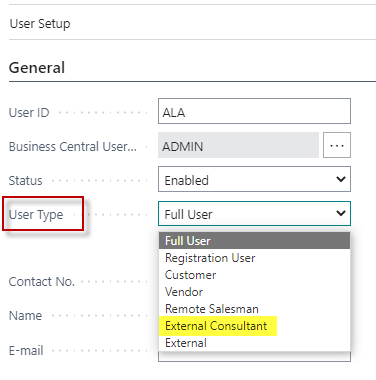
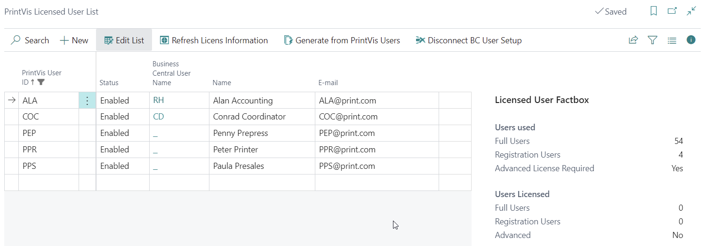
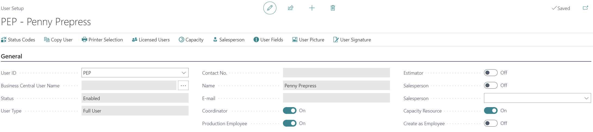
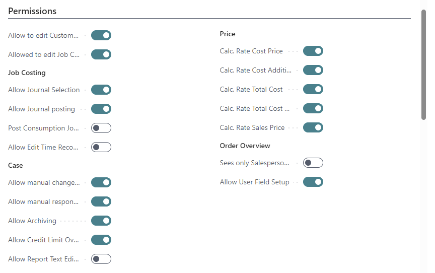
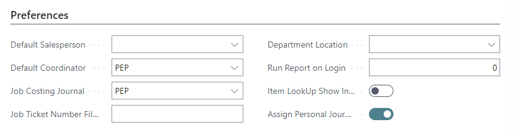
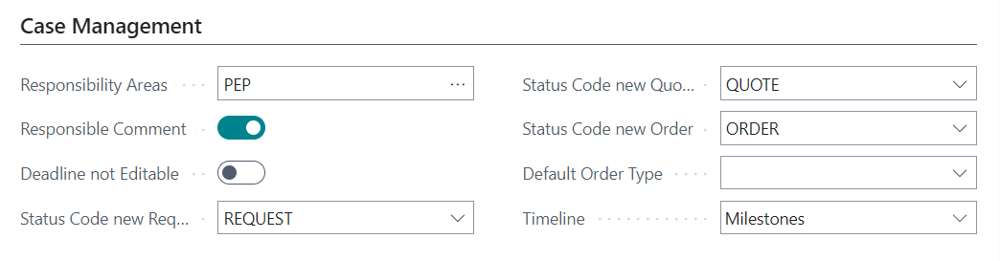
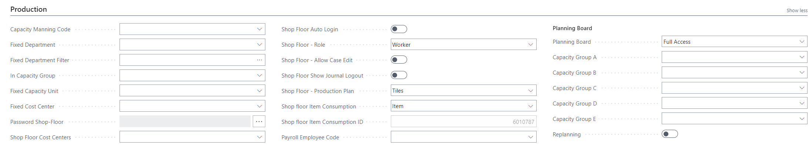
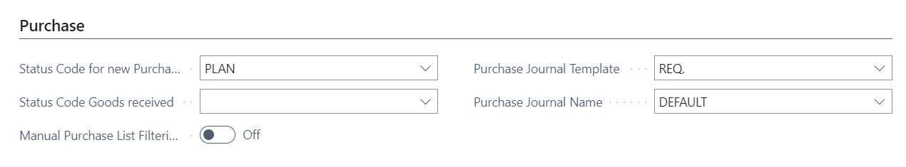

# Users

Every user in PrintVis must be a named user. User setup is performed in two steps: first creating a **PrintVis Licensed User**, then creating a **PrintVis User** with detailed settings.

## Usage

PrintVis users have role-specific settings that control what they can see and do in the system. The user setup defines:

- Whether the user is a Coordinator, Estimator, Salesperson, Production Employee, or Capacity Resource
- Calculation rate permissions (which price fields the user can manually modify)
- Journal posting rights
- Status code change rights
- Invoice posting rights
- Whether the user only sees their own salesperson orders

### User Types

| Type | Description |
|---|---|
| **Advanced Full User** | Total access including setup, Planning Board, Manufacturing Integration, and Web2PV. All Full Users must be the same type (all Advanced or all Standard). |
| **Standard Full User** | Total access including setup. All Full Users must be the same type. |
| **Registration User** | For shop floor time registration only. Often combined with a BC Device Only or Team Member license. |
| **External Consultant** | Does not count toward license calculations. For PrintVis employees or partners accessing customer databases for support. |

!!! note "License Compliance"
    A mismatch between the registered license and the used license is a violation of license terms. Monitor the Users Used and Users Licensed fields in the Licensed User fact box.

## Setup

### Step 1: Create a PrintVis Licensed User

1. Search for **PrintVis Licensed Users**.
2. Create a new record.
3. Fill in the following fields:

| Field | Description |
|---|---|
| **PrintVis User ID** | Identifier for the licensed user. Typically matches the BC User Name. |
| **Status** | Set to **Enabled** only if the user is licensed. |
| **Business Central User Name** | Links to the BC user (must be created first in BC). |
| **Name** | User's name. Changes here update the PrintVis User Setup. |
| **E-mail** | User's email address. Changes here update the PrintVis User Setup. |

### Step 2: Create a PrintVis User

1. Search for **PrintVis User Setup** (or access from the Licensed User page).
2. Create a new user or copy an existing one.
3. Fill in the **General Tab**:

| Field | Description |
|---|---|
| **User ID** | Controlled by Licensed User Setup. |
| **Name / E-mail** | Controlled by Licensed User Setup. |
| **Coordinator / Order Planner** | Select if the user is a coordinator or order planner. |
| **Production Employee** | Select if the user is a production worker. |
| **Estimator** | Select if the user is an estimator. |
| **Salesperson** | Select if the user is a salesperson. |
| **Capacity Resource** | Select if the user is a capacity resource. |
| **Create as Employee** | Select to create the user as a BC employee. |

4. Fill in the **Permissions Tab**:

| Field | Description |
|---|---|
| **Allow to edit Customer Accounting Fields** | Allows editing customer economics (payment terms, posting groups, etc.) via the customer card. |
| **Allow to edit Job Costing Journal Hour Entries** | Allows changes to Job Costing Hour Entries. |
| **Allow Journal Selection** | Allows registrations on all consumption journals manually. |
| **Allow Journal Posting** | Allows posting job costing journals. |
| **Post Consumption Journal at Close Window** | Auto-posts job costing journal when closing the window. |
| **Allow Edit Time Recordings** | Allows changes to time recordings on the shop floor. |
| **Allow manual change of status** | Allows manual status changes without following the defined sequence. |
| **Allow manual responsible** | Allows manually changing the 'responsible' code on the Case Card. |
| **Allow Archiving** | Allows archiving cases. |
| **Allow Credit Limit Override** | Allows overriding the credit limit check. |
| **Allow Report Text Editing** | Allows editing report text. |
| **Calc. Rate Cost Price** | Allows manually indicating cost prices in calculation details. |
| **Calc. Rate Cost Addition** | Allows manually controlling cost addition percentage. |
| **Calc. Rate Total Cost** | Allows manually controlling total cost in calculation details. |
| **Calc. Rate Total Cost Markup** | Allows manually controlling total cost markup percentage. |
| **Calc. Rate Sales Price** | Allows manually controlling sales price in calculation details. |
| **Calc. Rate Sales Price Markup** | Allows manually controlling sales price markup percentage. |
| **Calc. Rate Discount %** | Allows manually indicating discount percentage. |
| **Allow manual change of Account** | Allows manually building invoice lines and selecting account numbers. |
| **Allow Invoice Posting** | Allows posting invoice drafts. |
| **Sees only Salesperson orders** | If selected, user only sees cases where they are the salesperson. |
| **Allow User Field Setup** | Allows modifying User Fields. |

### Preferences Tab

| Field | Description |
|---|---|
| **Default Salesperson** | Automatically adds a salesperson code to new entries. |
| **Default Coordinator** | Automatically adds a coordinator code to new entries. |
| **Job Costing Journal** | Specifies the job costing journal to open when the job costing journal screen is accessed. |
| **Department Location** | Attaches the user to a specific department location. |
| **Run Report on Login** | Specifies a report to run when the user logs in. |

### Case Management Tab

| Field | Description |
|---|---|
| **Responsibility Areas** | Which responsible users/teams the user can view in the case list. Multiple users separated by `\|`. |
| **Deadline not Editable** | Restricts the user from manually editing the deadline on the Case Card. |
| **Status Code new Request / Quote / Order** | Which status code is assigned to new requests, quotes, or orders for this user. |
| **Default Order Type** | Default Order Type applied to new orders for this user. |
| **Timeline** | Additional information in the case list: Nothing, Status Code, Milestone, or Planning. |

### Production Tab

| Field | Description |
|---|---|
| **Capacity Manning Code** | Capacity resource code assigned to this employee. |
| **Fixed Department** | If set, only this department appears at login. |
| **Fixed Department Filter** | Multiple department filter (separated by `\|`). |
| **In Capacity Group** | Capacity group this user belongs to for job planning. |
| **Fixed Cost Center** | If the user is attached to a single cost center. |
| **Password Shop-Floor** | Password for Shop Floor login. |
| **Shop Floor Cost Centers** | Specific cost centers this user logs into on the Shop Floor. |
| **Shop Floor Auto Login** | Enables auto-login on the Shop Floor using a password. |
| **Planning Board** | None, View Only, or Full Access to the Planning Board. |

### Purchase Tab

| Field | Description |
|---|---|
| **Status Code for new Purchase Order** | Status code for new purchase orders created by this user. |
| **Status Code Goods Received** | Status code when goods are received. |
| **Purchase Journal Template / Name** | Purchase journal assigned to this user. |

### User-Specific Status Codes

It is possible to limit which Status Codes a user can change to. From the PrintVis User Setup page, select a set of Status Codes for the user. When configured, the user can only change cases to the selected status codes.

**Example use case:** A shop floor worker should only be able to move cases to "In Production" or "Quality Check" — not to "Invoiced" or "Archived".

## Examples

### Example: Setting Up a Salesperson User

1. Create a BC user with a BC Essentials license.
2. Create a PrintVis Licensed User linked to the BC user, set Status = Enabled.
3. Create a PrintVis User:
   - General tab: Enable **Salesperson** flag
   - Permissions tab: Enable **Calc. Rate Sales Price** and **Calc. Rate Discount %**
   - Optionally enable **Sees only Salesperson orders** to restrict visibility to their cases
4. In User Settings, assign the **PrintVis Salesperson** profile (Role Center).

## See Also

- [Permission Sets](permission-sets.md)
- [Role Centers](../general/role-centers.md)
- [Responsibility Areas](../case-management/responsibility-areas.md)
