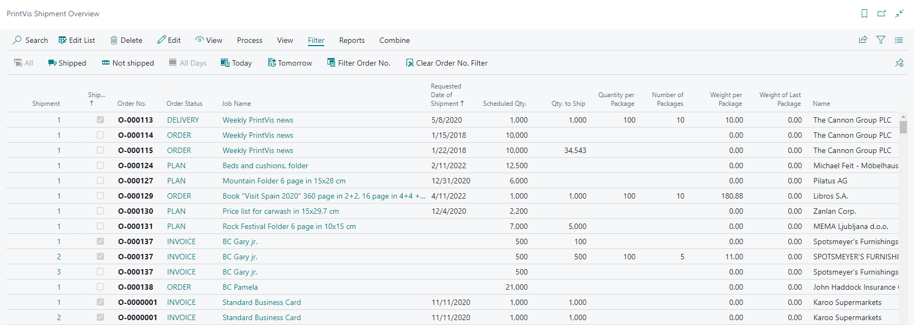

# Shipments

PrintVis provides its own Shipment Card for managing job shipments. PrintVis Shipments can be used as an alternative to Business Central Sales Shipments, or in conjunction with them depending on the implementation setup.

## Usage

The PrintVis Shipment Card is used to:
- Record when and how a job was shipped
- Capture shipping details (carrier, tracking number, weight, pieces)
- Link shipments to specific PrintVis jobs/cases
- Post shipments as BC Inventory transactions (if using finished goods items)
- Generate shipping documents and labels

### Shipment Types

| Approach | Description |
|---|---|
| **PrintVis Shipment** | Uses the PrintVis Shipment Card. Suitable for most print shops. Does not require BC Premium license. |
| **BC Sales Shipment** | Standard BC shipment. Used when BC warehouse functionality is required. |
| **Combined Shipment** | Multiple jobs combined into a single shipment (useful for consolidating orders for the same customer). |

### Combined Shipments

Multiple PrintVis jobs for the same customer can be combined into a single shipment. This is useful when:
- A customer has multiple active orders being shipped together
- Consolidating small orders to reduce shipping costs
- One delivery covers partial shipments of multiple jobs

### Registering Receipts

When purchased materials are received against a PrintVis job (e.g., subcontracted work being received back), use **Register Receipts in PrintVis** to record the receipt against the specific job.

### Release Finished Goods

When finished goods are produced and need to be put into inventory before shipping, use the **Release Finished Goods** function to post the production to inventory.

### Invoice Template Shipment on Invoice Lines

If invoice templates are configured to include shipment information, the shipment details automatically populate invoice lines during invoicing.

## Setup

### Shipment Number Series

1. In **General Setup**, set the **Shipment No. Series** field.
2. This is required if using combined shipments or if Status Code setup requires posted shipments.

### Shipping Agent Setup

See [Shipping Agents](shipping-agents.md) for setting up shipping carriers in the system.

### Status Code Configuration for Shipments

If a specific Status Code should trigger posting a shipment:
1. Open the Status Code.
2. Configure the appropriate shipment settings.

!!! warning "Missing Content"
    Detailed setup steps for the PrintVis Shipment Card fields and posting options are not fully documented in this article. Refer to the legacy Shipment documentation for detailed field descriptions and setup.

## Examples

### Example: Shipping a Completed Job

1. A job is complete (status = Finished or Shipped).
2. Open the Case Card → Shipments.
3. Create a new Shipment.
4. Enter:
   - Ship date
   - Shipping Agent (carrier)
   - Tracking number
   - Weight and pieces
5. Post the shipment.
6. The shipment is recorded and visible on the case history.

## See Also

- [Shipping Agents](shipping-agents.md)
- [Shipping Integrations](shipping-integrations.md)
- [Invoicing](../invoicing/invoicing.md)
