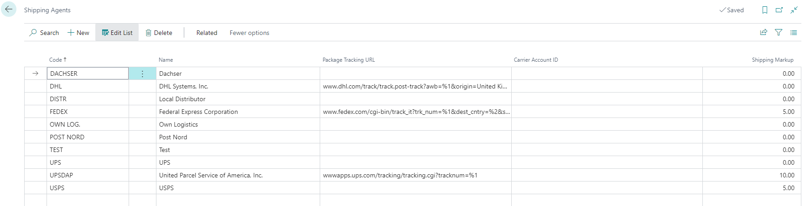
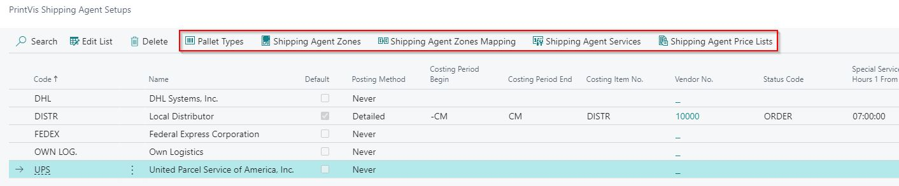

# Shipping Agents

Shipping Agents in PrintVis represent the carriers and shipping services used to deliver finished jobs to customers. They are used on the Shipment Card and can be integrated with third-party shipping systems.

## Usage

Shipping Agents are selected when creating a shipment. They provide:
- Carrier identification on shipment documents
- Tracking number association
- Integration with third-party shipping systems (EasyPost, nShift)
- Rate calculation for shipping costs (when integrated)

## Setup

Shipping Agents follow standard Business Central setup:

1. Search for **Shipping Agents** in Business Central.

2. Create a Shipping Agent record for each carrier.
3. For each agent, create **Shipping Agent Services** for the different service levels.

| Field | Description |
|---|---|
| **Code** | Unique identifier for the shipping agent. |
| **Name** | Carrier name (e.g., UPS, FedEx, DHL). |
| **Internet Address** | Carrier's website for reference. |

### Shipping Agent Services

| Field | Description |
|---|---|
| **Code** | Service code (e.g., GROUND, OVERNIGHT). |
| **Description** | Service description. |
| **Shipping Time** | Standard transit time for this service. |

### Integration-Specific Setup

For integrated shipping (EasyPost, nShift), additional setup is required. See [Shipping Integrations](shipping-integrations.md).

## Examples

### Example: Common Shipping Agents

| Code | Name | Services |
|---|---|---|
| UPS | UPS | Ground, 2-Day, Next Day Air |
| FEDEX | FedEx | Ground, 2-Day, Overnight |
| DHL | DHL | Express, Economy |
| LOCAL | Local Delivery | Standard |
| CUSTOMER | Customer Pickup | Pickup |

## See Also

- [Shipments](shipments.md)
- [Shipping Integrations](shipping-integrations.md)
