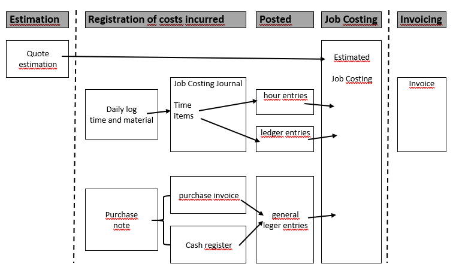
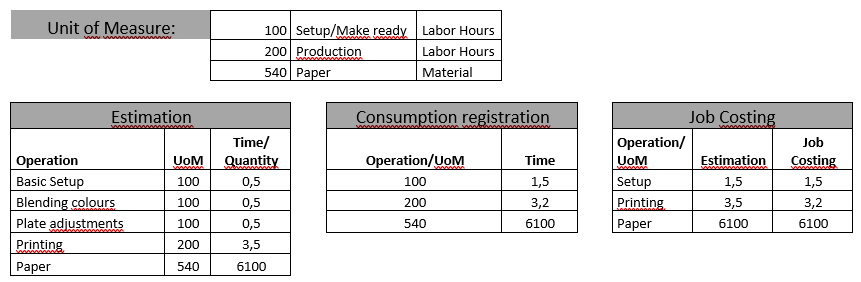
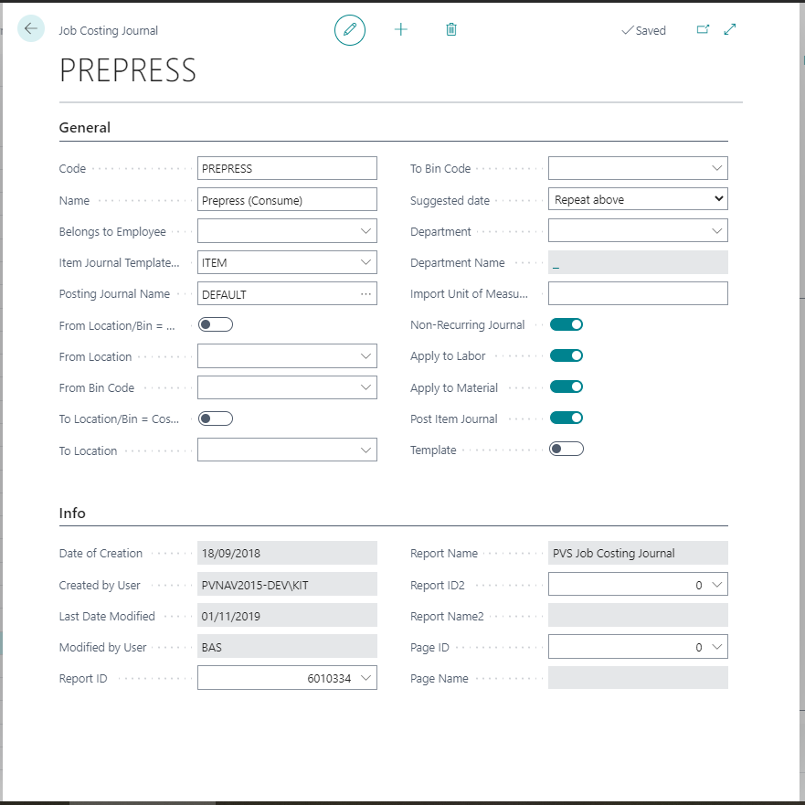
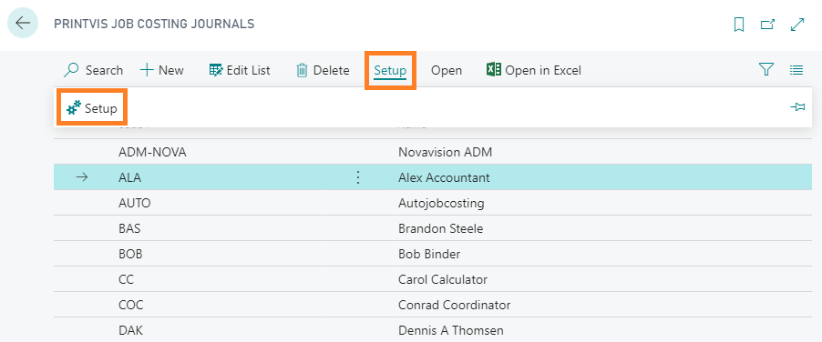
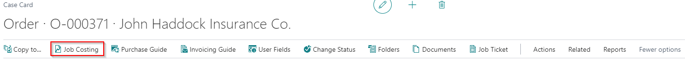

# Job Costing

Job Costing in PrintVis tracks the actual production costs for each job and compares them to the estimated costs. This enables profitability analysis and helps identify where estimates were accurate or where actual costs deviated from the plan.

## Usage

Job costing data is generated when:
- Shop floor operators register time (make-ready, production, setup)
- Materials are consumed and posted
- Purchased items or subcontracting costs are received against a job
- Extra work codes are registered

### Job Costing Analysis

After a job is complete, the job costing data shows:
- **Estimated time vs. actual time** per cost center and operation
- **Estimated material vs. actual material** consumption
- **Total cost vs. estimated cost** by department and overall
- **Cost per unit** (actual vs. estimated)

This data is the foundation for:
- Profitability reporting
- Estimate accuracy improvement
- Identifying inefficient processes
- Cost center performance monitoring

### Job Costing Journal

The Job Costing Journal is where time and material entries are recorded and posted to the case. Depending on setup, entries may:
- Post immediately when registered on the shop floor (direct posting)
- Be collected in a journal for review and approval before posting (journal buffer)

### Auto Job Costing

Auto Job Costing can be configured to automatically post job costing entries based on planned production times, eliminating the need for manual time registration in some scenarios.

### Move Worksheet for Approval

If shop floor entries are set to collect in a journal buffer, a supervisor can review entries in the **Move Worksheet** before approving and posting them.

## Setup

Job Costing setup requires:

1. **Job Costing Journals** — Set up journals for each department or user group
2. **Department Setup** — Configure the Shop Floor Journal Buffer per department
3. **Cost Center Setup** — Set the Shop Floor Posting method per cost center
4. **User Setup** — Configure journal permissions and journal assignments per user

### Job Costing Journal Setup

1. Search for **Job Costing Journals** or access via the Job Costing menu.
2. Create a journal for each posting group.

3. Set the posting type (Direct or Journal buffer).

### Job Costing Report

The Job Costing Report provides a comparison of estimated vs. actual costs per job.

To generate:
1. Open the Case Card.
2. Click **Job Costing** → **Job Costing Report**.
3. Select the parameters (date range, cost centers, etc.).
4. Run the report.

## Examples

### Example: Reviewing Job Profitability

After a job is shipped and invoiced:
1. Open the Case Card.
2. Navigate to **Job Costing**.
3. Review the breakdown:
   - Estimated press time: 2 hours → Actual: 2.5 hours (+25%)
   - Estimated DTP time: 1 hour → Actual: 0.75 hours (-25%)
   - Estimated paper: 1,100 sheets → Actual: 1,050 sheets (-5%)
4. Total: Job was slightly over cost on press time but under on DTP.
5. Use this data to refine future estimates for similar jobs.

## See Also

- [Shop Floor](shop-floor.md)
- [Work Codes](work-codes.md)
- [WIP](wip.md)
- [Analysis Pages](../reports/analysis-pages.md)
