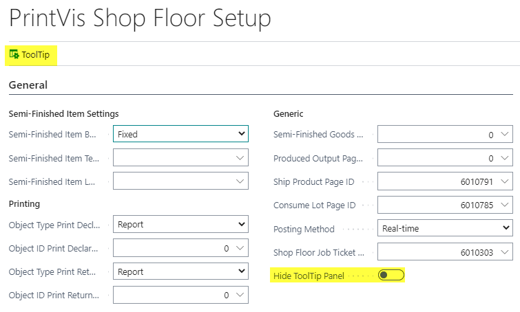
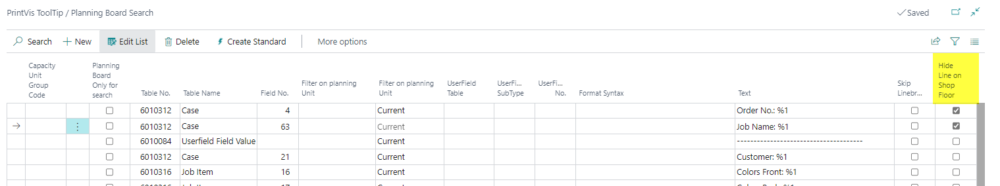
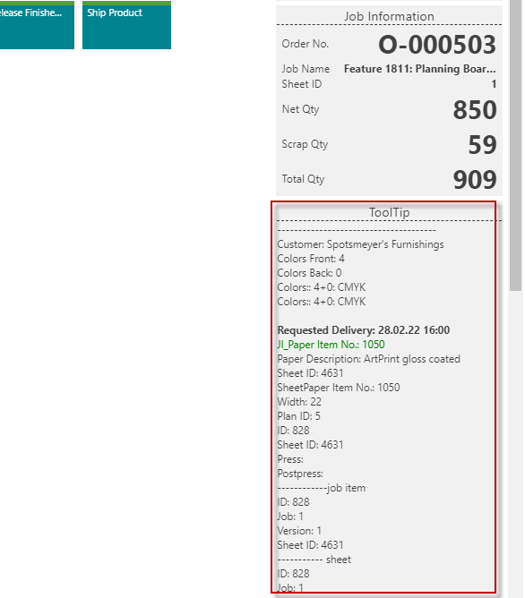
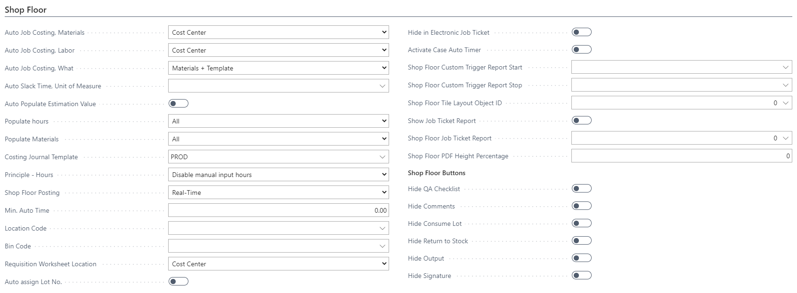
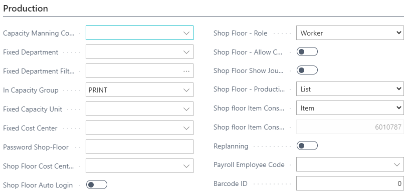

# Shop Floor

The PrintVis Shop Floor provides a touch-optimized interface for production staff to clock in/out of jobs, register production time, declare output, and complete QA checklists. It is designed for use with touch-sensitive screens and is accessible from the Shop Floor Role Center.

## Usage

The Shop Floor interface is used by production operators to:
- **Start/stop time** on jobs (make-ready and production time)
- **View job information** — Job Ticket details, production specifications, tooltips
- **Declare production** — Record how many good units were produced at each stage
- **Register material consumption** — Record actual material usage
- **Complete QA checklists** — Verify quality before advancing a job
- **Report indirect time** — Log non-job time (meetings, breaks, maintenance, etc.)

### Shop Floor Views

The Shop Floor can be accessed in two views:
- **Tile view** — Large colored tiles for touch interaction (primary shop floor view)
- **List view** — Traditional list for overview and searching

Once a job is opened, the main Shop Floor page displays tiles for start/stop functionality.

### Job Information Displays

Job-specific information is available in three ways:

| Display Type | Description |
|---|---|
| **Job Ticket** | Full printable job ticket with all job details and specifications |
| **Production Tile** | Essential job information displayed in the job's tile on the Shop Floor |
| **Tooltips** | Job-specific details shown on the right side of the screen when a user is clocked into a job |

### Time Registration Colors

Tiles are displayed in different colors to indicate the current state:
- Whether time is counting
- Which Unit of Measure (make-ready vs. production time)
This allows operators to see at a glance what is happening on any machine.

### Declaring Production (Semi-Finished Goods)

The Declare Production feature allows operators to record how many good units came out of their production step. This:
- Creates an inventory increase for the semi-finished item
- Is visible from the Case Card Job Costing
- Generates a pallet label (if configured with a barcode printer)

!!! note
    Production must be started before declaring production — you cannot declare production on a job that has not been started.

## Setup

Shop Floor setup is performed from multiple areas:

### 1. PV Shop Floor Setup

Search for **PV Shop Floor Setup**.

The action **"ToolTip"** opens the same ToolTips as in the Planning Board.

### 2. Semi-Finished Items Settings

| Field | Description |
|---|---|
| **Shop Floor Item Build-Up** | How semi-finished good items are created: **Fixed** (one item for all orders), **Product Group** (one item per product group), or **Order No.** (one item per order). |
| **Shop Floor Item Template / Item No.** | The item used as a template for creation (if build-up = Product Group or Order No.), or the fixed item used for all transactions. |
| **Shop Floor Item Location** | Fixed location for the item transactions. |

### 3. Printing Configuration

Controls what happens when the shop floor user clicks OK on Declare Production or Return to Stock:

| Field | Description |
|---|---|
| **Object Type Print Declare Production** | Report or Codeunit triggered on OK from Declare Production. |
| **Object ID Print Declare Production** | The object number triggered. |
| **Object Type Print Return to Stock** | Report or Codeunit triggered on OK from Return to Stock. |
| **Object ID Print Return to Stock** | The object number triggered. |

### 4. Cost Center Setup for Shop Floor

On each Cost Center, set the **Shop Floor Posting** method:

- **Direct Posting** — Time entries post directly when saved
- **Move to Journal** — Entries go to a department manager's journal for approval before posting

### 5. User Setup for Shop Floor

Assign the **PVS 365 SFloor** permission set to all shop floor users. In PrintVis User Setup:

- Enable **Production Employee** flag.
- Assign a personal Job Costing Journal if required.

## Examples

### Example: Shop Floor Workflow for a Press Operator

1. Operator arrives at the press and opens the Shop Floor Role Center.
2. Selects their press from the list of planning units/cost centers.
3. Finds the next scheduled job in the queue.
4. Clicks **Start Make-Ready** — the make-ready timer starts.
5. Reviews the Job Ticket for print specifications.
6. When the press is set up and running, clicks **Start Production** — the production timer starts.
7. When the run is complete, clicks **Stop**.
8. Opens **Declare Production** and enters the number of good sheets produced.
9. The system records the production output.
10. The next job in the queue is now accessible.

## See Also

- [Work Codes](work-codes.md)
- [Job Costing](job-costing.md)
- [WIP](wip.md)
- [Quality Assurance](../case-management/qa.md)
- [Departments](../case-management/departments.md)
