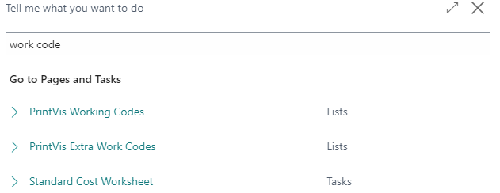
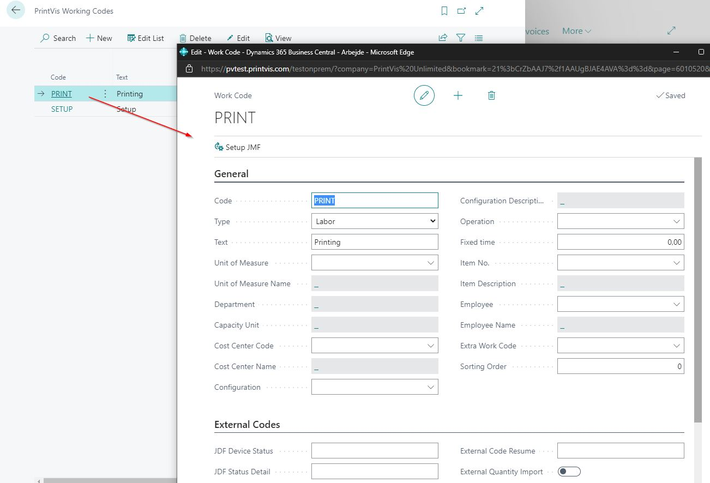

# Work Codes

Work Codes in PrintVis define the types of work activities that can be registered on the shop floor. They categorize time entries for job costing and analysis, distinguishing between different types of productive and non-productive time.

## Usage

Work Codes are used when:
- An operator starts or stops a time registration on the shop floor
- Recording make-ready time, production time, or downtime
- Registering indirect time (non-job-specific time)
- Analyzing how time is spent across production operations

### Types of Work Codes

Work codes typically include:
- **Make-Ready** — Time spent setting up the machine before production
- **Production/Run** — Active production time
- **Wash-Up / Clean-Up** — Time spent cleaning after production
- **Maintenance** — Machine maintenance time
- **Indirect time codes** — Non-production time (meetings, breaks, training)

## Setup

Work Codes are found by searching **PrintVis Work Code Setup**.

### Field Descriptions

| Field | Description |
|---|---|
| **Code** | Unique identifier for the work code. |
| **Description** | Name of the work activity. |
| **Time Group** | The Time Group this code belongs to (for grouping in reports). |
| **Type** | Direct (job-specific) or Indirect (non-job time). |
| **Unit of Measure** | The unit for this work type (hours, minutes, etc.). |
| **Default** | If enabled, this code is the default when starting time on the shop floor. |

### Unit of Measure Setup

PrintVis has its own Unit of Measure setup for shop floor registrations. Set up the UOMs before configuring work codes:

1. Search for **PrintVis Unit of Measure Setup**.
2. Create UOMs for time (hours, minutes) and production output (sheets, pieces, meters).
3. Link each UOM to a BC Unit of Measure for posting.

## Examples

### Example: Standard Work Code Setup

| Code | Description | Type | Time Group |
|---|---|---|---|
| MR | Make-Ready | Direct | MAKEREADY |
| PROD | Production Run | Direct | RUN |
| CLEAN | Clean-Up | Direct | CLEANUP |
| MAINT | Maintenance | Indirect | MAINTENANCE |
| MEETING | Meeting | Indirect | INDIRECT |
| BREAK | Break | Indirect | INDIRECT |

## See Also

- [Shop Floor](shop-floor.md)
- [Extra Work Codes](extra-work-codes.md)
- [Job Costing](job-costing.md)
- [Time Groups](../estimation/time-groups.md)
