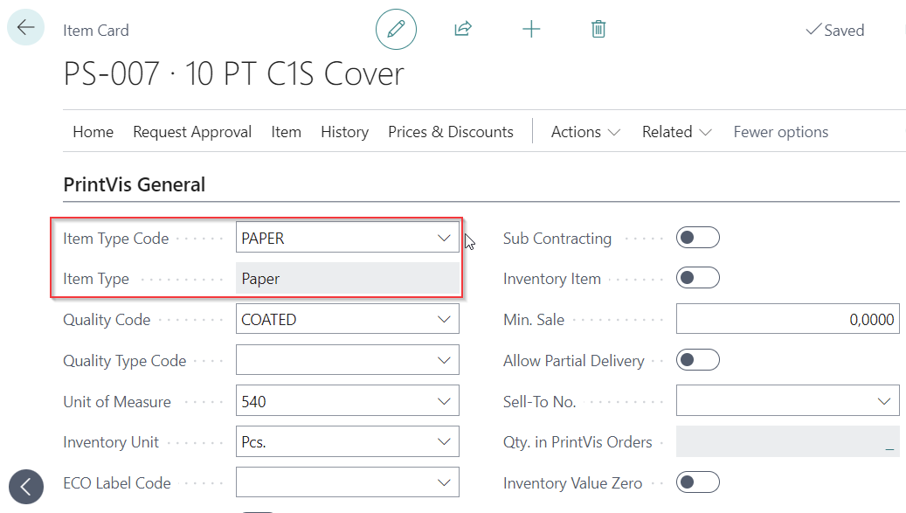
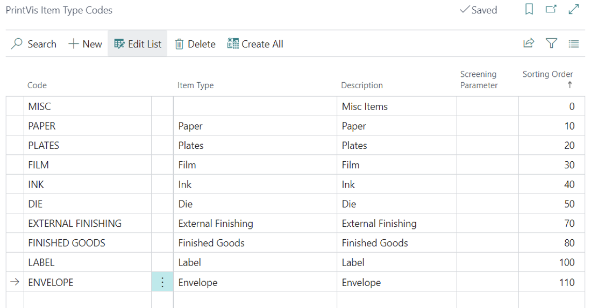

# Item Type Codes

Item Type Codes in PrintVis categorize items by their function in production. They are used to filter items in estimation, control how items are handled in material requirements, and organize inventory reporting.

## Usage

Item Type Codes appear throughout the system:
- **Estimation** — When selecting a paper or material in a Calculation Unit, the estimator can filter by Item Type Code to show only relevant items
- **Material Requirements** — Item Type Codes help categorize what materials need to be ordered or reserved
- **Job Costing** — Material consumption can be reported by Item Type Code
- **Item Type Code Filters** — Additional filters can be layered on top of type codes for finer control

### Item Type Code Filters

Item Type Code Filters allow you to further refine which items appear in specific contexts. For example, you might have a filter that shows only "SRA3 coated papers" within the broader "PAPER" item type code.

## Setup

!!! warning "Assisted Setup Note"
    Item Type Codes are one of the sections in PrintVis Assisted Setup. Standard item type codes can be imported from the reference database during initial setup.

Item Type Codes are found by searching **PrintVis Item Type Codes**.

### Field Descriptions

| Field | Description |
|---|---|
| **Code** | Unique identifier for the item type code (e.g., PAPER, INK, PLATE, TOOL). |
| **Description** | Name of the item type. |
| **Type** | What category of items this code applies to. |
| **Item Group Filter** | Automatically filters items shown in estimation by this group when this type code is active. |

### Creating Item Type Code Filters

1. Search for **PrintVis Item Type Code Filters**.
2. Create a filter linked to a base Item Type Code.
3. Define the filter criteria (e.g., specific paper weights, grades, formats).
4. Filters appear as sub-options when the base type code is selected in estimation.

## Examples

### Example: Item Type Code Structure for a Commercial Print Shop

| Code | Description |
|---|---|
| PAPER | Paper and Substrates |
| INK | Printing Inks |
| VARNISH | Varnishes and Coatings |
| PLATE | Printing Plates |
| FILM | Films and Laminates |
| TOOL | Tools and Dies |
| CONSUMABLE | Other Consumables |
| FINISHED | Finished Goods |

## See Also

- [Items](items.md)
- [Qualities](qualities.md)
- [Material Requirements](material-requirements.md)
