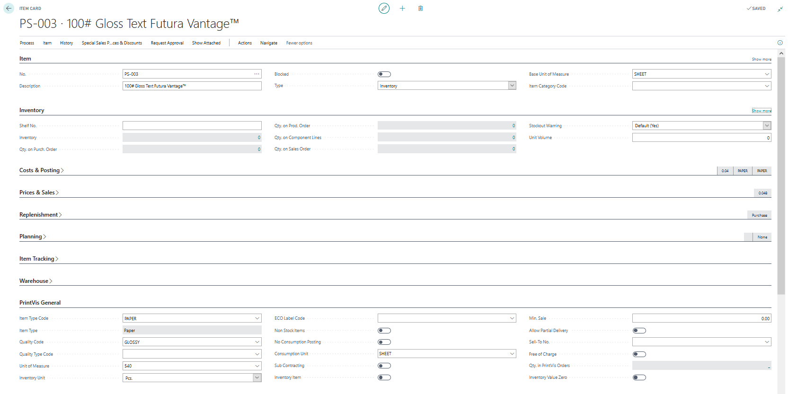
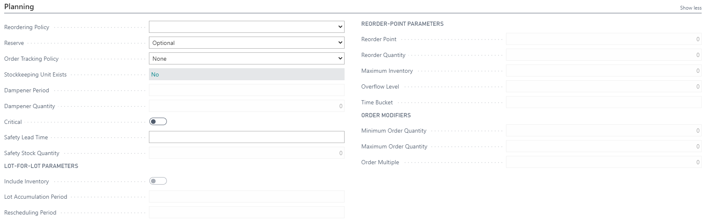

# Items

Items in PrintVis are managed through the standard Business Central Item Card. PrintVis extends item management with print-specific fields including item type codes, qualities, and integration with the estimation and shop floor systems.

## Usage

Items in PrintVis include:
- **Paper and substrates** — Used in estimation for material cost calculation
- **Inks and coatings** — Consumables used in production
- **Finished goods** — Items representing produced products
- **Plates and tools** — Production tooling items
- **Purchased materials** — Any material purchased for specific jobs

Items flow through:
- Estimation (material cost calculation)
- Material Requirements (what needs to be purchased or reserved)
- Job Material Movement (physical movement from warehouse to press)
- Shop Floor (material consumption registration)
- Invoicing (finished goods items on invoices)

### Item Type Codes and Qualities

PrintVis adds two important dimensions to items:
- **Item Type Codes** — Categorize items by type (paper, ink, substrate, tool, etc.)
- **Qualities** — Define quality grades for paper and materials

These are used to filter items in estimation and to apply correct pricing.

## Setup

### Creating a New Item

1. Search for **Items** in Business Central.
2. Click **New**.

3. Select an **Item Template** if available.

4. Fill in required fields:
   - **Description**
   - **Base Unit of Measure**
   - **Item Category Code**
   - **Inventory Posting Group**
   - **Gen. Prod. Posting Group**
   - **Unit Cost** (or set up a price list)
5. For paper items, also set:
   - **PrintVis Item Type Code** — e.g., PAPER
   - **PrintVis Quality** — e.g., COATED-100GSM

### Paper-Specific Item Setup

For paper items used in estimation:
1. Set the Unit of Measure for sheets and kilograms with conversion factors.
2. Set up the item in Price Lists if paper pricing varies by customer or quantity.
3. Set **Item Type Code** = PAPER (or the appropriate code for your setup).
4. Link to vendor items for automated purchasing.

## Examples

### Example: Setting Up a Standard Coated Paper

1. Item No.: 80GSM-GLOSS-A4
2. Description: 80gsm Gloss Coated A4
3. Base Unit of Measure: SHT (Sheet)
4. UOM Conversion: 1,000 SHT = 55.5 KG (based on paper weight)
5. Item Type Code: PAPER
6. Quality: GLOSS-COATED
7. Unit Cost: $0.02 per sheet (from price list)

## See Also

- [Item Type Codes](item-type-codes.md)
- [Qualities](qualities.md)
- [Material Requirements](material-requirements.md)
- [Price Lists](../estimation/price-lists.md)
