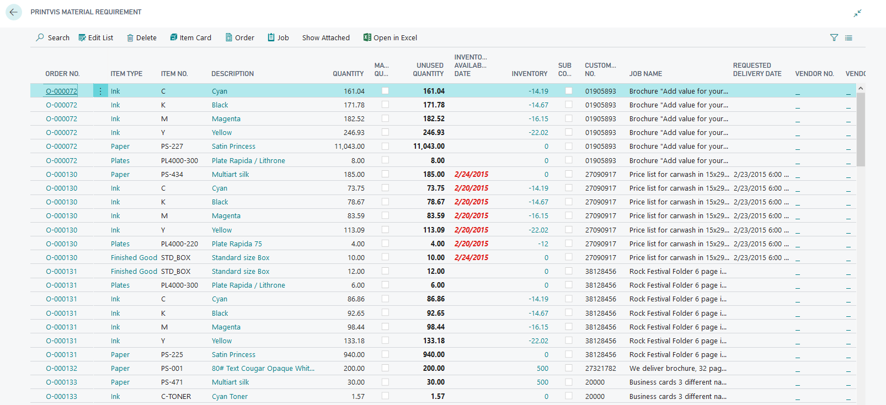

# Material Requirements

Material Requirements in PrintVis allow you to track and manage what materials are needed for specific jobs. Based on the estimation, the system calculates what paper, inks, and other materials need to be available for production.

## Usage

Material Requirements are used to:
- View what materials are needed for upcoming production jobs
- Check current inventory levels against production needs
- Generate purchase orders or requisitions for materials that are insufficient
- Reserve existing inventory for specific jobs
- Track material availability to prevent production delays

### Material Requirements Workflow

1. Cases are estimated with specific paper and material selections.
2. When a case reaches a status where materials can be reserved, the Material Requirements are visible.
3. The coordinator or purchasing team reviews material requirements.
4. If stock is insufficient, a purchase order or requisition is created.
5. When materials arrive, they can be reserved or allocated to the job.
6. At production time, materials are moved from warehouse to the press (Job Material Movement).

### Item Reservations

Materials can be reserved for specific jobs to ensure they are not used for other purposes. Reservations link a specific item quantity in inventory to a specific PrintVis job.

## Setup

Material Requirements behavior is controlled by:
- **Status Codes** — The **Allow Material Reservation** flag on the Status Code controls when reservations can be made
- **Item setup** — Items must be set up with the correct item type codes and units of measure

!!! warning "Missing Content"
    Detailed setup instructions specific to Material Requirements are not fully documented in the current source material. Contact PrintVis support or refer to the legacy Material Requirements documentation.

## Examples

!!! warning "Missing Content"
    Detailed step-by-step Material Requirements workflow examples are not fully documented in the current source material. Refer to the legacy documentation for specific workflow examples.

## See Also

- [Items](items.md)
- [Job Material Movement](job-material-movement.md)
- [Purchase Guide](purchase-guide.md)
- [Status Codes](../case-management/status-codes.md)
