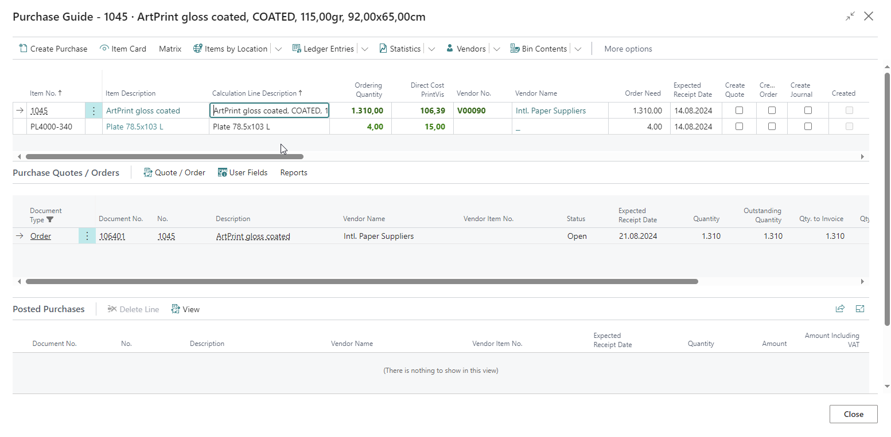
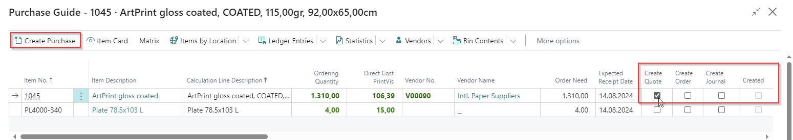

# Purchase Guide

The PrintVis Purchase Guide helps coordinators and purchasing staff identify what materials need to be purchased for upcoming production jobs. It provides a job-linked view of purchasing needs, enabling efficient, accurate purchasing decisions.

## Usage

The Purchase Guide is used to:
- See all materials needed for jobs in a specific date range or status
- Identify items that need to be purchased (insufficient inventory)
- Create purchase orders or requisitions directly from the guide
- Check current inventory levels against production needs

### Purchase Guide Workflow

1. Open the **Purchase Guide** from the Coordinator Role Center or search.

2. Review the list of required materials for upcoming jobs.

3. The system shows:
   - Item required
   - Quantity needed
   - Current available inventory
   - Shortfall quantity
   - Vendor information
4. Select items to create purchase orders.
5. Purchase orders are created in BC linked to the specific jobs.

## Setup

The Purchase Guide requires:
- Items set up with vendor information (item vendor catalog)
- Material Requirements enabled on the relevant Status Codes
- Appropriate lead times set on items or vendors

!!! warning "Missing Content"
    Detailed setup instructions specific to the Purchase Guide configuration are not fully documented in the current source material. Refer to the legacy Purchase Guide documentation for field descriptions and setup details.

## Examples

!!! warning "Missing Content"
    No specific Purchase Guide examples are currently documented.

## See Also

- [Material Requirements](material-requirements.md)
- [Items](items.md)
- [Vendors](../customers/vendors.md)
- [Requisition Worksheet](requisition-worksheet.md)
